### 题目
**题目描述**
>

**输入描述**
>

**输出描述**
>

-----
##### 思路

##### Solution
```cpp
```

# LeetCode原题
## 数组
数组由三个属性构成：下标、地址、元素。

数组删除操作方式：
1. 覆盖
2. 删除标记

#### 26 Remove Duplicates from Sorted Array


##### solution
思路：当元素重复时选择覆盖删除元素。

如何判断元素重复？当前元素与前一元素对比（需修正，使用下文的 j）。
如何删除？覆盖删除，向后找到第一个非重复元素覆盖重复元素。

需要两个下标，i 和 j。
i：向后寻找非重复元素
j：指向已知非重复元素最后一位。

两种情况：
1. nums[i] == nums[j] 时，i 向后寻找非重复元素
2. nums[i] != nums[j] 时，nums[i] 覆盖删除 nums[j+1]，修正 i, j。
```c
class Solution {
public:
    int removeDuplicates(vector<int>& nums) {
        if(nums.empty())
        {
            return 0;
        }
        int length = 1;
        for(int i = 0, j = 0; i < nums.size(); i++)
        {
            if(nums[i] != nums[j])
            {
                j++;
                length++;
                nums[j] = nums[i];
            }
        }
        return length;
    }
};
```

#### 80 Remove Duplicates from Sorted Array II

与 26 题类似，只需引入一个 count 计数。
因为 j 需要指向已知合法元素最后一位。所以 nums[i] == nums[j] && count < 2 && j < i 时，j 需要前进。
##### solution
```c
class Solution {
public:
    int removeDuplicates(vector<int>& nums) {
        int length = 0;
        int count = 0;
        for(int i = 0, j = 0; i < nums.size(); i++)
        {
            if(nums[i] != nums[j])
            {
                j++;
                length++;
                nums[j] = nums[i];
                count = 1;
            }
            else
            {
                if(count < 2)
                {
                    count++;
                    length++;
                    if (j < i)
                    {
                        j++;
                        nums[j] = nums[i];
                    }
                }
            }    
        }
        return length;
    }
};
```

#### 1 Two Sum
 

#####  Brute Force
怎么两数求和？通过两数相加。
需要两个下标：
i: 遍历整个数组
j: 遍历整个下标大于 i 的数组
```c
vector<int> res;
        for(int i = 0; i < nums.size()-1; i++)
        {
            for(int j = i+1; j < nums.size(); j++)
            {
                if(nums[i] + nums[j] == target)
                {
                    res.push_back(i);
                    res.push_back(j);
                    return res;
                }
            }
        }
        return res;
```

##### hash table
求和需要两位数相加，一位是 nums[i]，一位是 target - nums[i]，通过 unordered_map 缓存数组的值和下标，就可以 O(1) 时间判断是否数组存在 tartget-nums[i]。
```c
class Solution {
public:
    vector<int> twoSum(vector<int>& nums, int target) {
        unordered_map<int, int> m;
        vector<int> res;

        for(int i = 0; i < nums.size(); i++)
        {
            int complete = target - nums[i];
            if(m.count(complete))
            {
                res.push_back(i);
                res.push_back(m[complete]);
                return res;
            }
            m[nums[i]] = i;
        }
        return res;
    }
};
```

#### 11 Container With Most Water

##### two pointer
如何计算某个区域水面积大小？取最小边 * 距离。

需要两个下标表示边界。
l: 左边界，当 height[l] < height[r] 时，l 需要前进，找到一个 l2 使得 height[l] < height[l2]，边界 [l2,r] 水面积此时才有可能大于边界 [l,r]。
r: 同理。
```c
class Solution {
public:
    int maxArea(vector<int>& height) {
        int res = INT_MIN;
        int l = 0, r = height.size()-1;
        while(l < r)
        {
            res = max(res, min(height[l], height[r]) * (r-l));
            if(height[l] < height[r])
            {
                l++;
            }
            else
            {
                r--;
            }
        }
        return res;
    }
};
``` 

#### 31 Next Permutation


##### solution
[a,b]区间由后往前增长，只要 [a,b] 不是最大值，就可以将其重排列为下一更大值序列。
如果 [a,b] 区间为递减区间，则说明 [a,b] 区间是最大值序列，将 [a,b] 区间反转得到最小值序列。要求下一更大值序列，只需由后往前找到一个递减区间，然后从 [a,b] 中取第一个大于 nums[a-1] 的与 nums[a-1] 交换，再将 [a,b] 区间反转即得下一更大值序列。
```c
class Solution {
public:
    void nextPermutation(vector<int>& nums) {
        int i = nums.size() - 2;
        while(i >= 0 && nums[i+1] <= nums[i])
        {
            i--;
        }

        if(i >= 0)
        {
            int j = nums.size()-1;
            while(j > i && nums[j] <= nums[i])
            {
                j--;
            }

            swap(nums[i], nums[j]);
        }
        
        reverse(nums, i+1);
    }

    void reverse(vector<int>& nums, int start)
    {
        int i = start;
        int j = nums.size()-1;
        while(i < j)
        {
            swap(nums[i], nums[j]);
            i++;
            j--;
        }
    }
};
```

#### 15 3Sum

##### solution
难点在于怎么找到唯一的 triplet。
怎么判断已选择过某个数为 a？通过将数组排序，选择一个值为 a 时，跳过连续相同的值(a)。
```c
class Solution {
public:
    vector<vector<int>> threeSum(vector<int>& nums) {
        vector<vector<int>> res;
        
        sort(nums.begin(), nums.end());

        for(int i = 0; i < nums.size(); i++)
        {
            int target = -nums[i];
            int front = i+1;
            int back = nums.size()-1;

            if(target < 0)
            {
                break;
            }

            while(front < back)
            {
                int sum = nums[front] + nums[back];
                if(sum > target)
                {
                    back--;
                }
                else if(sum < target)
                {
                    front++;
                }
                else
                {
                    vector<int> triplet(3, 0);
                    triplet[0] = nums[i];
                    triplet[1] = nums[front];
                    triplet[2] = nums[back];
                    res.push_back(triplet);
                    
                    while(front < back && nums[front] == triplet[1] )
                    {
                        front++;
                    }

                    while(front < back && nums[back] == triplet[2])
                    {
                        back--;
                    }
                }
            }

            while(i+1 < nums.size() && nums[i] == nums[i+1])
            {
                i++;
            }
        }
        return res;
    }
};
```

#### 42 Trapping Rain Water

##### solution
如何计算某个位置水的面积？找出其左右最高边界，取低边界减去该位置黑块的高。
如何找出左右最高边界？左最高边界可以通过动态规划算出。
```c
class Solution {
public:
    int trap(vector<int>& height) {
        if(height.empty())
        {
            return 0;
        }
        int res = 0;
        int size = height.size();
        vector<int> left_max(size);
        vector<int> right_max(size);

        left_max[0] = height[0];
        for(int i = 1; i < size; i++)
        {
            left_max[i] = max(height[i], left_max[i-1]);
        }

        right_max[size-1] = height[size-1];
        for(int i = size-2; i >= 0; i--)
        {
            right_max[i] = max(height[i], right_max[i+1]);
        }

        for(int i = 0; i < size; i++)
        {
            res += min(left_max[i], right_max[i]) - height[i];
        }
        return res;
    }
};
```

#### 53 Maximum Subarray
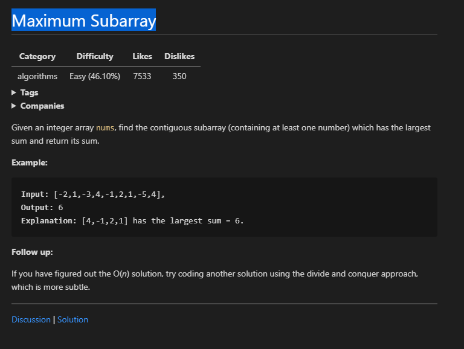

##### divide and conquer

```c
class Solution {
public:
    int maxSubArray(vector<int>& nums) {
        // O(n) solution
        // int temp = 0;
        // int sum = INT_MIN;
        // for (int num : nums)
        // {
        //     temp += num;
        //     sum = temp > sum ? temp : sum;
        //     if (temp < 0)
        //     {
        //         temp = 0;
        //     }
        // }2
        // return sum;

        // dynamic program solution
        // vector<int> dp(nums.size()+1, INT_MIN);
        // int sum = INT_MIN;
        // for(int i = 1; i <= nums.size(); i++)
        // {
        //     if(dp[i-1] > 0)
        //     {
        //         dp[i] = dp[i-1] + nums[i-1];
        //     }
        //     else
        //     {
        //         dp[i] = nums[i-1];
        //     }
        //     sum = sum > dp[i] ? sum : dp[i];
        // }
        // return sum;

        // divide and conquer solution

        return maxSubArray(nums, 0, nums.size()-1);
    }

    int maxSubArray(vector<int>& nums, int l, int r)
    {
        if(r < l)
        {
            return INT_MIN;
        }

        int mid = l + (r - l) / 2;
        int ml = 0, mr = 0;
        int lmax = maxSubArray(nums, l, mid-1);
        int rmax = maxSubArray(nums, mid+1, r);

        for(int i = mid-1, sum = 0; i >= l; i--)
        {
            sum += nums[i];
            ml = max(ml, sum);
        }

        for(int i = mid+1, sum = 0; i <= r; i++)
        {
            sum += nums[i];
            mr = max(mr, sum);
        }

        return max(max(lmax, rmax), ml + nums[mid] + mr);
    }
};
```
## 动态规划
### 线性dp
#### 最经典单串
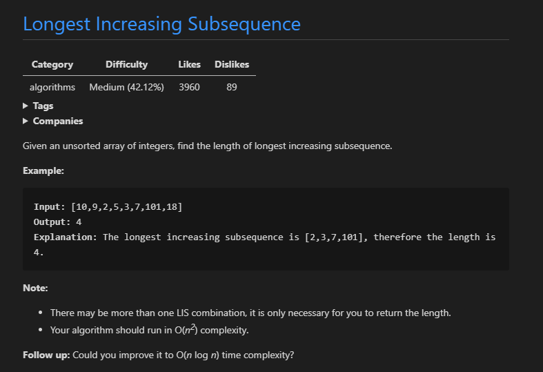

##### solution 1
时间复杂度 O(n^2)
```c
class Solution {
public:
    int lengthOfLIS(vector<int>& nums) {
        if(nums.empty())
        {
            return 0;
        }
        vector<int> dp(nums.size(), 0);
        dp[0] = 1;
        for(int i = 1; i < nums.size(); i++)
        {
            int length = 0;
            for(int j = i-1; j >= 0; j--)
            {
                if(nums[j] < nums[i] && dp[j] > length)
                {
                    length = dp[j];
                }
            }
            dp[i] = length + 1;
        }

        int maxLength = 0;
        for(auto num : dp)
        {
            maxLength = num > maxLength ? num : maxLength;
        }
        return maxLength;
    }
};
```


##### solution 2 
时间复杂度 O(nlogn)。arr 数组存储由 nums 元素构成的最长递增子序列。
```c
class Solution {
public:
    int lengthOfLIS(vector<int>& nums) {
        int n = nums.size();
        vector<int> arr(n, 1);

        int length = 0;
        for(int i = 0; i < n; i++)
        {
            int idx = binarySearch(arr, length, nums[i]);
            if (length == idx)
            {
                length++;
            }
            arr[idx] = nums[i];
        }
        return length;
    }

    // 返回第一个大于等于 key 的数组元素下标
    int binarySearch(vector<int>& arr, int length, int key)
    {
        int l = 0;
        int r = length;
        
        while(l < r)
        {
            int mid = l + (r-l)/2;
            if (key > arr[mid])
            {
                l = mid + 1;
            }
            else if (key < arr[mid])
            {
                r = mid;
            }
            else
            {
                return mid;
            }
        }
        return l;
    }
};
```
### Binary Tree Inorder traversal
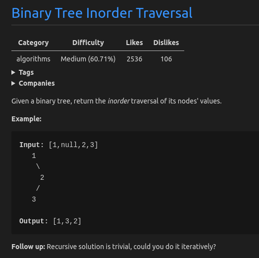
##### 使用递归
递归地中序遍历，将值存储到数组中。
##### solution 1
```c
class Solution {
public:
    vector<int> inorderTraversal(TreeNode* root) {
        vector<int> res;
        inorderTraversalAux(root, res);
        return res;
    }

    void inorderTraversalAux(TreeNode* root, vector<int>& res)
    {
        if(root != NULL)
        {
            if(root->left != NULL)
            {
                inorderTraversalAux(root->left, res);
            }
            res.push_back(root->val);
            if(root->right != NULL)
            {
                 inorderTraversalAux(root->right, res);
            }    
        }
    }
};
```

##### 使用迭代
通过 stack 模拟递归遍历。
##### solution 2
```c
class Solution {
public:
    vector<int> inorderTraversal(TreeNode* root) {
        vector<int> res;
        stack<TreeNode*> treeStack;

        TreeNode* cur = root;
        while(cur != NULL || !treeStack.empty())
        {
            while(cur != NULL)
            {
                treeStack.push(cur);
                cur = cur->left;
            }
            cur = treeStack.top();
            treeStack.pop();
            res.push_back(cur->val);
            cur = cur->right;
        }
        return res;
    } 
};
```

### Unique Binary Search Trees II
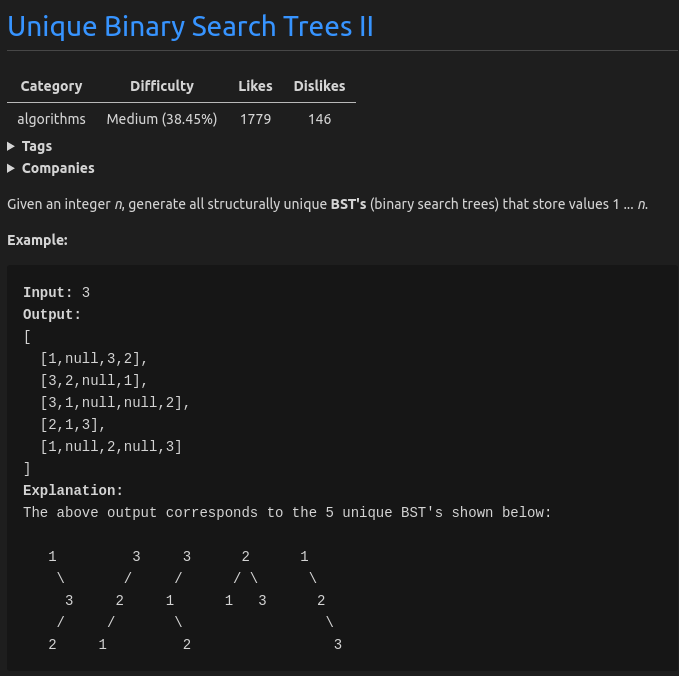
##### 思路
构建树需要 root，left，right 节点。观察题目，可以知道数值 1-n 都可以成为 root 节点。每次取[start,end]其中一个值为 root 节点时，它的左子节点的值必须比 root 节点小，它的右子节点的值必须比 root 节点大，所以子树[start, end]的范围可以不断缩小。
##### solution
```c
class Solution {
public:
    vector<TreeNode*> generateTrees(int n) {
	// 构建一棵树需要 root 节点和其左右子树
        // 节点的值为 [1, n]，每个值都可作为 root 节点，遍历选择 root 节点可通过递归或循环
        // 当选中 i(1<=i<=n) 为 root 节点时，其左子树的值由 [1,i-1] 构成，右子树的值由[i+1,n]构成
        // 由此看出，每选择一个 root 节点时，其左右子树规模不断减少。构造左右子树需要传入取值范围作为参数。
        if(n <= 0)
        {
            return vector<TreeNode*>{};
        }

        return createTree(1, n);
    }

    vector<TreeNode*> createTree(int start, int end)
    {
        if(end < start)
        {
            return vector<TreeNode*>{nullptr};
        }

        vector<TreeNode*> ans;
        for(int i = start; i <= end; i++)
        {
            vector<TreeNode*> left_subtrees, right_subtrees;
            left_subtrees = createTree(start, i-1);
            right_subtrees = createTree(i+1, end);

            for(auto& leftSubtree : left_subtrees)
            {
                for(auto& rightSubtree : right_subtrees)
                {
                    TreeNode* root = new TreeNode;
                    root->val = i;
                    root->left = leftSubtree;
                    root->right = rightSubtree;
                    ans.push_back(root);
                }
            }
        }

        return ans;
    }
```

### Validate Binary Search Tree
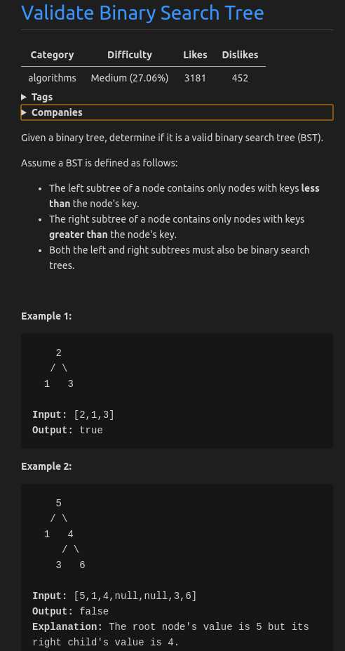

##### 思路 递归
画图可以看出，每个节点都有一个范围值 [lower, upper] 限制，左子节点 lower 取父节点的 lower，左子节点 upper 取父节点的值。右子节点 lower 取父节点的值，右子节点 upper 取父节点的 upper。

##### sulotion 1
```c
class Solution
{
public:
    bool isValidBST(TreeNode *root)
    {
        if (root == NULL)
        {
            return true;
        }

        return help(root, LONG_LONG_MIN, LONG_LONG_MAX);
    }
    bool help(TreeNode* node, long long lower, long long upper)
    {
        if(node == NULL)
        {
            return true;
        }

        int val = node->val;
        if(val <= lower)
        {
            return false;
        }
        if(val >= upper)
        {
            return false;
        }

        if(!help(node->left, lower, val))
        {
            return false;
        }
        if(!help(node->right, val, upper))
        {
            return false;                                                 
        }

        return true;
    }
};
```
##### 使用迭代
通过迭代模拟递归，可以观察到每次递归都会更新 [lower, upper]，所以模拟递归的时候每个节点携带的信息也要有 [lower, upper]，分别通过两个 stack 去缓存就行了。
##### solotion
```c
class Solution
{
public:
    bool isValidBST(TreeNode *root)
    {
        if(root == NULL)
        {
            return true;
        }
        stack<TreeNode*> stacks;
        stack<long long> lowers, uppers;
        auto update = [&stacks, &lowers, &uppers](TreeNode* node, long long lower, long long upper)
        {
            stacks.push(node);
            lowers.push(lower);
            uppers.push(upper);
        };
        
        update(root, LONG_LONG_MIN, LONG_LONG_MAX);
        while(!stacks.empty())
        {
            TreeNode* root = stacks.top();
            long long lower = lowers.top();
            long long upper = uppers.top();
            stacks.pop();
            lowers.pop();
            uppers.pop();

            if(root == NULL)
            {
                continue;
            }
            int val = root->val;
            if(val <= lower || val >= upper)
            {
                return false;
            }

            if (root->left != NULL)
            {
                update(root->left, lower, val);
            }
            if (root->right != NULL)
            {
                update(root->right, val, upper);
            }
        }
        return true;
    }
};
```
### Same Tree
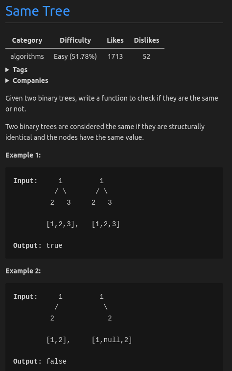

##### 思路
通过递归遍历节点，判断节点是否相同。每一次递归的作用都是，判断当前节点是否相同，如果不相同则说明树不相同，如果相同，则要继续判断当前节点的左右节点是否相同。

##### solution
```c
class Solution {
public:
    bool isSameTree(TreeNode* p, TreeNode* q) {
        if(p == NULL)
        {
            if(q == NULL)
            {
                return true;
            }
            else
            {
                return false;
            }
        }
        else
        {
            if(q == NULL)
            {
                return false;
            }
            else if(p->val != q->val)
            {
                return false;
            }
        }

        return isSameTree(p->left, q->left) && isSameTree(p->right, q->right);
    }
};
```

### Symmetric Tree
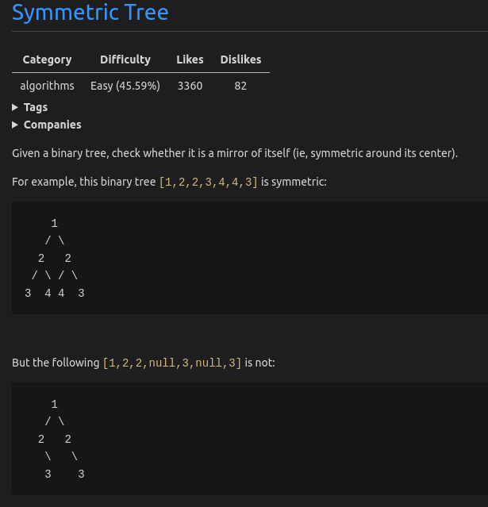

##### 使用递归
画图观察可以发现规律

### Single Number
Description:
Given an array of integers, every element appears twice except for one. Find that single one.
Note: Your algorithm should have a linear runtime complexity. Could you implement it without using extra memory?

##### 思路
元素出现偶数次，则元素的 bit 也应为偶数次，因为 x^x = 0, x^0 = x，(0 ^ 1) ^ 1  == 0 ^ (1  ^ 1)  == 0（组合顺序无关），所以当相同元素相异或时（x^x = 0），值为0。0 与 单独的元素异或时(x^0 = x)，则得到该值。

##### Solution
代码：
```c
int singleNumber(const vector<int> & nums)
	{
		int x = 0;
		for (auto i& nums)
			x ^= i;
		return x;
	}
```
### Arithmetic Slices
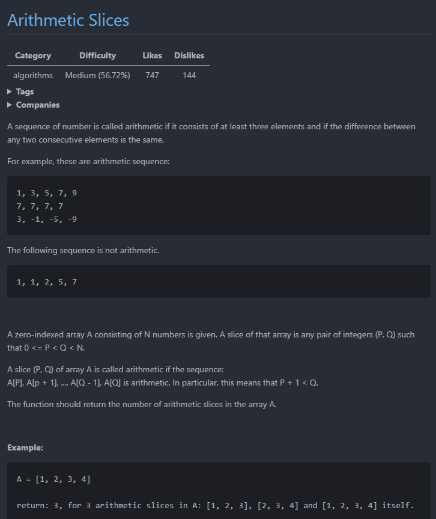

##### 思路
从左往右开始计算，每次计算以 left 为起点的 slice 数，直到遇到第一个 difference 不同的数，则 left + 1，继续计算。
##### Solution 1
```cpp
class Solution {
public:
    int numberOfArithmeticSlices(vector<int>& A) {
        if(A.size() < 3)
        {
            return 0;
        }

        int result = 0;
        for(int left = 0; left <= A.size() - 3;)
        {
            int right = left + 1;
            int difference = A[right] - A[left];
            while(right < A.size() - 1 && A[right + 1] - A[right] == difference)
            {
              result++;
              right++;
            }
            left++;
        }
        return result;
    }
};
```

##### 思路
根据 Solution 1 可观察到 left 和 right 之间的 difference 都相同，所以用一个辅助函数计算 left 和 right 之间能组成的 slice，从而避免重复计算。
##### Solution 2
```cpp
class Solution {
public:
    int numberOfArithmeticSlices(vector<int>& A) {
        if(A.size() < 3)
        {
            return 0;
        }

        int result = 0;
        for(int left = 0; left <= A.size() - 3;)
        {
            int right = left + 1;
            int difference = A[right] - A[left];
            while(right < A.size() - 1 && A[right + 1] - A[right] == difference)
            {
              right++;
            }
            result += cacul(left, right);
            left = right;
        }
        return result;
    }

    int cacul(int left, int right)
    {
        if(right - left + 1 < 3)
        {
            return 0;
        }

        int max = right - left + 1 - 2;
        int total = 0;
        while(max >= 1)
        {
            total += max;
            max--;
        }
        return total;
    }
};
```
##### 思路 动态规划
Solution 1 是计算以 left 为起点的 slice，但如果计算以某一个位置作为结尾的 slice 则可通过动态规划去解决问题。dp[tail] 记录以 A[tail] 为结尾的 slice 数量，当计算 dp[tail+1] 时，只需简单计算 A[tail+1] 与 A[tail], A[tail-1] 是否能组成一个 slice 即可，如果能，则多增加一个 A[tail-1] ，A[tail], A[tail+1] 的 slice。
##### Solution 3
```c
class Solution {
public:
    int numberOfArithmeticSlices(vector<int>& A) {
        if(A.size() < 3)
        {
            return 0;
        }

        vector<int> dp(A.size(), 0);
        if(A[1] - A[0] == A[2] - A[1]) 
        {
            dp[2] = 1;
        }
        
        int result = dp[2];
        for(int tail = 3; tail < A.size(); tail++)
        {
            if(A[tail-1] - A[tail-2] == A[tail] - A[tail-1])
            {
                dp[tail] = dp[tail-1] + 1;
            }
            result += dp[tail];      
	}
        return result;
    }
};
```

### Longest Substring with At Least K Repeating Characters
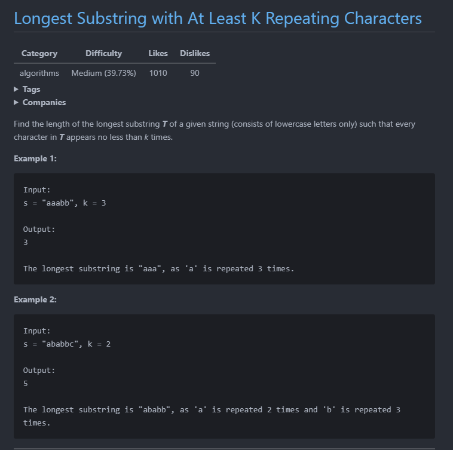
##### 思路
找出满足条件的区间，然后取最大那个。为了找出满足条件的区间，可以通过找出分隔区间的字符。统计出哪些字符不满足条件，提供一个方法去判断当前下标的字符是否满足条件。
##### Solution 1  
```c
class Solution {
public:
    int to_idx(const char& c) { return c - 'a';}
    int longestSubstring(string s, int k) {
        return aux(s, 0, (int)s.size(), k);
    }

    int aux(const string& str, int start, int end, int k)
    {
        vector<int> dp(26, 0);
        for(int i = start; i < end; i++)
        {
            dp[to_idx(str[i])]++;
        }

        int idx = start;
	// 注意！会导致溢出
        // while(dp[to_idx(str[idx])] >= k && idx < end) idx++;
        while( idx < end && dp[to_idx(str[idx])] >= k) 
        {
            idx++;
        }
        if(idx == end)
        {
            return idx - start;
        }

        int right_start = idx + 1;
	// 注意！会导致溢出
        // while(dp[to_idx(str[right_start])] < k && right_start < end) right_start++;
	while(right_start < end && dp[to_idx(str[right_start])] < k) 
        {
            right_start++;
        }
        return max(aux(str, start, idx, k), aux(str, right_start, end, k));
    }
};
```
##  depth-first search
### Arithmetic Slices II - Subsequence
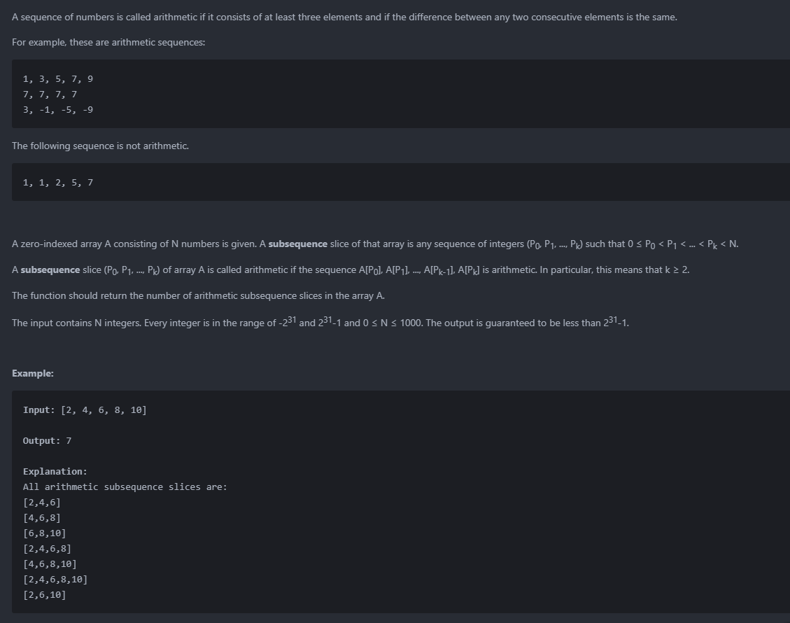

##### 思路
枚举所有序列。通过两条线路来枚举所有序列，序列中存在或不存在 A[dep]。
时间复杂度为 O(2^n)，空间复杂度为 O(n)。
##### Solution 1 Brute Force 
```c
class Solution {
public:
    int n;
    int ans;
    
    void dfs(int dep, vector<int>& A, vector<int> cur)
    {
        if(dep == n)
        {
            if(cur.size() < 3)
            {
                return;
            }

            for(int i = 1; i < cur.size(); i++)
            {
                if(cur[i] - cur[i-1] != cur[1] - cur[0])
                {
                    return;
                }
            }

            ans++;
            return;
        }

        dfs(dep+1, A, cur); // 不包含 A[dep] 的线路
        cur.push_back(A[dep]);
        dfs(dep+1, A, cur);  // 包含 A[dep] 的线路
        return;
    }

    int numberOfArithmeticSlices(vector<int>& A) {
        n = A.size();
        ans = 0;
        
        vector<int> cur;
        dfs(0, A, cur);
        return ans;
    }
};
```

##### 思路
用 f[i][d] 记录以 A[i] 为结尾，距离为 d 的 arithmetic subsequences。但如果 arithmetic subsequences 长度至少为 3 的话，那么前两个数不能形成 arithmetic subsequences。所以 f[i][d] 都为 0，无法利用 f[i][d] 的信息。但假设定义 weak arithmetic subsequences 为长度至少 2
且任意两个相邻的数的距离相同的序列。此时用 f[i][d] 记录以 A[i] 为结尾，距离为 d 的 weak arithmetic subsequences。此时就可以利用 f[i][d] 的信息进行推导。
> f[i][A[i]-A[j]] = f[j][A[i]-A[j]] + 1 // 这里 +1 是因为 pair(i, j)组成了一个weak arithmetic subsequence

如果 f[i][d] 不为 0 则说明 f[i][d] 至少存在一个 weak arithmetic subsequences。在一个 weak arithmetic subsequence 追加一个数必定能组成一个 arithmetic subsequence。所以 f[i+1][d] 的 arithmetic subsequences 等于 f[i][d] 的 weak arithmetic subsequences。
##### Solution 2 动态规划
```c
class Solution {
public:
    int numberOfArithmeticSlices(vector<int>& A) {
        int n = A.size();
        long long ans = 0;

        vector<map<long long, int>> cnt(n);
        for (int i = 1; i < n; i++) {
          for (int j = 0; j < i; j++) {
            long long delta = (long long)A[i] - (long long)A[j];
            int sum = 0;
            if (cnt[j].find(delta) != cnt[j].end()) {
              sum = cnt[j][delta];
            }
            cnt[i][delta] += sum + 1;
            ans += sum;
          }
        }
        return ans;
    }
};
```
# 其他
### 二维数组中的查找
**题目描述**
>在一个二维数组中，每一行都按照从左到右递增的顺序排序，每一列都按照从上到下递增的顺序排序。请完成一个函数，输入这样的一个二维数组和一个整数，判断数组中是否含有该整数。

**输入描述**

>input:  待查找的二维数组
>target: 查找的数字

**输出描述**
>查找到返回true，查不到返回false。

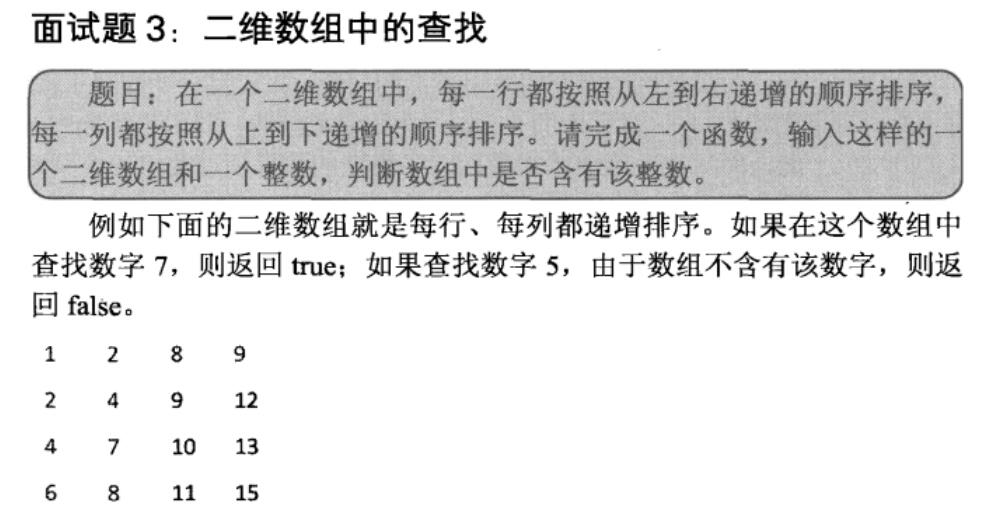

____
##### Solution
```cpp
bool findNumber(const vector<vector<int>>& input, const int target)
{
    int rows = input.size();
    int cols = input[0].size();
    
    bool found = false;
  
    if(input.empty())
        return found;

    int row = 0, col = cols - 1;
    while(row < rows && col >= 0)
    {
        if(input[row][col] == target)
        {
            found = true;
            break;
        }
        else if(input[row][col] > target)
        {
            --col;
        }
        else 
        {
            ++row;
        }
    }
    return found; 
}
```
### 从尾到头打印链表 
**题目描述**
>输入一个链表的头节点，从尾到头反过来打印出每个节点的值

**输入描述**
>pHead: 头节点


结构体定义如下：
```cpp
struct ListNode
{
  int m_nKey;
  ListNode* m_pNext;
};
```
---------
##### 思路
链表是从头到尾的顺序访问的，与从尾到头的顺序相反。这时可以想到使用栈，来暂存节点数据。当遍历完整个链表后，再从栈顶依次打输出节点的值。
##### 使用栈
```cpp
void PrintList(ListNode* pHead)
{
    std::stack<ListNode*> nodes;
    
    ListNode* pNode = pHead;
    while(pNode != NULL)
    {
	nodes.push(pNode);
	pNode = pNode->m_pNext;
    }

    while(!nodes.empty())
    {
	pNode = nodes.top();
	printf("%d\t", pNode->m_nKey);
     	nodes.pop();
}
```

##### 使用递归
递归本质上就是一个栈结构，所以可以使用递归代替栈。

```cpp
void PrintList(ListNode* pHead)
{
    if(pHead != NULL)
    {
        if(pHead->m_pNext != NULL)
	{
	    PrintList(pHead->m_pNext);
	}
	printf("%d\t", pHead->m_nkey);
    }
}
```
### 快速排序
**题目描述**
>实现快排

**输入描述**
>data: 序列
>length: 序列长度
>start: 序列起始位置
>end: 序列结束位置


-----

##### Solution
```cpp
int Partition(int data[], int length, int start, int end)
{
    if(data == NULL || length <= 0 || start < 0 || end >= length)
        throw new std::exception("Invalid Parameters");

    std::random_device rd;
    std::uniform_int_distribution<> dis(start, end);
    int index = dis(rd);

    swap(&data[index], &data[end]);

    int small = start - 1;
    for(index = start; index < end; ++index)
    {
        if(data[index] < data[end])
        {
            ++small;
            if(small != index)
                swap(&data[index], &data[small]);
        }
    }

    ++small;
    swap(&data[small], &data[end]);

    return small;
}

void QuickSort(int data[], int length, int start, int end)
{
    if(start == end)
        return;

    int index = Partition(data, length, start, end);
    if(index > start)
        QuickSort(data, length, start, index - 1);
    if(index < end)
        QuickSort(data, length, index + 1, end);
    
}
```
### 替换空格
**题目描述**
>请实现一个函数,把字符串中的每个空格替换成“%20”。例如输入“We are happy.”，则输出“We%20are%20happy.”

**输入描述**
>str: 被替换的字符串

```cpp
void replaceSpace(string& str)
{
    int n = 0;
    for(auto& i : str)
    {
        if(i == ' ')
        {
            ++n;
        }
    }
    
    n *= 2;
    n += str.size();
    string res;
    res.resize(n);
    for(int i = str.size() - 1, j = n - 1; i >= 0; --i)
    {
        if(str[i] != ' ') 
        {
            res[j--] = str[i];
        }
        else
        {
            res[j--] = '0';
            res[j--] = '2';
            res[j--] = '%';
        }
    }
    str = res;
}

```
### 用两个栈实现队列
**题目描述**
>用两个栈实现一个队列。队列声明如下，请实现它的两个函数appendTail和deleteHead，分别完成在队列尾部插入结点和在队列头部删除结点的功能

```cpp
template<typename T>
class Queue
{
public:
    Queue();
    ~Queue();

    void appendTail(const T& node);
    T deleteHead();

private:
    stack<T> stack1;
    stack<T> stack2;
};
```

##### 思路
stack是先进后出，而queue是先进先出。出入顺序刚好相反，所以再借助一个stack再反一次，就是queue的顺序了。注意queue为空时的判空处理。
##### Solution
```cpp
template<typename T>
void Queue<T>::appendTail(const T& node)
{
    stack1.push(node);
}

template<typename T>
T Queue<T>::deleteHead()
{
    if(stack2.size() <= 0)
    {
        while(stack1.size() > 0)
        {
            T& data = stack1.top();
            stack1.pop();
            stack2.push(data);
        }
    }

    if(stack2.size() == 0)
        throw new exception("queue is empty");

    T head = stack2.top();
    stack2.pop();

    return head;
}
```
### 重建二叉树
**题目描述**
>输入某二叉树的前序遍历和中序遍历的结果，请重建出该二叉树。

**结点**
```cpp
struct Node
{
    int value_;
    Node* left_;
    Node* right_;
}
```

**输入描述**
>preorder: 前序遍历序列
>inorder: 中序遍历序列
>length: 序列长度

##### 思路
由前序遍历序列找出root结点，根据root结点的值找出root结点在中序遍历序列的位置，用root结点划分root结点的左右子树。
构建树的过程是找出根结点、构建左子树、构建右子树。可以发现，这是由一个大的问题，不断划分成同样的小问题。可以使用递归解决，递归基是当子树没有左右结点时停止。

##### Solution
```cpp
Node* Construct(int* preorder, int* inorder, int length)
{
    if(preorder == NULL || inorder == NULL || length <= 0)
        return NULL;

    return ConstructCore(preorder, preorder + length - 1,
            inorder, inorder + length - 1);
}

Node* ConstructCore(int* startPreorder, int* endPreorder,
        int* startInoder, int* endInorder)
{
    // 前序遍历序列的第一个数字是根结点的值
    int rootValue = startPreorder[0];
    Node* root = new Node();
    root->value_ = rootValue;
    root->left_ = root->right_ = NULL;

    if(startPreorder == endPreorder)
    {
        if(startInoder == endInorder && *startPreorder == *startInoder)
            return root;
        else
            throw std::exception("Invalid input.");
    }

    // 在中序遍历中找到根结点的值
    int* rootInorder = startInoder;
    while(rootInorder <= endInorder && *rootInorder != rootValue)
        ++rootInorder;

    if(rootInorder == endInorder && *rootInorder != rootValue)
        throw std::exception("Invalid input.");

    int leftLength = rootInorder - startInoder;
    int* leftPreorderEnd = startPreorder + leftLength;
    if(leftLength > 0)
    {
        // 构建左子树
        root->left_ = ConstructCore(startPreorder + 1,
                leftPreorderEnd, startInoder, rootInorder - 1);
    }

    if(leftLength < endPreorder - startPreorder)
    {
        // 构建右子树
        root->right_ = ConstructCore(leftPreorderEnd + 1, endPreorder,
                rootInorder + 1, endInorder);
    }
    
    return root;
}
```


## 回文字符串
### 判断是否为回文字符串
##### 思路
```c
bool isPalindrome(string str)
{
    if(str.size() < 2)
    {
        return false;
    }
    int left = 0;
    int right = str.size() - 1;

    while(left < right)
    {
        if(str[left] != str[right])
        {
            return false;
        }
        left--;
        right--;
    }

    return true;
}
```

## 洗牌算法
将一副牌随机打乱
```c
    void shuffle(vector<int>& data)
    {
        srand(time(nullptr));
        int n = data.size();
        for(int i = 0; i < n; i++)
        {
            int rand = i + rand() % n-i;
            swap(data[i], data[rand]);
        }
    }
```
### 生成k个小于n的不重复值
生成 k 个小于 n 的不重复值。
```c
    void func(vector<int>& data, int n, k)
    {
        data.resize(n);
        for(int i = 0; i < n; i++)
        {
            data[i] = i;
        }

        srand(time(nullptr));
        for(int i = 0; i < k; i++)
        {
            int rand = i + rand() % n-i;
            swap(data[i], data[rand]);
        }
    }
```
