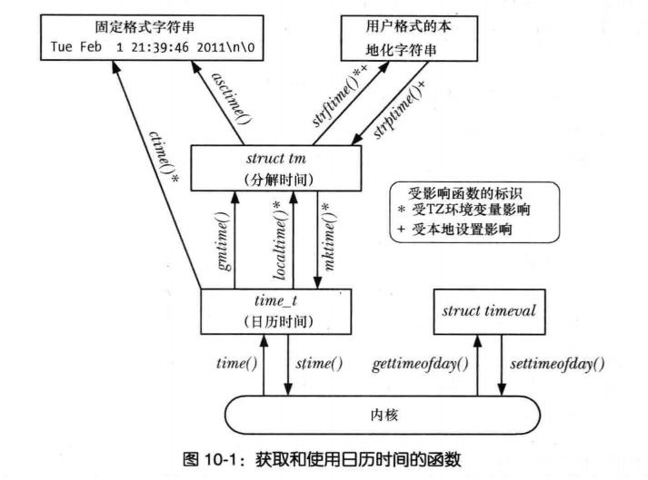

# UNIX 系统编成手册

## chapter 4 文件I/O
### 4.3 打开一个文件 open
open() 调用既能打开一个已存在的文件，也能创建并打开一个新文件。

```c
int open(const char* pathname, int flags, .../* mode_t */);
	Returns file descriptor on success, or -1 on error
```

如果 pathname 是一符号链接，会对其解引用。如果发生错误，返回 -1，并将 errno 置为相应的错误标志。参数 flags 为位掩码，用于指定文件的访问模式，可选择下表所示常量之一。

访问模式|描述
|----|---|
O_RDONLY | 以只读方式打开文件
O_WRONLY | 以只写方式打开文件
O_RDWR | 以读写方式打开文件
```c
// int open(const char *pathname, int flags, mode_t mode)
// 如果不是创建文件， mode 不用指定
void create_c()
{
    int fd = open("create.txt", O_CREAT, S_IRUSR | S_IWUSR);
    if (fd < 0)
    {
        perror("failed to open file");
        return;
    }
    close(fd);
}
// 如果文件存在，打开文件会失败
void open_c()
{
    int fd = open("open.txt", O_TRUNC |O_RDWR | O_APPEND);
    if (fd < 0)
    {
        perror("failed to open file");
        return;
    }
    close(fd);
}

int main(int argc, char *argv[])
{
    create_c();
    open_c();
    return 0;
}
```

### read write
读写文件
```
void read_c()
{
    int fd = open("create.txt", O_RDONLY);
    if (fd < 0)
    {
        perror("failed to open file");
        return;
    }

    char buf[1024];
    int n = read(fd, buf, sizeof buf - 1);
    if(n < 0)
    {
        perror("failed to read");
        return;
    }
    buf[n] = '\0';
    printf("%s", buf);
    close(fd);
}

void write_c()
{
    int fd = open("create.txt", O_WRONLY | O_APPEND | O_TRUNC);
    if (fd < 0)
    {
        perror("failed to open file");
        return;
    }

    const char* str = "hello\nwolrd\n";
    int n = write(fd, str, strlen(str));
     if(n < 0)
    {
        perror("failed to write");
        return;
    }
    close(fd);
}
int main(int argc, char *argv[])
{
    write_c();
    read_c();
    
    return 0;
}

output:
hello
wolrd

```
### 4.6 关闭文件 close()
close() 系统调用关闭一个打开的文件描述符，并将其释放回调用进程，供该进程继续使用。当一进程终止时，将自动关闭其已打开的所有文件描述符。

```c
int close(int fd)
	Returns 0 on success, or -1 on error
```

像其他所有系统调用一样，应对 close() 的调用进行错误检查，如下所示。
```c
if(close(fd) == -1)
  perror("close")
```
上述代码能够捕获的错误有：企图关闭一个未打开的文件描述符，或者两次关闭同一文件描述符，也能捕获特定文件系统在关闭操作中诊断出的错误条件。

### 4.7 改变文件偏移量 lseek
文件偏移量是指执行下一个 read() 或 write() 操作的文件起始位置，会以相对于文件头部起始点的文件当前位置来表示。文件第一个字节的偏移量为 0。

文件打开时，会将文件偏移量设置为指向文件开始，以后每次 read() 或 write() 调用将自动对其进行调整，以指向已读或已写数据后的下一字节。

```c
off_t lseek(int fd, off_t offset, int whence);
	Returns new file offset if successful, or -1 on error
```
whence 参数表明应参照哪个基点来解释 offset 参数，应为下列其中之一：
- SEEK_SET: 将文件偏移量设置为文件头部起始点开始的 offset 个字节
- SEEK_CUR：相对于当前文件偏移量，将文件偏移量调整 offset 个字节
- SEEK_END：将文件偏移量设置为起始于文件尾部的 offset 个字节。也就是说，offset 参数应该从文件最后一个字节之后的下一个字节算起。


## chapter 5 深入探究文件 I/O
### 原子操作和竞争条件
所有系统调用都是以原子操作方式执行的。
#### 向文件尾部追加数据
用以说明原子操作必要性的例子是多个进程同时向同一个文件（例如，全局日志文件）尾部添加数据。可以考虑使用如下代码。
```c
if(lseek(fd, 0, SEEK_END) == -1)
  errExit("lseek")
if(write(fd, buf, len) != len)
  fatal("failed wirte")
```

可以发现，如果第一个进程执行到 lseek() 和 write() 之间，被执行相同代码的第二个进程打断，那么这两个进程会在写入数据之前，将文件偏移量设为相同位置，而这会造成数据被覆盖的情况。要规避这一问题，需要将文件偏移量与数据写操作纳入同一原子操作。在打开文件时加入 O_APPEND 标志就可以保证这一点。


### 5.2 文件控制操作 fcntl()
fcntl() 系统调用对一个打开的文件描述符执行一系列控制操作。
```c
int fcntl(int fd, int cmd, ...);
	Returns on success depends on cmd, or -1 on error
```
fcntl()的第三个参数以省略号来表示，这意味着可以将其设置为不同的类型，或者加以省略。内核会依据 cmd 参数的值来确定该参数的数据类型。

### 5.3 打开文件的状态标志
## chapter 10 时间

两种时间类型：
- 真实时间：度量这一时间的起点有二：一为某个标准点；二为进程声明周期内的某个
固定时点（通常为程序启动）。前者为日历（calendar）时间，适用于需要对数据库记录或
文件上打上时间戳的程序；后者则称之为流逝（elapsed）时间或者挂钟（wall clock），
主要针对需要周期性操作或定期从外部输入设备进行度量的程序。
- 进程时间：一个进程所使用的 CPU 时间总量，适用于对程序、算法性能的检查和优化。

### 10.1 日历时间（Calendar time）

无论地理位置如何，UNIX 系统内部对时间的表示方式均是以自 Epoch 以来的秒数来度量的。
Epoch 亦即通用协调时间（UTC）的 1970 年 1 月 1 日早晨零点。日历时间存储于类型为 time\_t的变量中。

系统调用 gettimeofday()，可于 tv 指向的缓冲区中返回日历时间。
```c
#include <sys/time.h>
int gettimeofday(struct timeval* tv, struct timezone* t);
    Returns 0 on success, or -1 on error
```
参数 tv 是指向如下数据结构的一个指针：
```c
struct timeval
{
    time_t tv_sec; /* Seconds since 00:00:00, 1 Jan 1970 UTC */
    suseconds_t tv_usec; /* Additional microseconds (long int) */
};
```
虽然 tv\_usec 字段能提供微妙级精度，但其返回值的准确性则由依赖于架构的具体实现来决定。
gettimeofday() 的参数 tz 是个历史产物，目前已废弃，应始终将其置为 NULL。

time()系统调用返回自 Epoch 以来的秒数（和函数 gettimeofday() 所返回的 tv 参数中 tv\_sec 字段的数值相同）。
```c
#include <time.h>
time_t time(time_t* timeep);
    Returns number of seconds since the Epoch, or(time_t)-1 on error
```

如果参数 timep 不为 NULL，那么还会将自 Epoch以来的秒数置于 timep 所指向的位置。
由于 time() 会以两种方式返回相同值，而使用时唯一可能出错的地方是赋予 timep 参数一个无效地址，因此
往往会简单地采用如下调用（不做错误检查）：t = time(NULL)

### 10.2 时间转换函数

如下图所示，用于在 time\_t 值和其他时间格式之间相互转换的函数，其中包括打印输出。



### 10.2.1 将 time\_t 转换为可打印格式
为了将 time\_t 转换为可打印格式，ctime() 函数提供了一个简单方法。

```c
#include <time.h>
char* ctime(const time_t* timep);
    Returns pointer to statically allocated string terminated by newline 
    and \0 on success, or NULL on error
```

把一个指向 time\_t 的指针为 timep 参数传入函数 ctime()，将返回一个长达 26 字节的字符串，
内含标准格式的日期和时间，如下所示：Thu Mar  5 17:24:33 2020

SUSv3 规定，调用 Ctime(), gmtime(), localTime() 或 asctime() 中的任一函数，都可能会覆盖
由其他函数返回，且经静态分配的数据结构。

### 10.2.2 time\_t 和分解时间之间的转换

函数 gmtime() 和 localtime() 可将一 time\_t 值转换为一个所谓的分解时间（broken-down time)。
分解时间被置于一个经由静态分配的结构中，其地址则作为函数结果返回。

```c
#include <time.h>
struct tm* gmtime(const time_t* timep);
struct tm* localtime(const time_t* timep);
    Both return a pointer to a statically allocated broken-down time structure
    on success, or NULL on error
```

函数 gmtime() 能够把日历时间转换为一个对应于 UTC 的分解时间。（字母 GM 源于格林威治标准时间）。相形之下，函数 localtime() 
需要考虑时区和夏令时设置，返回对应于系统本地时间的一个分解时间。

在这些函数所返回的 tm 结构中，日期和时间被分解为多个独立字段，其形式如下：

```c
struct tm
{
    int tm_sec;         /* Seconds (0-60) */ 
    int tm_min;         /* Minutes (0-59) */ 
    int tm_hour;        /* Hours   (0-23) */ 
    int tm_mday;        /* Day of the month (1-31)*/ 
    int tm_mon;         /* Month   (0-11) */ 
    int tm_year;        /* Year since 1900 */ 
    int tm_wday;        /* Day of the week (Sunday = 0) (0-60) */ 
    int tm_yday;        /* Day in the year (0-6=365; 1 Jan = 0)*/ 
    int tm_isdst;       /* Daylight saving time flah
                            > 0: DST is in effect;
                            = 0: DST is not effect;
                            < 0: DST information not available*/ 
};
```

函数 mktime() 将一个本地时区的分解时间翻译为 time\_t 值，并将其作为函数结果返回。

```c
#include <time.h>
time_t mktime(struct tm* timeptr);
    Returns seconds since the Epoch corresponding to timeptr on success, or(time_t) -1 on error
```

函数 mktime() 可能会修改 timeptr 所指向的结构体，至少会确保对 tm\_wday 和 tm\_yday 字段值的设置，会与其他输入
字段的值能对应起来。

此外，mktime() 不要求 tm 结构体的其他字段受到前述范围的限制。任何一个字段的值超出范围，
mktime() 都会将其调整回有效范围之内，并适当调整其他参数。

例如，如果输入字段 tm\_sec 的值为 123，那么在返回时此字段的值将为 3，且 tm\_min 字段值
会在其之前值的基础上加 2。（如果这一改动造成 tm\_min 溢出，那么将调整 tm\_min 的值，并且递增 tm\_hour 字段，以此类推）这些调整甚至适用于字段负值。例如，
指定 tm\_sec 为 -1 即意味着前一分钟的第 59 秒。此功能允许以分解时间来计算日期和时间，故而非常有用。

### 10.2.3 分解时间和打印格式之间的转换

**从分解时间转换为打印格式**

在参数 tm 中提供一个指向分解时间结构的指针，asctime() 则会返回一个指针，指向经由静态分配的字符串，内含时间，格式则与 ctime() 相同。

```c
#include <time.h>
char* asctime(const struct tm* timeptr);
    Returns pointer to statically allocated string terminated by newline
    and \0 on success, or NULL on error
```
