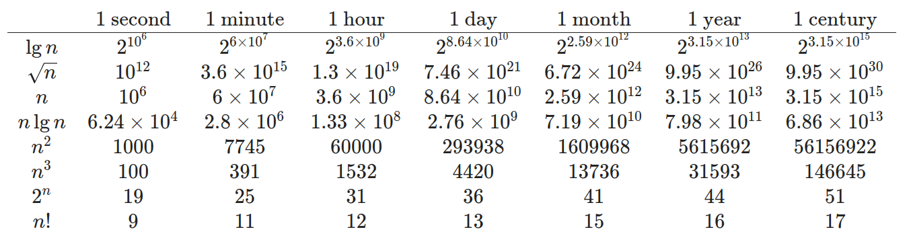

# 算法导论 笔记

## chapter 1
##### 1-1 运行时间比较
假设求解问题的算法需要 f(n) 微秒，对下表中的每个函数 f(n) 和时间 t，确定可以在时间 t 内求解的问题的最大规模 n。


## chapter 2 算法基础
### 2.1 插入排序
插入排序就像手工排序扑克牌一样，每次拿到牌都将牌由右往左比较，然后将其插入到合适位置。
```c
INSERTION-SORT(A)
for j = 2 to A.length
    key = A[j]
    i = j - 1
    while i > 0 and A[i] > key
        A[i+1] = A[i]
        i--
    A[i+1] = key
```
在 for 循环每次迭代，包含元素 A[1...j-1] 的子数组构成了当前已排好序数组，称这些性质形式地表示为一个**循环不变式**(即每次迭代，该数组都为已排序数组)。

循环不变式主要用来帮助我们理解算法的正确性。关于循环不变式，必须证明三条性质：
- 初始化：循环的第一次迭代之前，它为真
- 保持：如果循环的某次迭代之前它为真，那么下次迭代之前它仍为真。
- 终止：在循环终止时，不变式为我们提供一个有用的性质，该性质有助于证明算法时正确的。


插入排序如何证明这些性质成立。
- 初始化：首先第一次循环迭代之前(当 j=2 时)，循环不变式成立。子数组A[1...j-1]仅由单个元素A[1]组成。
- 保持：for 循环将 A[j-1], A[j-2], A[j-3]等向右移动一个位置，直到找到 A[j] 的适当位置，然后将 A[j] 的值插入该位置。此时子数组A[1...j]由原来在A[1...j]中的元素组成，但已按序排列。那么对 for 循环的下一次迭代增加 j 将保持循环不变式。
- 终止：导致 for 循环终止的条件是 j>A.length=n。因为每次循环迭代 j 增加1，那么必有 j=n+1。在循环不变式的表述中将 j 用 n+1 代替，有：子数组A[1...n]由原来在A[1...n]中的元素组成，但已按序排列。注意到，子数组A[1...n]就是整个数组，推断出整个数组已排序。因此算法正确。


#### 练习
##### 2.1-2 
使重写过程 INSERTION-SORT 使之按非升序(而不是非降序)排序。
```c
INSERTION-SORT(A)
for j=2 to A.length
    key = A[j]
    i = j-1
    while i > 0 and A[i] < key
        A[i+1] = A[i]
        i--
    A[i+1] = key
```
##### 2.1-3 
考虑以下查找问题：
输入：n 个数的一个序列A={a1, a2, a3, ..., an}和一个值 v。
输出：下标 i 使得 v=A[i] 或者当 v 不存在 A 中时，v 为特殊值 NIL。
写出伪代码，并使用循环不变式来证明算法正确。
```c
FIND(A, v)
for j=1 to A.length
    if v == A[j]
        return i
return NIL
```
证明：
循环不变式：在 for 循环每次迭代，包含元素A[1..j-1]的子数组不存在 v。
- 初始化：第一次循环之前，循环不变式成立。子数组为空。
- 保持：for 循环每次判断一下 A[j] 是否等于 v。如果不等于，那么下一次循环迭代子数组A[1..j-1]不存在 v。保持循环不变式。
- 终止：导致 for 循环终止的条件是，A[j] 等于 v，或者 j > A.length。此时已符合条件，所以终止循环。


##### 2.2-2
写出选择排序算法，及其循环不变式。
```c
SELECT-SORT(A)
for i = 1 to A.length
    min = i
    for j = i+1 to A.length 
        if(A[j] < A[min])
            min = j
    swap(A[i], A[min])
```

### 2.3.1 分治法

分治模式在每层递归都有三个步骤：
- **分解**原问题为若干子问题，这些子问题都是原问题的规模较小的实例。
- **解决**这些子问题，递归地求解各子问题。然而，若子问题的规模足够小，则直接求解。
- **合并**这些子问题的解成原问题的解。

**归并排序**算法完全遵循分治模式。直观上其操作如下：
- **分解**：分解待排序的 n 个元素的序列成各具 n/2 个元素的两个子序列。
- **解决**：使用归并排序递归地排序两个子序列。
- **合并**：合并两个已排序的子序列以产生已排序的答案。

当待排序的序列长度为 1 时，递归“开始回升”，在这种情况下不要做任何工作，因为长度为 1 的每个序列都已排好序。

```c
// 合并数组 A[p, q], A[q+1, r]
MERGE(A, p, q, r)
n1 = q-p+1 // size of A[p, q]
n2 = r-q // size of A[q+1, r]
// let L[1..n1+1] and R[1..n2+1] be new arrays
for i = 1 to n1
    L[i] = A[p+i-1]
for j = 1 to n2
    R[j] = A[q+j]
L[n1+1] = infinite // 哨兵
L[n2+1] = infinite // 哨兵
```
