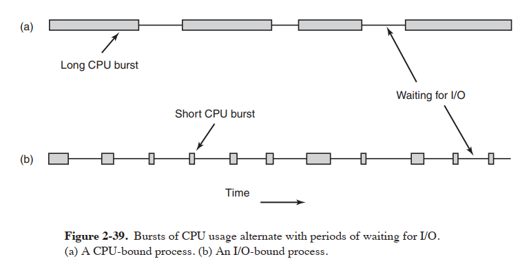

# Modern Operating Systems
### 2.2.4 Implementing Threads in User Space
线程的实现两个主要的空间为：用户空间和内核，或者混合实现。

线程在 run-time system 上运行。run-time system 是管理线程的子程序的集合。比如，pthread\_create,
pthread\_exit, pthread\_join and pthread\_yield.
当在用户空间管理线程时，每个进程需要有它私有的线程表(thread table)，用于管理该进程下的线程。
比如每个线程的 program counter, stack pointer, registers, state...。run-time system管理线程表


在用户空间实现线程的优点：
1，可以在不支持线程的操作系统上实现线程，比如通过 library 实现。
2, 线程调度非常快，因为不需要 trap into the kernel，不需要切换上下文，内存缓存不需要刷新。

在用户空间实现线程的缺点：
1, 当一个线程调用系统调用时 blocking，会导致所有线程 blocking。所以要额外实现针对线程的系统调用，使之当一个线程 blocking 时，不会影响到其他线程。但这并不容易实现。
2, 在进程内，由于没有时钟中断(clock interrupt)，所以无法通过 round-robin 的方式去调度线程。当前线程一直运行，除非自愿进入 run-time system，否则别的线程只能等待。

在内核实现线程的优点：
1， 无需额外实现针对线程的系统调用，当一个线程 blocking 时，内核可以选择一个 ready 的线程。但是在用户空间，线程对内核是不可见的，在 CPU 时间里完全交给进程控制。


在内核实现线程的缺点：
1, 开销大，切换线程时，需要切换上下文。

### 2.3.2 Critical Regions
一个好的解决 critical regions 的方法需要有一下要求：
1， 不能存在两个进程同时出于他们的 critical regions
2， 不能对速度和cpu时间作假设
3， 进程不处于它的 critical regions时，不会 block 其他进程 
4， 进程不需要永远等待进入 critical regions

### 2.3.3 Mutaul Exclusion with Busy Waiting
#### Disabling Interrupts
进程进入 critical region 时关闭所有中断，会使得 crutical exclusion。但也会导致该进程一直占用CPU，直到它恢复中断。关闭中断通常对于操作系统很有作用，但很少用在用户空间。

#### Strict Alternation
```c
a:
while(TRUE)
{
    while(turn != 0)；// loop
    critical_region();
    turn = 1;
    noncritical_region();
}

b:
while(TRUE)
{
    while(turn != 1)；// loop
    critical_region();
    turn = 0;
    noncritical_region();
}
``````
  整数 turn 初始化为0。首先线程 a/b 发现 turn 为0。线程 a 进入临界区，而线程 b 则循环等待，直到 turn 为 1。持续地检查一个变量，直到一个值出现被称为 **busy waiting**。这种情况应该尽量避免，因为它浪费了 CPU 时间。只有当一个短暂的合适的等待才会使用 **busy waiting**。使用 **busy waiting**的锁称为 **spin lock**。
 当线程 a 离开它的临界区，将 turn 置为 1，此时线程 b 得以进入它的临界区。假如线程 b 很快就离开它的临界区，并将 turn 置为0，此时线程 a/b 都处于它们的非临界区。假如线程 a 的非临界区很短，它很快又开始一轮循环，并将 turn 置为1。假设线程 b 非临界区很长，此时线程 a 又开始一轮循环，此时 turn 为1，所以线程 a 会陷入 **busy waiting**，必须等待线程 b 进入新的循环后将 turn 置为0.这种方式需要严格交替，不适用于当一个线程比另一个线程慢很多。并且这种方式违反了一个好的解决 critical regions 的方法的条件 3.

#### Peterson’s Solution
```c
#define FALSE 0
#define TRUE 1
#define N 2 /* number of processes */
int turn; /* whose turn is it? */
int interested[N]; /* all values initially 0 (FALSE) */
void enter_region(int process); /* process is 0 or 1 */
{
    int other; /* number of the other process */
    other = 1 - process; /* the opposite of process */
    interested[process] = TRUE; /* show that you are interested */
    turn = process; /* set flag */
    while (turn == process && interested[other] == TRUE) /* null statement */ ;
}
void leave_region(int process) /* process: who is leaving */
{
    interested[process] = FALSE; /* indicate departure from critical region */
}
```
这是一个纯软件实现的解决方法。

#### The TSL Instruction
现在许多计算机，尤其是有多处理器的计算机，通常会提供一个指令，如 **TSL**(Test and Set Lock):
TSL RX, LOCK 
这个指令，读取 lock 的内容到寄存器 RX 中，然后设置一个非零值在内存地址为 lock 上。这个指令保证原子性，期间其他处理器不可以访问这个地址，直到指令完成。CPU 执行 **TSL** 指令锁住内存总线防止其他 CPU 访问，直到指令完成为止。
注意！**TSL** 指令锁住内存总线和关闭中断有所区别。处理器 1 关闭中断后不能阻止处理器 2 去读写该内存。
为了使用 **TSL** 指令，需要借助一个共享变量 lock。当 lock 为 0 时，任何处理器都可以使用 **TSL** 将其置为 1，然后读写共享内存。当它处理完以后，处理器通过一个普通的 **move** 指令将其还原为 0。
如下方法可以阻止两个进程同时进入临界区。第一个指令复制 lock 的值到 REGISTER，并将 lock 设为 1.第二个指令将 REGISTER 与 0 对比，如果不相等，则说明 lock 已经被设置了，所以程序要跳转到最开始再测试一遍。当进程离开临界区时，则释放 lock 就行了，只需要普通的指令 **move** 将其设为 0。为了阻止两个进程同时进入临界区，处理器只需要在进入临界区之前调用 enter_region，在离开临界区时调用 leave_region 即可。这个方法需要处理器用正确的方式调用，如果有一个进程不正确调用，这个方法就会失效。
```c
enter_region:
TSL REGISTER,LOCK | copy lock to register and set lock to 1
CMP REGISTER,#0 | was lock zero?
JNE enter_region | if it was not zero, lock was set, so loop
RET | return to caller; critical region entered
leave_region:
MOVE LOCK,#0 | store a 0 in lock
RET | retur n to caller
```

另一个可以代替 **TSL** 指令是 **XCHG**，这个指令交换两个位置的内容，比如寄存器和内存。这个指令使用方法本质上和 **TSL** 相同。All Intel x86 CPUs use XCHG instruction for low-level synchronization。
```c
enter_region:
MOVE REGISTER,#1 | put a 1 in the register
XCHG REGISTER,LOCK | swap the contents of the register and lock variable
CMP REGISTER,#0 | was lock zero?
JNE enter region | if it was non zero, lock was set, so loop
RET | return to caller; critical region entered
leave_region:
MOVE LOCK,#0 | store a 0 in lock
RET | retur n to caller
```

### 2.3.4 Sleep and Wakeup
使用 Peterson’s Solution 和指令 **TSL**， **XCHG**都可以解决临界区的问题。但是这些解决办法都有个缺陷，就是需要 **busy waiting**。本质上来说，这些方法都做了这些工作：当进程想进入临界区时，它先是否能进入临界区，如果不行就循环等待，直到可以为止。
这些方法不仅浪费 CPU 时间，有时候还会导致意想不到的影响。假如 CPU 中有两个进程，H 具有高优先级，L 具有低优先级。调度规则是当 H 可以调用时永远优先调用 H。当某个时刻，L 在它的临界区内，此时 H 可以被调用(I/O操作完成)。H 开始  **busy waiting**，但是 L 永远不会被调度，因为 H 的优先级高，所以 L 没有机会离开临界区，H 则无限循环。这种情况有时候被称为 **priority inversion problem**

#### The Producer-Consumer Problem
生产者-消费者问题，又称为有界缓冲区问题。两个进程共享一个固定大小的缓冲区。其中一个是生产者，负责填充缓冲区，另一个是消费者，负责消耗缓冲区。问题出现在，当生产者想将新的 item 放进缓冲区时，发现缓冲区满了，于是生产者进入睡眠状态，直到消费者取出 item 并唤醒它。同样地，当消费者想取出 item 时，却发现缓冲区为空，于是消费者进入睡眠状态，直到生产者放入 item 并唤醒它。这会导致竞争。
使用 count 记录缓冲区有多少 item。如果缓冲区最大 item 数为 N，生产者首先检查是否 count 为 N，如果是，则进入睡眠，否则放入 item 并增加 count。
消费者同样地，首先检查是否 count 为 0，如果是，则进入睡眠，否则取出 item 并减少 count。生产者和消费者都检查是否可以唤醒对方，如果可以则唤醒对方。
当缓冲区为空时，消费者读取 count 后刚判断它是否为 0，调度器选择运行生产者。生产者放入一个 item 后发现此时 count 为 1后发送唤醒信号。而消费者此时判断 count 为 0，准备进入睡眠状态。问题出现在当唤醒信号发出时，处理器运行的不是消费者，所以这个信号相当于丢失了。当调度器调度消费者时，它判断 count 为 0，进入睡眠状态。于是调度器调度生产者，生产者不断放入 item，直至缓冲区满了，它也进入睡眠状态。此时生产者、消费者都处于睡眠状态。
一个快速解决的办法是引入 **wakeup waiting bit**，当一个唤醒信号发送给一个未睡眠的进程时，wakeup waiting bit 被设置。晚一点，当这个进程准备睡眠时，发现 wakeup waiting bit 被设置了，则取消 wakeup waiting bit，但该进程不进入睡眠了。但当我们有多个进程时，就要引入多个 **wakeup waiting bit**，本质上来说问题还是存在的。
```c
#define N 100 /* number of slots in the buffer */
int count = 0; /* number of items in the buffer */
void producer(void)
{
    int item;
    while (TRUE) { /* repeat forever */
        item = produce_item( ); /* generate next item */
        if (count == N) sleep( ); /* if buffer is full, go to sleep */
        insert_item(item); /* put item in buffer */
        count = count + 1; /* increment count of items in buffer */
        if (count == 1) wakeup(consumer); /* was buffer empty? */
    }
}
void consumer(void)
{
    int item;
    while (TRUE) { /* repeat forever */
        if (count == 0) sleep( ); /* if buffer is empty, got to sleep */
        item = remove_item( ); /* take item out of buffer */
        count = count ? 1; /* decrement count of items in buffer */
        if (count == N ? 1) wakeup(producer); /* was buffer full? */
        consume_item(item); /* pr int item */
    }
}
```

### 2.3.5 Semaphores
采用一种新的变量类型 **semaphore** 去记录唤醒信号，如果值为 0 则表示没有信号被记录，如果为负数则表示有一个或多个信号被记录。通常有两种操作作用于 **semaphore**,分别是 **up** 和 **down** 操作。**down** 操作作用于 **semaphore**，如果值大于 0，它则减少值，然后继续(即不睡眠)。如果值为 0 则进程进入睡眠，但 **down**操作此时还不算全部完成，检查值，改变值，睡眠这些操作都是原子操作。
**up** 操作增加 **semaphore** 的值。如果有一个或多个进程因为 **semaphore** 而出于睡眠状态，系统则从中选出一个，使其完成之前未完成的 **down** 操作。所以在 **up** 操作于一个有进程睡眠的 **semaphore** 后，该值仍为 0，但睡眠的进程减少了。

#### Solving the Producer-Consumer Problem Using Semaphores
通过使用 **semaphore** 可以解决上面唤醒信号丢失的问题。**up** 和 **down** 操作通常实现为系统调用，当检查值、改变值、使进程休眠时操作系统只需要简单的关闭所有中断，因为这些操作都是使用很少的指令就可以完成，不会造成什么影响。如果在多核的情况下，就需要借助 **TSL** 和 **XCHG** 指令去保证同一时间只有一个 CPU 能访问 **semaphore**。

```c
#define N 100 /* number of slots in the buffer */
typedef int semaphore; /* semaphores are a special kind of int */
semaphore mutex = 1; /* controls access to critical region */
semaphore empty = N; /* counts empty buffer slots */
semaphore full = 0; /* counts full buffer slots */
void producer(void)
{
    int item;
    while (TRUE) { /* TRUE is the constant 1 */
        item = produce_item( ); /* generate something to put in buffer */
        down(&empty); /* decrement empty count */
        down(&mutex); /* enter critical region */
        insert_item(item); /* put new item in buffer */
        up(&mutex); /* leave critical region */
        up(&full); /* increment count of full slots */
    }
}
void consumer(void)
{
    int item;
    while (TRUE) { /* infinite loop */
        down(&full); /* decrement full count */
        down(&mutex); /* enter critical region */
        item = remove_item( ); /* take item from buffer */
        up(&mutex); /* leave critical region */
        up(&empty); /* increment count of empty slots */
        consume_item(item); /* do something with the item */
    }
}
```
full 记录有多少槽有 item。empty 记录有多少空的槽。使用 mutex 确保生产者、消费者不会同一时间访问槽。**semaphore** 初始化为 1 用来保证多个进程在某个时刻只能有一个进程进入临界区，这称为 **binary semaphore**。

### 2.3.6 Mutexes
**mutex** 是一种共享变量，它只能处于两种状态：unlocked or locked。当值为 0 时为 unlocked，其他值时为 locked。由于 **mutex** 比较简单，它可以在提供 **TSL** 指令的用户空间实现。
```c
mutex_lock:
    TSL REGISTER,MUTEX | copy mutex to register and set mutex to 1
    CMP REGISTER,#0 | was mutex zero?
    JZE ok | if it was zero, mutex was unlocked, so return
    CALL thread_yield | mutex is busy; schedule another thread
    JMP mutex_lock | tr y again
    ok: RET | return to caller; critical region entered
mutex_unlock:
    MOVE MUTEX,#0 | store a 0 in mutex
    RET | return to caller
```
mutex\_lock 和 enter\_region的实现有个关键的地方不同。enter\_region 会进入 **busy waiting**，直到时间片用完或者其他进程被调度。但在用户空间又有些不同，因为线程没有 clock 会导致它停止。这会导致线程一直在 **busy waiting** 而又拿不到锁，因为其他线程没有机会运行并释放锁。
mutex\_lock 不同于 enter\_region 是当 mutex\_lock  请求锁失败后，它会调用 thread\_yield 放弃 CPU 给其他线程。作为一个结论，无论时 mutex\_lock 或者 mutex\_unlock 都不需要任何系统调用，效率高。user-level 的线程可以使用它们在用户空间实现同步。
但进程比较微妙，因为线程是共享一个进程空间地址的，线程可以访问同一个 mutex 。如果进程空间地址不相交，怎么才能做到共享同一个 mutex 或者 semaphore 呢？
一般有两种方法。第一种，将一些需要共享的数据，比如 semaphore 存储在内核空间，然后通过系统调用去访问。第二种，大多数现代操作系统(Windows and Unix)提供一个方法给进程，让其将进程的一部分空间地址分享给其他进程。


#### Futexes
随着越来越多的并发编程，同步和锁的效率对于性能十分重要。**spin lock** 如果等待时间短就快，反之则会浪费 CPU 时间。如果存在很多竞争，通过 block 进程和在 lock 释放时通知内核 unblock 进程会提高效率。这需要频繁的切换到内核，当竞争激烈时它很有效，但竞争不激烈时切换到内核的代价就很昂贵了。
一个解决的办法是使用 **futex(fast user space mutex)**。**futex** 是 linux 实现的一种基础锁（像 mutex）除非很必要否则避免切换到内核。**futex** 由两部分组成：kernel service and user library。kernel sevice 提供一个 "wait queue" 给进程等待一个 lock。这些进程不会运行，除非 kernel unblocked 进程。应该避免将一个进程放入 "wait queue"，因为这需要调用一个系统调用（切换到内核开销大）。所以在**竞争不激烈**的情况下，**futex** 完全运行在用户空间。特别地，进程之间共享一个 lock variable--一个 32-bit 整数。假设这个 lock 初始化为 1，表示 lock is free。进程通过原子操作 "decrement and test" 获取这个 lock。然后检查这个 lock 是否可获取。如果这个 lock 可以获取，则这个进程拿到这个 lock。但如果这个 lock 早被其他进程获取，那么当前进程需要进 "wait queue"。在这个情况下，**futex library** 不使用 **busy waiting**，而是使用系统调用将进程放入内核的 "wait queue"。因为进程无论如何都是要被 blocked 的，所以这里的开销是合适的。当一个进程不需要 lock 时，它释放 lock 并且执行原子操作 "decrement and test"，然后检查 lock variable，看看是否还有其他进程 blocked 在内核的 "wait queue"。如果有，它就会通知内核去 unblock 进程。如果此时没有竞争，则不会被涉及内核。

#### Mutexes in Pthreads
Pthread 提供了一些函数用于同步线程。

| Thread_call          | Description               |
|-----------------------|---------------------------|
| pthread_mutex_init    | Create a mutex            |
| pthread_mutex_destroy | Destroy an existing mutex |
| pthread_mutex_lock    | Acquire a lock or block   |
| pthread_mutex_trylock | Acquire a lock or fail    |
| pthread_mutex_unlock  | Release a lock            |


| Thread_call            | Description                                  |
|------------------------|----------------------------------------------|
| pthread_cond_init      | Create a condition variable                  |
| pthread_cond_destroy   | Destroy an condition variable                |
| pthread_cond_wait      | Block waiting for a signal                   |
| pthread_cond_signal    | Signal another thread and wake it up         |
| pthread_cond_broadcast | Signal multiple threads and wake all of them |

### 2.3.7 Monitors

### 2.3.8 Message Passing
进程间通信的方法是通过两个原语，send 和 receive。

#### Design Issues for Message-Passing Systems
Message-Passing system 有着许多问题和设计要求是 semaphore 和 monitor 没有的。
尤其是通信的进程处于通过网络连接的不同机器。比如，messages 可能在网络中丢失。
为了不丢失 messages，发送者和接收者应协商，一旦 message 被接收，发送者应返回一个
特别的 **acknowledgement** message。如果发送者一定时间内没接收到这个 acknowledgement，
那么它就要从新发送 message。

如果 message 被正确接收，但返回给发送者的 acknowledgement 丢失了。这时发送者会再次发送 message，
所以接收者会接收到两次相同的 message。这表明接收者要有区分 message 和 重发送的 message 的能力。
这个问题一般同过将一个连续的序号放入每个 message 中。如果接收到两个相同序号的 message，说明重复发送了，
此时就可以丢弃重复的 message。

Message system 还要处理进程命名的问题，如何区分不同的进程。验证方式也是 Message system 的一个问题：
客户端怎么知道它正在通信的是一个真正的服务器，而不是一个假冒的。

还有许多重要的问题，如果发送者和接收者在同一机器。性能怎么提升。从一个进程复制 message 到另一个进程总是比使用 semaphore operation 和 进入 monitor 慢。

#### The Producer-Consumer Problem with Message Passing
如何通过非共享内存和 message passing 解决 producer-consumer problem。
假设所有 message 的大小都一样，所有发送且未被接收的 message 自动地被操作系统缓存。
一种解决方法如下代码所示。如同共享内存缓冲区 N 个 slot 一样，N 个 message 被使用。
consumer 一开始发送 N 个 empty message 到 producer。无论何时，当 producer 有一个 item 发送给 consumer，
它将取出一个 empty message 然后返回一个 full message。In this way, the total number of messages in the system remains constant in time,
so they can be stored in a given amount of memory known in advance.

如果 producer 工作地比 consumer 快，所有的 message 都为 full，然后等待 consumer 消耗，这时 producer 就会被阻塞，等待 empty message。


Many variants are possible with message passing. For starters, let us look at how messages are addressed. One way is to assign each process
a unique address and have message be addressed to processes. A different way is to invent a new
data structure, called a **mailbox**. A mailbox is a place to buffer a certain number of messages, typically specified when 
the mailbox is created. When mailboxes are used, the address parameters in the 
send and receive calls are mailboxes, not processes. When a process tries to send to a mailbox that is full, it is suspended until a 
message is removed from that mailbox, making room for a new one.

For the producer-consumer problem, both the produce and consumer would create mailboxes large enough to hold N messages.
The producer would send messages containing actual data to the consumer's mailbox, and the consumer would send empty 
message to the producer's mailbox. When mailboxes are used, the buffering mechanism is clear: the destination mailbox holds
messages that have been sent to the destination process but hav not yet been accepted.
```c
#define N 100   // number of slots in the buffer

void producer(void)
{
    int item;
    message m;  // message buffer
    while(TRUE)
    {
        item = produce_item();      // generate something to pu in buffer
        receive(consumer, &m);      // wait for an empty to arrive
        build_messagek(&m, item);   // construct a message to send
        send(consumer, &m);         // send item to consumer
    }
}

void consumer(void)
{
    int item, i;
    message m;  // message buffer
    for(i = 0; i < N; i++)
    {
        send(producer, &m); // send N empties
    }

    while(TRUE)
    {
        receive(producer, &m);      // get message containing item
        item = extract_item(&m);    // extract item from message
        send(producer, &m);         // send back empty reply
        consume_item(item);         // do something with the item
    }
}

```


## 2.4 SCHEDULING
### Process Behavior
如图 2-39 所示，Nearly all processes alternate bursts of computing with (disk or network) I/O requests。通常是 CPU 不停地运行一段时间，然后一个系统调用发起读写文件的请求。当读写请求完成时，CPU 就继续运行直到它需要更多数据或写入更多数据。注意，有些 I/O activites 视为 computing。比如当 CPU 复制 bits 到 video RAM 去更新显示时，这是 computing 而不是 I/O，因为 CPU 被使用。I/O 是程序进入阻塞状态去等待外部设备完成工作。



如图 2-39（a），花费大部分时间在 computing 的情况称为 compute-bound。如图 2-39（b），花费大部分时间在等待 I/O 的情况称为 I/O-bound。compute-bound 进程通常含有更长的 CPU bursts，和少量的 I/O 等待。关键因素在于 CPU bursts 的长度，而不是 I/O bursts 的长度。I/O-bound 进程之所以为 I/O-bound 它在两个 I/O 请求之间只需要做少量的 CPU 计算，而不是因为它有长的 I/O 请求。

值得注意的是，随着CPU的速度越来越快，进程往往会获得更多的 I/O-bound，因为 CPU 比磁盘快的多。当一个进程为 I/O-bound 时，当它想运行，应该快速让它运行，这样可以保持磁盘高占用率。

### When to Schedule
非抢占式调度算法选择一个进程运行，直至该进程阻塞（比如等待 I/O 或等待其他进程）或自愿让出 CPU。甚至它连续运行几个小时也不会被暂停。实际上在时钟中断时，没有做调度决策。在时钟中断处理完成后，又将在时钟中断前运行的进程恢复运行。

抢占式调度算法选择一个进程并让其运行一段固定的时间。如果该进程一直运行到时间结束，它将被暂停，然后调度器从新选择其他进程运行。抢占式调度需要时钟中断发在进程运行时间结束，使得 CPU 的控制权回到调度器。如果没有时钟中断，那么非抢占式调度是唯一的选择。

### Categories of Scheduling Algorithms
不同的系统调度器的优化目的不同。所以不同环境下可区分为：
1. Batch
2. Interactive
3. Real Time

Batch system 仍然广泛应用在商业世界，用于工资账单、库存、应收账款、应付账款、利息计算（银行）、索赔处理（保险公司）以及其他周期性服务。在 Batch system 中，没有用户会不耐烦地要求终端快速响应。结论是，无论是抢占式算法还是非抢占式算法，只要是有一个足够长的周期给每个进程都是可以接受的。这减少了切换进程的频率，从而提升了效率。

在一个有用户交互的环境中，抢占对于防止一个进程不合理占用 CPU 以及拒绝对其他服务至关重要。即便没有进程打算永久运行，但也可能程序出 bug 而导致其他进程无法运行。抢占可以防止这种情况。服务器也应用这种策略，因为通常会服务多个（远程）用户，所有用户都很急。

在受 real-time 限制的系统中，抢占有时是不需要的，因为进程不会运行时段不会太长，它们通常很快完成工作然后阻塞。interactive 系统和 real-time 系统的区别是，real-time 系统只运行旨在促进现有应用程序的程序。interactive 系统更为通用，可以运行任意非协作甚至是恶意的程序。

### Scheduling Algorithm Goals
为了设计一个调度算法，需要考虑一个好的算法应该做什么。有些目标依赖于环境（batch, interactive, or real time），但有些目标适用于所有情况。下面罗列了一些目标：
- All systems
	- Fairness：所有进程公平地共享 CPU
	- Policy enforcement：保证 policy 被执行
	- Balance：keeping all parts of the system busy
- Batch systems
	- Throughput：每小时最大化工作
	- Turnaround time：minimize time between submission and termination
	- CPU utilization：keep the CPU busy all the time
- Interactive systems
	- Response time：快速响应请求
	- Proportionality：满足用户的期望
- Real-time systems
	- Meeting deadlines：避免丢失数据
	- Predictability：避免多媒体系统的质量下降

在所有情况下，公平是最重要的。可比较的进程应该获取可比较的服务。给一个进程比另一个同等进程更长的 CPU 时间是不公平的。当然，不同的进程类型应该区别对待。考虑安全控制并在核反应堆的计算机中心进行工资核算。

有些与公平相关正在执行系统策略。如果本地策略是安全控制进程在它们想运行时运行，即便是工资核算要延迟 30 秒，调度器也要保证这个策略被执行。

另一个总目标是尽可能保持系统各个部分繁忙。如果一直保持 CPU 和所有 I/O 设备繁忙，每小时工作量肯定比当其中某部分空闲时多。在 batch 系统，调度器可以控制将哪些作业带入内存以运行。内存中既有 CPU-bound 进程也有 I/O bound 进程比先加载并运行所有 CPU-bound 进程，等其结束后再加载运行所有 I/O-bound 要好。如果采用后一种策略，先运行所有 CPU-bound 进程，那么硬盘就会空闲，后面再运行所有 I/O-bound 进程，CPU 就会空闲。更好的做法是小心地将进程混合起来。

运行许多批处理作业的大型计算机中心通常会查看三个指标，以查看其系统的性能如何：**throughput**，**turnaround time** 和 **CPU utilization**。throughput 是系统每小时完成作业数。每小时完成 50 次作业肯定比 40 次好。turnaround time 是从批处理作业提交到完成为止的统计平均时间。它意味着用户平均需要多长时间才能等到输出。当然是越小越好。

调度算法试图最大化 throughput 可能并不需要最小化 turnaround time。比如，给定混合短时间和长时间的作业，调度器只需总是运行短时间的作业，从不运行长时间的作业可能会达到很好的 throughput（每小时完成许多短作业），但是对于长作业而言，turnaround time 会很烂。如果短作业保持稳定的增长速度，长作业可能永远不会运行，从而使 turnaround time 时间无限长，但实现了高 throughput。


