# TCP/IP协议 读书笔记

## chapter 1 概述
### 1.4 地址划分

### 1.5 域名系统
在 T C P / I P领域中，域名系统（ D N S）是一个分布的数据库，由它来提供 I P地址和
主机名之间的映射信息。

任何应用程序都可以调用一个标准的库函数来查看给定名字的主机 的I P地址。类似地，系统还提供一个逆函数—给定主机的I P地址，查看它所对应的主机名。

### 1.6 封装
当应用程序用 T C P传送数据时，数据被送入协议栈中，然后逐个通过每一层直到被当作
一串比特流送入网络。其中每一层对收到的数据都要增加一些首部信息（有时还要增加尾部信息）。
T C P传给I P的数据单元称作 T C P报文段或简称为 T C P段（TCP segment）。I P传给网络接口层的数据单元称作 I P数据报(IP datagram)。通过以太网传输的比特流称作帧(Frame)。

以太网数据帧的物理特性是其长度必须在 4 6～1 5 0 0字节之间。

### 1.7 分用
当目的主机收到一个以太网数据帧时，数据就开始从协议栈中由底向上升，同时去掉各
层协议加上的报文首部。每层协议盒都要去检查报文首部中的协议标识，以确定接收数据的
上层协议。这个过程称作分用（Demultiplexing）

### 1.9 端口
T C P和U D P采用16 bit的端口号来识别应用程序。

服务器一般都是通过知名端口号来识别的。例如，对于每个 T C P / I P实现来说，F T P服务
器的T C P端口号都是2 1，每个Telnet服务器的T C P端口号都是23，每个TFTP (简单文件传送协议)服务器的U D P端口号都是69。任何T C P / I P实现所提供的服务都用知名的 1～1023之间的端口号。这些知名端口号由Internet号分配机构（Internet Assigned Numbers Authority, IANA）来管理。

客户端通常对它所使用的端口号并不关心，只需保证该端口号在本机上是唯一的就可以
了。客户端口号又称作临时端口号（即存在时间很短暂）。这是因为它通常只是在用户运行该客户程序时才存在，而服务器则只要主机开着的，其服务就运行。

大多数T C P / I P实现给临时端口分配 1024～5000之间的端口号。大于 5000的端口号是为其他服务器预留的（Internet上并不常用的服务)

### 1.16 网络测试 图 1-11

## chapter 2 链路层
在T C P / I P协议族中，链路层主要有三个目的：（1）为I P模块发送和接收I P数据报；（2）为ARP模块发送ARP请求和接收ARP应答；（3）为RARP发送RARP请求和接收RARP应答。

### 2.2 以太网和IEEE 802封装

802.3标准定义的帧和以太网的帧都有最小长度要求。802.3规定数据部分必须至少为 38字
节，而对于以太网，则要求最少要有46字节。为了保证这一点，必须在不足的空间插入填充
（pad）字节。以太网帧使用2字节的类型字段来标识上层协议：如0x800为IP数据报，0x806为ARP请求或应答报文，0x835为RARP请求或应答报文。

### 2.7 环回接口
大多数的产品都支持环回接口（ Loopback Interface），以允许运行在同一台主机上的客户
程序和服务器程序通过 T C P / I P进行通信。A类网络号127就是为环回接口预留的。根据惯例，
大多数系统把I P地址127.0.0.1分配给这个接口，并命名为 localhost。一个传给环回接口的 I P数据报不能在任何网络上出现。

1) 传给环回地址（一般是127.0.0.1）的任何数据均作为I P输入。
2) 传给广播地址或多播地址的数据报复制一份传给环回接口，然后送到以太网上。这是因为广播传送和多播传送的定义包含主机本身。
3) 任何传给该主机I P地址的数据均送到环回接口。

### 2.8 最大传输单元MTU
正如在图2-1看到的那样，以太网和802.3对数据帧的长度都有一个限制，其最大值分别是1500和1492字节。链路层的这个特性称作MTU，最大传输单元。不同类型的网络大多数都有一个上限。

如果 I P层有一个数据报要传，而且数据的长度比链路层的 MTU还大，那么 I P层就需要进行分片（fragmentation），把数据报分成若干片，这样每一片都小于 MTU。

### 2.9 路径MTU
当在同一个网络上的两台主机互相进行通信时，该网络的 MTU是非常重要的。但是如果两台主机之间的通信要通过多个网络，那么每个网络的链路层就可能有不同的 MTU。重要的不是两台主机所在网络的 MTU的值，重要的是两台通信主机路径中的最小 MTU。它被称作路径MTU。

## chapter 3 IP: 网际协议
### 3.1 引言
IP提供不可靠、无连接的数据报传送服务。
不可靠(unreliale): 它不保证IP数据报能成功到达目的地。IP仅提供最好的服务。可靠性应该由上层提供(如TCP)。如果发生某种错误时，如某个路由器暂时用完了缓冲区， IP有一个简单的错误
处理算法：丢弃该数据报，然后发送ICMP消息报给信源端。任何要求的可靠性必须由上层来
提供（如TCP）。
无连接(connectionless): IP并不维护任何关于后续数据报的状态信息。每个数据报的处理都是相互独立的。这也说明IP数据报可以不按发送顺序接收。如果一信源向相同的信宿发送两个连续的数据报（先是 A，然后是B），每个数据报都是独立地进行路由选择，可能选择不同的路线，因此 B可能在A到达之前先到达。

### 3.2 IP首部
IP数据报的格式如下图所示。普通的IP首部长为20个字节，除非含有选项字段。

4位版本号指定IP协议的版本，对于IPv4来说，其值是4

4位头部长度标识该IP头部有多少个32bit字(4字节)。因为4位最大能表示15,所以IP头部最长是60字节

8位服务类型(Type of Service, TOS)包括一个3位的优先权字段（现已忽略），4位的TOS字段和1位保留字（必须置0）。4位的TOS字段分别表示：最小延时，最大吞吐量，最高可靠性和最小费用。其中最多有一个能置1

16位总长度(total length)是指整个IP报的长度，以字节位单位，因此IP数据报的最大长度为65 535(2^16  - 1)字节。尽管以太网的最小帧长为 4 6字节（见图 2 - 1），但是I P数据可能会更短。如果没有总长度字段，那么I P层就不知道4 6字节中有多少是I P数据报的内容

16位标识(identification)唯一地标识主机发送的每一个数据报。其初值由系统随机生成，每发送一个数据报，其值加1.该值在数据报分片时被复制到每个分片中，因此同一个数据报的所有分片都具有相同的标识值

3位标志的第一位保留。第二位(Don't Fragment, DF)表示“禁止分片”。如果设置了这个位，IP模块将不对数据报进行分片。这种情况下，如果IP数据报长度超过MTU的话，IP模块将丢弃该数据报并返回一个ICMP差错报文。
第三位(More Fragment, MF)表示“更多分片”。除了数据报的最后一个分片外，其他分片都要把它置1

13位分片偏移(fragmentation offset)是分片相对原始IP数据报开始处(仅指数据部分)的偏移。实际的偏移值是该值左移3位(乘8)后得到的。由于这个原因，除了最后一个IP分片外，每个IP分片的数据部分的长度必须是8的整数倍

8位生存时间(Time To Live, TTL)是数据报到达目的地之前允许经过的路由器跳数。TTL值被发送端设置(常见的值是64)。数据报在转发过程中每经过一个路由，该值就被路由器减1.当TTL值减为0时，路由器将丢弃数据报，并向源端发送一个ICMP差错报文。TTL值可以防止数据报陷入路由循环

8位协议用来区分上层协议，/etc/protocols 文件定义了所有上层协议对应的protocol字段的数值。其中，ICMP是1, TCP是6，UDP是17

16位头部校验和(header checksum)由发送端填充，接收端对其使用CRC算法以检验IP数据报头部(注意，仅检验头部)在传输过程中是否损坏

32位源端IP地址和目的端IP地址用来标识数据报的发送端和接收端

IPv4最后一个选项字段(option)是可变长的可选信息。这部分最多包含40字节，因为IP头部最长是60字节（其中包含了20字节的固定部分）。可用的IP选项包括：
- 记录路由(record route)，告诉数据报途径的所有路由器都将自己的IP地址填入IP头部的选项部分，这样我们就可以跟踪数据报的传递路径
- 时间戳(timestamp)，告诉每个路由器都将数据报被转发的时间（或时间与IP地址对）填入IP头部选项部分，这样就可以测量途经路由之间数据报传输的时间
- 松散路由选择(loose source routing)，指定一个路由器IP地址列表，数据报发送过程中必须经过其中的所有路由器
- 严格路由选择(strict source routing)，和松散路由选择类似，不过数据报只能经过被指定的路由器

### 3.3 IP路由选择
如果目的主机与源主机直接相连（如点对点链路）或都在一个共享网络上（以太网或令牌环网），那么I P数据报就直接送到目的主机上。否则，主机把数据报发往一默认的路由器上，由路由器来转发该数据报。

在一般的体制中，IP可以从TCP、UDP、ICMP和IGMP接收数据报（即在本地生成的数据报）并进行发送，或者从一个网络接口接收数据报（待转发的数据报）并进行发送。 I P层在内存中有一个路由表。当收到一份数据报并进行发送时，它都要对该表搜索一次。当数据报来自某个网络接口时，I P首先检查目的I P地址是否为本机的I P地址之一或者I P广播地址。如果确实是这样，数据报就被送到由 I P首部协议字段所指定的协议模块进行处理。如果数据报的目的不是这些地址，那么（ 1）如果I P层被设置为路由器的功能，那么就对数据报进行转发（也就是说，像下面对待发出的数据报一样处理）；否则（ 2）数据报被丢弃。

路由表中的每一项都包含下面这些信息：
- 目的I P地址。它既可以是一个完整的主机地址，也可以是一个网络地址，由该表目中的标志字段来指定（如下所述）。主机地址有一个非0的主机号（见图1 - 5），以指定某一特定的主机，而网络地址中的主机号为0，以指定网络中的所有主机（如以太网，令牌环网）。
- 下一站（或下一跳）路由器（ next-hop router）的I P地址，或者有直接连接的网络 I P地址。下一站路由器是指一个在直接相连网络上的路由器，通过它可以转发数据报。下一站路由器不是最终的目的，但是它可以把传送给它的数据报转发到最终目的。
- 标志。其中一个标志指明目的 I P地址是网络地址还是主机地址，另一个标志指明下一站路由器是否为真正的下一站路由器，还是一个直接相连的接口
- 为数据报的传输指定一个网络接口

I P路由选择主要完成以下这些功能：
1) 搜索路由表，寻找能与目的 I P地址完全匹配的表目（网络号和主机号都要匹配）。如果
找到，则把报文发送给该表目指定的下一站路由器或直接连接的网络接口（取决于标
志字段的值）。
2) 搜索路由表，寻找能与目的网络号相匹配的表目。如果找到，则把报文发送给该表目
指定的下一站路由器或直接连接的网络接口（取决于标志字段的值）。目的网络上的所
有主机都可以通过这个表目来处置。例如，一个以太网上的所有主机都是通过这种表
目进行寻径的。
3) 搜索路由表，寻找标为“默认（default）”的表目。如果找到，则把报文发送给该表目
指定的下一站路由器。

如果上面这些步骤都没有成功，那么该数据报就不能被传送。如果不能传送的数据报来自本机，那么一般会向生成数据报的应用程序返回一个“主机不可达”或“网络不可达”的错误。

完整主机地址匹配在网络号匹配之前执行。只有当它们都失败后才选择默认路由。默认路由，以及下一站路由器发送的 I C M P间接报文（如果我们为数据报选择了错误的默认路由）

## chapter 4 ARP：地址解析协议
当一台主机把以太网数据帧发送到位于同一局域网上的另一台主机时，是根据 48 bit的以
太网地址来确定目的接口的。设备驱动程序从不检查 I P数据报中的目的I P地址。

地址解析为这两种不同的地址形式提供映射： 32 bit的I P地址和数据链路层使用的任何类型的地址。

### 4.2 例子
任何时候我们敲入下面这个形式的命令：
>  ftp bsdi

都会进行以下这些步骤。这些步骤的序号如图 4-2所示
1) 应用程序FTP客户端调用函数gethostbyname(3)把主机名（bsdi）转换成32 bit的IP地址。这个函数在D N S（域名系统）中称作解析器。这个转换过程或者使用DNS，或者在较小网络中使用一个静态的主机文件（/etc/hosts）。
2) F T P客户端请求T C P用得到的I P地址建立连接。
3) T C P发送一个连接请求分段到远端的主机，即用上述 I P地址发送一份 I P数据报
4) 如果目的主机在本地网络上（如以太网、令牌环网或点对点链接的另一端），那么I P数据报可以直接送到目的主机上。如果目的主机在一个远程网络上，那么就通过 I P选路函数来确定位于本地网络上的下一站路由器地址，并让它转发 I P数据报。在这两种情况下，I P数据报都是被送到位于本地网络上的一台主机或路由器。
5) 假定是一个以太网，那么发送端主机必须把 32 bit的I P地址变换成48 bit的以太网地址。从逻辑Internet地址到对应的物理硬件地址需要进行翻译。这就是 A R P的功能。A R P本来是用于广播网络的，有许多主机或路由器连在同一个网络上。
6) A R P发送一份称作 A R P请求的以太网数据帧给以太网上的每个主机。这个过程称作广播，如图 4 - 2中的虚线所示。 A R P请求数据帧中包含目的主机的 I P地址（主机名为bsdi），其意思是“如果你是这个 I P地址的拥有者，请回答你的硬件地址。”
7) 目的主机的A R P层收到这份广播报文后，识别出这是发送端在寻问它的 I P地址，于是发送一个A R P应答。这个A R P应答包含I P地址及对应的硬件地址。
8) 收到A R P应答后，使A R P进行请求—应答交换的I P数据报现在就可以传送了。
9) 发送I P数据报到目的主机。

在A R P背后有一个基本概念，那就是网络接口有一个硬件地址（一个 48 bit的值，标识不同的以太网或令牌环网络接口）。在硬件层次上进行的数据帧交换必须有正确的接口地址。但是，TCP / IP有自己的地址：32 bit的I P地址。知道主机的I P地址并不能让内核发送一帧数据给主机。内核（如以太网驱动程序）必须知道目的端的硬件地址才能发送数据。 A R P的功能是在32 bit的I P地址和采用不同网络技术的硬件地址之间提供动态映射。

### 4.3 ARP高速缓存
A R P高效运行的关键是由于每个主机上都有一个 A R P高速缓存。这个高速缓存存放了最近Internet地址到硬件地址之间的映射记录。高速缓存中每一项的生存时间一般为 2 0分钟，起始时间从被创建时开始算起。
可以用arp(8)命令来检查ARP高速缓存。参数-a的意思是显示高速缓存中所有的内容
> arp -a

### 4.4 ARP的分组格式
在以太网上解析 I P地址时，A R P请求和应答分组的格式如图 4-3所示（A R P可以用于其他类型的网络，可以解析 I P地址以外的地址。紧跟着帧类型字段的前四个字段指定了最后四个字段的类型和长度）。

两个字节长的以太网帧类型表示后面数据的类型。对于 A R P请求或应答来说，该字段的
值为0x0806

形容词hardware(硬件)和protocol(协议)用来描述A R P分组中的各个字段。例如，一个 A R P请求分组询问协议地址（这里是 I P地址）对应的硬件地址（这里是以太网地址）。硬件类型字段表示硬件地址的类型。它的值为 1即表示以太网地址。协议类型字段表示要映射的协议地址类型。它的值为 0x0800即表示I P地址。它的值与包含 I P数据报的以太网数据帧中的类型字段的值相同，这是有意设计的（参见图 2-1）。

接下来的两个1字节的字段，硬件地址长度和协议地址长度分别指出硬件地址和协议地址的长度，以字节为单位。对于以太网上 I P地址的A R P请求或应答来说，它们的值分别为 6和4。

操作字段指出四种操作类型，它们是 A R P请求（值为1）、A R P应答（值为2）、R A R P请求（值为3）和R A R P应答（值为4）。这个字段必需的，因为 A R P请求和A R P应答的帧类型字段值是相同的。

接下来的四个字段是发送端的硬件地址（在本例中是以太网地址）、发送端的协议地址（I P地址）、目的端的硬件地址和目的端的协议地址。注意，这里有一些重复信息：在以太网的数据帧报头中和ARP请求数据帧中都有发送端的硬件地址。

对于一个A R P请求来说，除目的端硬件地址外的所有其他的字段都有填充值。当系统收到一份目的端为本机的 A R P请求报文后，它就把硬件地址填进去，然后用两个目的端地址分别替换两个发送端地址，并把操作字段置为 2，最后把它发送回去。

### 4.6 ARP代理
如果A R P请求是从一个网络的主机发往另一个网络上的主机，那么连接这两个网络的路由器就可以回答该请求，这个过程称作委托 A R P或A R P代理(Proxy ARP)。

## Chapter 10 动态选路协议
**RIP(Routing Information Protocol)**: 选路信息协议。
**OSPF**:
**BGP**:

## chapter 17 TCP 传输控制协议
### 17.2 TCP 的服务
TCP提供一种面向连接、可靠的字节流服务。

面向连接意味着两个使用 TCP 的应用在彼此交换数据之前必须先建立一个 TCP 连接。

TCP 通过一下方式提供可靠性：
1. 应用数据被分割成 TCP 认为合适发送的数据块。这和UDP 应用程序产生的数据报长度将保持不变完全不同。由 TCP 传递给 IP 的信息单位成为报文段（segment）。
2. 当 TCP 发送一个报文段后，它启动一个定时器，等待目的端确认收到这个报文段。如果不能及时收到一个确认，将重发这个报文段。
3. 当 TCP 收到发自 TCP 连接另一端的数据，它将会发送一个确认。这个确认不是立即发送，通常将推迟几分之一秒。
4. TCP 将保持它首部和数据的检验和。这是一个端到端的检验和，目的是检测数据在传输中的变化。如果收到段的检验和有差错，TCP 将丢弃这个报文段和不确认收到此报文段（希望发送端超时并重发）。
5. TCP 报文段作为 IP 数据报来传输，而 IP 数据报的到达可能会失序，因此 TCP 报文段的到达也可能会失序。如果必要，TCP 将对收到的数据进行重新排序，将收到的数据以正确的顺序交给应用层。
6. IP 数据报会发生重复，TCP 的接收端必须丢弃重复的数据报。
7. TCP 还提供流量控制。TCP 连接的每一方都有固定大小的缓冲空间。 TCP 的接收端只允许另一端发送接收端缓冲区所能容纳的数据。这将防止比较快主机导致比较慢主机的缓冲区溢出。

两个应用程序通过 TCP 交换 8 bit字节构成的字节流。TCP 不在字节流中插入标识符。这称为字节流服务（byte stream service）。

TCP 对字节流的内容不作任何解释。TCP 不知道传输的数据字节流是二进制数据，还是 ASCII 字符或者其他类型数据。对字节流的解释由 TCP 连接双方的应用层解释。

### 17.3 TCP 首部

每个 TCP 段都包含源端和目的端的端口号，用于寻找发送端和接收端的应用进程。

序号表示在这个报文段中的第一个数据字节，用来标识从 TCP 发送端向 TCP 接收端发送的数据字节流。

当建立一个新的连接时，SYN 标志变 1。序号字段包含由这个主机选择的该连接的初始序号 **ISN（Initital Sequence Number）**。该主机要发送数据的第一个字节序号为这个 **ISN** 加 1，因为 SYN 标志消耗了一个序号。

既然每个传输的字节都被计数，确认序号包含发送确认的一端所期望收到的下一序号。因此确认序号应当是上次已经成功收到的数据字节序号加 1。只要 ACK 标志为 1时确认序号字段才有效。

发送 ACK 无需任何代价，因为 32 bit的确认序号和 ACK 标志一样，总是 TCP 首部的一部分。因此，一旦一个连接建立起来，这个字段总是被设置，ACK 标志也总是被置为 1。

TCP 为应用层提供全双工服务。这意味数据能在两个方向u上独立地进行传输。因此，连接的每一端必须保持每个方向上的传输数据序号。

TCP 可以表述为一个没有选择确认或者否认的滑动窗口协议。TCP缺少选择确认是因为 TCP 首部中的确认序号表示发送方已成功接收到字节，但还不包含确认序号所指的字节。当前还无法对数据流中选定的部分进行确认。例如 1~1024 字节已成功收到，下一报文段中包含序号从 2049~3072 的字节，接收端并不能确认这个新的报文段。它所能做的是发回一个确认序号为 1025 的 ACK。它也无法对一个报文段进行否认。例如，如果收到包含 1025~2048 字节的报文段，但它的检验和错，TCP 接收端所能做的就是发送回一个确认序号为 1025 的 ACK。

首部长度给出首部中 32 bit 字的数目。需要这个值是因为任选字段的长度是可变的。这个字段占 4 bit，因此 TCP 最多有 60 字节的首部。然而，没有任选字段，正常的长度为 20 字节。

在 TCP 首部中有 6 个标志比特。它们中的多个可同时被设置为 1。他们用法分别为：
- URG：紧急指针（urgent pointer）有效。
- ACK：确认序号有效
- PSH：接收方应该尽快将这个报文段交给应用层
- RST：重建连接
- SYN：同步序号用来发起一个连接
- FIN：发送端完成发送任务

TCP 的流量控制由连接的每一端通过声明的窗口大小来提供。窗口的大小为字节数，起始于确认序号字段指明的值，这个值是接收端期望接收的字节。窗口大小是一个 16 bit 字段，因而窗口大小最大为 65535 字节。

检验和覆盖了整个的 TCP 报文段：TCP 首部和 TCP 数据。这个一个强制性的字段，一定是由发送端计算和存储，并由接收端进行验证。

只有当 URG 标志为 1时紧急指针才有效。紧急指针是一个正的偏移量，和序号字段中的值相加表示紧急数据最后一个字节的序号。

最常见的可选字段时是最长报文大小，又称为 **MSS（Maximum Segment Size）**。每个连接方通常都在通信的第一个报文段（为建立连接而设置的 SYN 标志的那个段）中指明这个选项。它指明本端所能接收的最大长度的报文段。

TCP 报文段中数据的部分是可选的。在一个连接和终止时，双方交换的报文段仅有 TCP 首部。

## chapter 18 TCP 连接的建立与终止
#### 18.2.1 tcpdump 的输出
下图显示一个 TCP 连接与终止时的 tcpdump 输出。
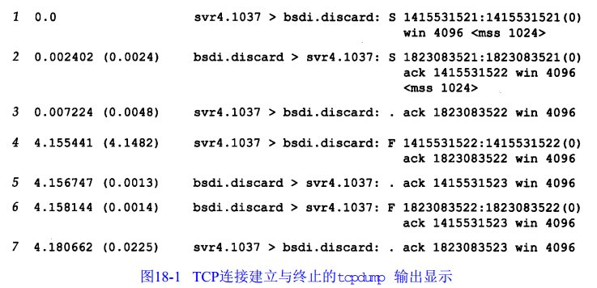

对于每个 TCP 段，每个输出行开始按如下格式显示：
源 > 目的：标志
下图显示了表示标志的五个字符含义：
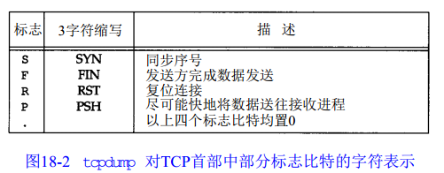

TCP 首部其他两个标志比特--ACK 和 URG--tcpdump 将作特殊显示。

在第一行中，字段 **1415531521：1415531521（0）**表示分组的序号是 1415531521，而报文段中数据字节数为 0。tcpdump 显示这个字段的格式是开始的序号、一个冒号、隐含的结尾序号及圆括号内的数据字节。

在第二行中，字段 ack 1415531522 表示确认序号。它只有在首部中的 ACK 标志比特被设置 1 时才显示。

每行显示的字段 win 4096 表示发送端通告的窗口大小。

#### 18.2.3 建立连接
为了建立一个 TCP 连接：
1. 请求端发送一个 SYN 段指明客户打算连接服务器的端口，以及初始序号（ISN）。这个 SYN 段为报文段 1。
2. 服务器发回包含服务器的初始序号的 SYN 段（报文段 2）作为应答。同时，将确认序号设置为客户的 ISN 加 1 以对客户的 SYN 段进行确认。一个 SYN 将占用一个序号。
3. 客户将确认序号设置为服务器的 ISN 加 1 以对服务器的 SYN 段进行确认（报文段 3）。

这三个报文段完成连接的建立。这个过程称为**三次握手（three-way handshake）**。

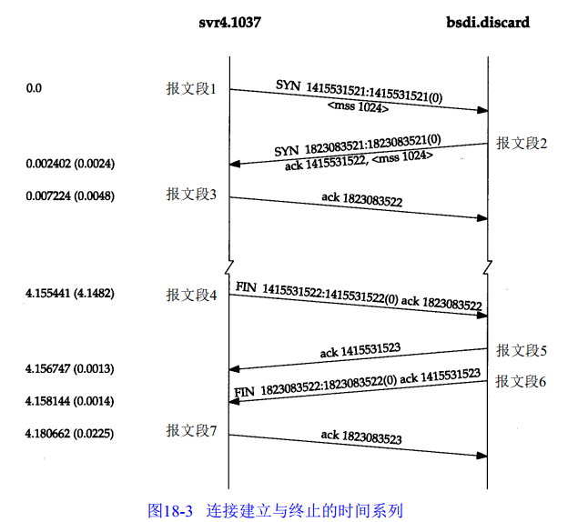

#### 18.2.4 连接终止协议
终止一个连接需要四次握手。这是由于 TCP 的半关闭造成的。既然一个 TCP 连接是全双工（即数据在两个方向上能同时传递），因此每个方向都必须单独地进行关闭。收到一个 FIN 只意味着在这一个方向上没有数据流动。

#### 18.6 TCP 的状态变迁图

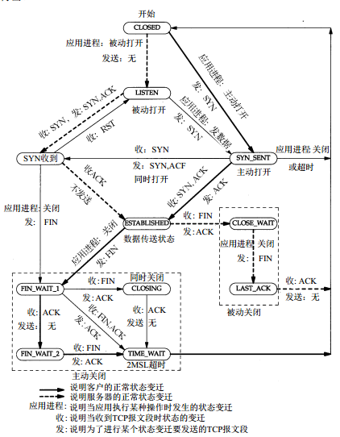

#### 18.6.1 2MSL 等待状态
TIME\_WAIT 状态也称为 2MSL 等待状态。每个具体 TCP 实现必须选择一个报文段最大生存时间 MSL(Maximum Segment Lifttime)。它是任何报文段被丢弃前在网络内的最长时间。这个时间是有限的，因为 TCP 报文段以 IP 数据报在网络内传输，而 IP 数据报则有其生存时间的 TTL 字段。

当 TCP 执行一个主动关闭，并发回最后一个 ACK，该连接必须在 TIME\_WAIT 状态停留的时间为 2 倍的 MSL。这样可以让 TCP 再次发送最后的 ACK 以防止这个 ACK 丢失（另一端超时并重发最后的 FIN）。

这种 2MSL 等待的另一个结果是这个 TCP 连接在 2MSL 等待期间，定义这个连接的 socket（客户的 IP 地址和端口号，服务器的 IP 地址和端口号） 不能再被使用。这个连接只能在 2MSL 结束后才能在被使用。

在连接处于 2MSL 等待时，任何迟到的报文段将被丢弃。因为处于 2MSL 等待的，由该 socket pair 定义的连接在这段时间内不能再被使用，因为当要建立一个有效的连接时，来自该连接的一个较早的替身的迟到报文作为新连接的一部分会被曲解（一个连接的新的实例称为该连接的替身）。

一个 socket pair(即包含本地 IP 地址、本地端口号、远端 IP 地址和远端端口号的 4 元组）在它处于 2MSL 等待时，将不能在被使用。尽管许多具体的实现中允许一个进程重新使用仍处于 2MSL 等待的端口号（通常是设置选项 SO\_REUSEADDR），但 TCP 不能允许一个新的连接建立在相同的 socket pair 上。可通过下面的试验看到：
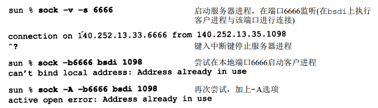
在第一次运行 sock 程序中，我们将它作为服务器程序，端口号为 6666，并从主机 bsdi 上的一个客户程序与它连接，这个客户程序使用的端口号为 1098.我们终止服务器程序，因此将它执行主动关闭。这将导致 4 元组 140.252.13.33（本地 IP 地址）、6666（本地端口号）、140.252.13.35（另一端I P地址）和 1098（另一端的端口号）在服务器主机进入 2MSL 等待。

在第二次运行 sock 程序时，我们将它作为客户程序，并试图将它的本地端口号指明为 6666，同时与主机 bsdi 在端口 1098 上进行连接。但这个程序在试图将它的本地端口号赋值为 6666 时产生一个差错，因为这个端口号是处于 2MSL 等待 4 元组的一部分。

为了避免这个差错，我们再次运行这个程序，并使用选项 -A 来设置 SO\_REUSEADDR。这将让 sock 程序能将它的本地端口号设置为 6666，但当我们试图进行主动打开时，又出现了一个差错。即使它能将它的本地端口号设置为 6666，但它仍不能和主机 bsdi 在端口 1098 上进行连接，因为定义这个连接的 socket pair 仍处于 2MSL 等待状态。

如果我们试图从其他主机来建立这个连接会如何？首先我们必须在 sun 上以 -A 标记来重新启动服务器程序，因为它需要的端口号（6666）是还处于 2MSL 等待连接的一部分。
> sun % sock -A -s 6666	   启动服务器程序，在端口 6666 监听

接着，在 2MSL 等待结束前，在 bsdi 上启动客户端程序：
> bsdi % sock -b1098 sun 6666
>connected on 140.252.13.35.1098 to 140.252.13.33.6666

不幸的是它成功了，这违反了 TCP 规范，但被大多数的伯利克版实现所支持。

#### 18.6.3 FIN_WAIT_2 状态
在 FIN_WAIT_2 状态我们已经发出了 FIN，并且另一端也已经对它进行确认。除非我们在实行半关闭，否则将等待另一端的应用层意识到它已经收到一个文件结束符，并向我们发来一个 FIN 来关闭另一方向的连接。只有当另一端的进程完成这个关闭，我们这端才会从 FIN\_WAIT_2 状态进入 TIME\_WAIT 状态。

这意味着我们这端可能永远保持这个状态。另一端也将处于 CLOSE\_WAIT 状态，并一直保持这个状态直到应用层决定进行关闭。

>许多伯克利实现采用如下方式来防止这种在 FIN_WAIT_2 状态的无限等待。如果执
行主动关闭的应用层将进行全关闭，而不是半关闭来说明它还想接收数据，就设置一
个定时器。如果这个连接空闲 10 分钟 75 秒，TCP 将进入CLOSED状态。在实现代码的注
释中确认这个实现代码违背协议的规范。

### 18.7 复位报文段
TCP 首部中的 RST 比特是用于 “复位”的，一般来说，无论何时一个报文段发往基准的连接（referenced connection）出现错误，TCP 都会发出一个复位报文段（这里提到的“基准的连接”是指由目的 IP 地址和目的端口号以及源 IP 地址和源端口号指明的连接。

#### 18.7.1 到不存在的端口的连接请求
产生复位的一种常见情况是当连接请求到达时，目的端口没有进程正在监听。对于 UDP，当一个数据报到达目的端口时，该端口没有在使用，它将产生一个 ICMP 端口不可达的信息。而 TCP 使用复位。

我们可以使用  Telnet 客户程序来指明一个目的端口没在使用的情况：
>bsdi % telnet svr4 20000          端口 20000 未使用
Trying 140.252.13.34...
telnet: Unable to connect to remote host: Connection refused

Telnet 客户程序会立即显示这个差错信息。下图显示了对应这个命令的分组交换过程。

在这个图中需要注意的值是复位报文段中的序号字段和确认序号字段。因为 ACK 比特在
到达的报文段中没有被设置为 1，复位报文段中的序号被置为 0，确认序号被置为进入的 ISN 加
上数据字节数。尽管在到达的报文段中没有真正的数据，但 SYN 比特从逻辑上占用了 1字节的
序号空间；因此，在这个例子中复位报文段中确认序号被置为 ISN 与数据长度（0)、SYN 比特
所占的1的总和。

#### 18.7.2 异常终止一个连接
正常终止一个连接的方式是一方发送 FIN。有时这也称有序释放（orderly release），因为在所有排队数据都已发送之后才发送 FIN，正常情况下没有任何数据丢失。但也有可能发送一个复位报文段而不是 FIN 来中途释放一个连接。有时称这为异常释放（abortive release）。

异常终止一个连接对应用程序来说有两个优点：
1. 丢弃任何待发数据并立即发送复位报文段
2. RST 的接收方会区分另一端执行的是异常关闭还是正常关闭。

应用程序使用的 API 必须提供产生异常关闭而不是正常关闭的处理方法。

使用 sock 程序能够观察到这种异常关闭的过程。Socket API 通过“linger on close”选项（SO\_LINGER）提供了这种异常关闭的能力。我们加上 -L 选项并将停留时间设为 0。这将导致连接关闭时进行复位而不是正常的 FIN。

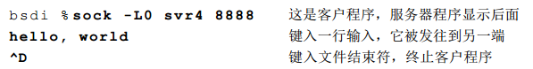

图 18-15 是这个例子的 tcpdump 输出显示。
第 1~3 行显示建立连接的正常过程。第 4 行发送我们键入的数据行（12 个字符和 Unix 换行符），第 5 行是对收到数据的确认。

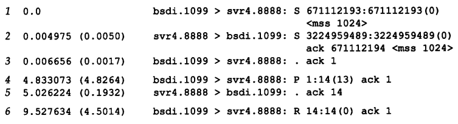

第6行对应为终止客户程序而键入的文件结束符(Control\_D）。由于我们指明使用异常关闭
而不是正常关闭（命令行中的 -L0 选项），因此主机 bsdi 端的 TCP 发送一个 RST 而不是通常的FIN。RST 报文段中包含一个序号和确认序号。需要注意的是 RST 报文段不会导致另一端产生任何响应，另一端根本不进行确认。收到 RST 的一方将终止该连接，并通知应用层连接复位。

### 18.11 TCP 服务器设计
#### 18.11.1 TCP 服务器端口号
通过观察任何一个 TCP 服务器，可以了解到 TCP 如何处理端口号。使用 netstat 命令来观察 Telnet 服务器。下面是在没有 Telnet 连接时的显示。

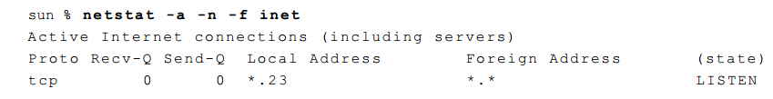

-a 标志将显示网络中所有主机端，而不仅仅是处理 ESTABLISHED 的主机端。-n 标志将以点分十进制的形式显示 IP 地址，而不是通过 DNS 将地址转换为主机名，同时还要求显示端口号（例如为 23）而不是服务器名称（如 Telnet）。-f inet 选项则仅要求显示使用 TCP 或 UDP 的主机。

显示的本地地址为 *.23。这表示传入的连接请求将被任何一个本地接口所接收。如果该主机是多接口主机，我们将定制其中的一个 IP 地址为本地 IP 地址，并且只接收来自这个接口的连接。

远端地址显示为 *.*，表示还不知道远端 IP 地址和端口号，因为该端还处于 LISTEN 状态，正等待连接请求的到达。

在主机 slip(140.252.13.65)启动一个 Telnet 客户程序来连接这个 Telnet 服务器。以下是 netstat 程序的输出：

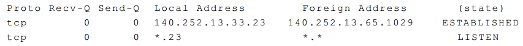

端口为 23 的第一行表示处于 ESTABLISHED 状态的连接。另外还显示了这个连接的本地 IP 地址、本地端口号、远端 IP地址和远端端口号。本地 IP 地址为该连接请求到达的接口（以太网接口，140.252.13.65）。

处于 LISTEN 状态的服务器进程仍然存在。这个服务器进程是当前 Telnet 服务器用于接收其他的连接请求。当传入的连接请求到达并被接收时，系统内核中的 TCP 模块就创建一个处于 ESTABLISHED
 状态的进程。另外，注意处于 ESTABLISHEＤ　状态的连接的端口号不会变化：也是 23，与处于 LISTEN 状态的进程相同。

现在在主机 slip 上启动另一个 Telnet 客户进程，并仍与这个 Telnet 服务器进行连接。以下是 netstat 程序的输出行：

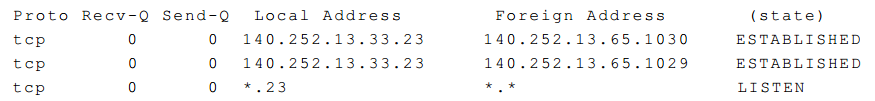

现在有两条从相同主机到相同服务器的处于 ESTABLISHED 的连接。它们的本地端口号均为 23.由于它们的远端端口号不同，这并不会造成冲突。因为每个 Telnet 客户进程要使用一个外设端口，并且这个外设端口会选择为主机（slip）当前未曾使用的端口，因此它们的端口号肯定不同。

这个例子再次重申 TCP 使用由本地地址和远端地址组成的 4 元组：目的 IP 地址、目的端口号、源 IP 地址和源端口号来处理传入的多个连接请求。TCP 仅通过目的端口号无法确定那个进程接收了一个连接请求。另外，在三个使用端口 23 的进程中，只有处于 LISTEN 的进程能够接收新的连接请求。处于 ESTABLISHED 的进程将不能接收 SYN 报文段，而处于 LISTEN 的进程将不能接收数据报。

下面从主机 solaris 上启动第三个 Telnet 客户进程，这个主机通过 SLIP 链路与主机 sun 相连，而不是以太网接口。

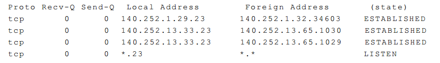

现在第一个 ESTABLISHED 连接的本地 IP 地址对应多地址主机 sun 中的 SLIP 链路接口地址（140.252.1.29）。

#### 18.11.2 限定的本地 IP 地址
看看当服务器不能任选其本地 IP 地址而必须使用特定的 IP 地址时的情况。如果我们为 sock 程序指明一个 IP 地址（或主机名），并将它作为服务器，那么该 IP 地址就成为处于 LISTEN 服务器的本地 IP 地址。例如：
> sun % sock -s 140.252.1.29 8888

使这个服务器程序的连接仅局限于来自 SLIP 接口（140.252.1.29）。netstat 的显示说明了这一点。

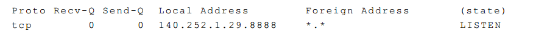

如果我们从主机 solaris 通过 SLIP 链路与这个服务器相连接，它将正常工作。

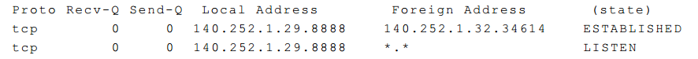

但如果我们试图从以太网（14.252.13）中的主机与这个服务器进行连接，连接请求将被 TCP 模块拒绝。如果使用 tcpdump 来观察这一切，对连接请求 SYN 的响应是一个如下图所示的 RST。

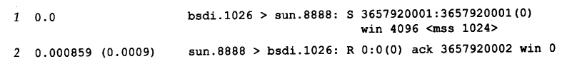

这个连接请求将不会到达服务器的应用程序，因为它根据应用程序中指定的本地 IP 地址被内核中的 TCP 模块拒绝。

#### 18.11.3 限定的远端 IP 地址
下图总结了 TCP 服务器进行连接时三种类型的地址绑定。在三种情况中，lport 是服务器的熟知端口，而 localIP 必须是一个本地接口的 IP 地址。表中行的顺序正是 TCP 模块在收到一个连接请求时确定本地地址的顺序。

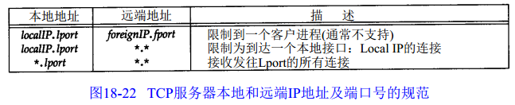

#### 18.11.4 连接请求队列
当到达多个连接请求，而服务器正处于忙时，TCP 是如何处理这些呼入的连接请求？
在伯克利的 TCP 实现中采用一下规则：
1. 正等待连接请求的一端有一个固定长度的连接队列，该队列中的连接已被 TCP 接受（即三次握手已经完成），但还没有被应用层所接受。注意区分 TCP 接受一个连接是将其放入到这个队列，而应用层接受连接是将其从该队列中移出。
2. 应用层将指明该队列的最大长度，这个值通常称作为积压值（backlog）。
3. 当一个连接请求（即 SYN）到达时，TCP 使用一个算法，根据当前连接队列中的连接数来确定是否接收这个连接。注意，积压值说明的是 TCP 监听的端点已被 TCP 接受而等待应用层接受的最大连接数。这个积压值对系统所允许的最大连接数，或者并发服务器所能处理的客户数，并无影响。
4. 如果对于新的连接请求，该 TCP 监听的端点的连接队列中还有空间，TCP 模块将对 SYN 进行确认并完成连接的建立。但应用层只有在三次握手中的第三个报文段收到后才会知道这个新连接。另外，当客户进程的主动打开成功但服务器的应用层还不知道这个新连接时，它可能会认为服务器进程已准备好接收数据了（如果发生这种情况，服务器的 TCP 仅将接收的数据放入缓冲队列）。
5. 如果对于新的连接请求，连接队列中已没有空间，TCP 将不理会收到的 SYN。也不发回任何报文段（即不发回 RST）。如果应用层不能及时接受已被 TCP 接受的连接，这些连接可能占满整个连接队列，客户的主动打开最终将超时。

当队列已满时，TCP 将不理会传入的 SYN，也不发回 RST 作为应答，因为这是一个软错误，
而不是一个硬错误。通常队列已满是由于应用程序或操作系统忙造成的，这样可防止应用程
序对传入的连接进行服务。这个条件在一个很短的时间内可以改变。但如果服务器的 TCP 以
系统复位作为响应，客户进程的主动打开将被废弃（如果服务器程序没有启动我们就会遇到）。
由于不应答 SYN，服务器程序迫使客户 TCP 随后重传 SYN，以等待连接队列有空间接受新的
连接。

## chatpter 19 TCP 的交互数据流
如果按照分组数量计算，约有一半的 TCP 报文段包含成块数据（如 FTP、电子邮件），另一半则包含交互数据（如 Telnet 和 Rlogin）。如果按字节计算，则成块数据与交互数据的比例约为 90% 和 10%。这是因为成块数据的报文段基本上都是满长度（full-size）的（通常为 512 字节的用户数据），而交互数据则小得多（Telnet 和 Rlogin 分组中通常约 90% 左右的用户数据小于 10 个字节）。

TCP 需要同时处理这两类数据，但使用的处理算法有所不同。

### 19.2 交互式输入
观察在一个 Rlogin 连接上键入一个交互命令时所产生的数据流，通常每一个交互按键都会产生一个数据分组，也就是说，每次从客户传到服务器的是一个字节的按键（而不是每次一行）。而且，Rlogin 需要远程系统（服务器）回显客户键入的字符。这样就会产生 4 个报文段：
1. 来自客户的交互按键
2. 来自服务器的按键确认
3. 来自服务器的按键回显 
4. 来自客户的按键回显确认

下图表示了这个数据流

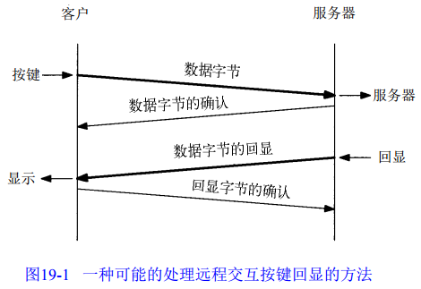

然而，一般可以将报文段 2 和 3 进行合并--按键确认与按键回显一起发送。这种合并的技术称为经受时延的确认。

图 19-2 显示的是当键入 5 个字符 date\n 时的数据流。第一行客户发送字符 d 到服务器。第二行是该字符的确认及回显（也就是经受迟延的确认）。第 3 行是回显字符的确认。第 3 行是回显字符的确认。与字符 a 有关的是第 4~6 行，与字符 t 有关的是第 7~9 行，
第 10~12 行与字符 e 有关。第 3~4、6~7、9~10 和 12~13 行之间半秒左右的时间差是键入两个字符之间的时延。

注意到 13~15 行稍有不同。从客户发送到服务器的是一个字符（按下 RETURN 键后产生的 UNIX 系统中的换行符），而回显的则是两个字符。这两个字符分别是回车和换行字符（CR/LF），它们的作用是将光标回移到左边并移动到下一行。

第 16 行是来自服务器的 date 命令的输出。这 30 个字节由 28 个字符与最后的 CR/LF 组成。紧接着从服务器发往客户的 7 个字符（第 18 行）是在服务器主机上的客户提示符：svr4 % 。第 19
行确认了这 7 个字符。

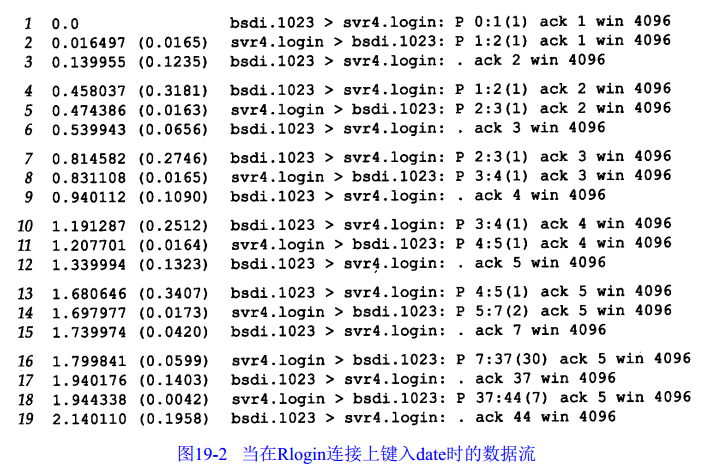

注意 TCP 是怎样进行确认的。第 1 行以序号 0 发送数据字节，第 2 行通过将确认序号设为 1，
也就是最后成功收到的字节的序号加 1，来对其进行确认（也就是所谓的下一个期望数据的序
号）。在第 2 行中服务器还向客户发送了一序号为 1 的数据，客户在第 3 行中通过设置确认序号为 2 来对该数据进行确认。

### 19.3 经受时延的确认
图 19-3 表示了图 19-2 中数据交换的时间系列（在该时间系列中，去掉了所有的窗口通告，并增加了一个记号来表明正在传输何种数据）。

把从 bsdi 发送到 srv4 的 7 个 ACK 标记为经受时延的 ACK。通常 TCP 在接收到数据时并不立即发送 ACK。相反，它延迟发送，以便将 ACK 与需要沿该方向发送的数据一起发送。绝大数实现采用的时延为 200ms，也就是说，TCP 将以最大 200ms 的时延等待是否有数据一起发送。

如果观察 bsdi 接收到数据和发送 ACK 之间的时间差，就会发现它们似乎是随机的：123.5、65.6、109.0、132.2、42.0、140.3 和 195.8ms。相反，观察到发送 ACK 的实际时间（从 0 开始）为：139.9、539.3、940.1、1339.9、1739.9、1940.1 和2140.1ms（在图 19-3 中用星号标出）。这些时间之间的差则是 200ms 的整数倍，这里所发生的情况是因为 TCP 使用了一个 200ms 的定时器，该定时器以相对于内核引导的 200ms 固定时间溢出。由于将要确认的数据是随机到达的（在时刻 16.4, 474.3, 831.1 等），TCP 在内核的 200ms 定时器的下一次溢出时得到通知。这有可能是将来1~200 ms中的任何一刻。

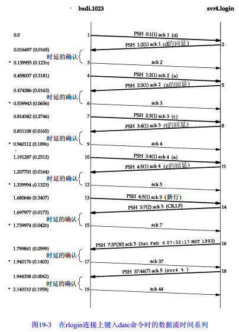

如果观察 svr4 为产生所收到的每个字符的回显所使用的时间，则这些时间分别为 16.5、16.3、16.5、16.4 和 17.3ms。由于这个时间小于 200ms，因此我们在另一端从来没有观察到一个经受时延的 ACK。在经受时延的定时器溢出前总是有数据需要发送（如果有一个约为 16ms 等待时间越过了内核的 200ms 时钟滴答的边界，则仍可以看到一个经受时延的 ACK。在本例
中我们一个也没有看到）。

### 19.4 Nagle 算法
在一个 Rlogin 连接上客户一般每次发送一个字节到服务器，这就产生了一些 41 字节长的分组：20 字节的 IP 首部、20 字节的 TCP 首部和 1 字节的数据。在局域网上，这些小分组（被称为微小分组（tinygram））通常不会引起麻烦，因为局域网一般不会出现拥塞。但在广域网上，这些小分组则会增加拥塞出现的可能。一种解决的方法就是采用 Nagle 算法。

该算法要求一个 TCP 连接上最多只能由一个未被确认的未完成的小分组，在该分组的确认到达前不能发送其他的小分组。相反，TCP 收集这些少量的分组，并在确认到来时以一个分组的方式发出去。该算法的优越之处在于它是自适应的：确认到达得越快，数据也就发送得越快。而在希望减少微小分组数目得低速广域网上，则会发送更少得分组。

在图 19-3 中可以看到，在以太网上一个字节被发送、确认和回显的平均往返时间约为 16ms。为了产生比这个速度更快的数据，我们每秒键入的字符必须多于 60 个。这表面在局域网环境下两个主机之间发送数据时很少使用这这算法。

但是，当往返时间（RTT）增加时，如通过一个广域网，情况就会发生变化。图 19-4 显示了当客户端快速键入字符（像一个快速打字员一样）时一些数据流的时间系列（去掉了服务类型信息，但保留了窗口通告）。

比较图 19-4 与 图 19-3，首先注意到从 slip 到 vangogh 不存在经受时延的 ACK。这是因为在时延定时器溢出之前总是有数据等待发送。

其次，注意到从左到右待发数据的长度是不同的，分别为：1、1、2、1、2、2、3、1 和 3 个字节。这是因为客户只有收到前一个数据的确认后才发送已经收集到的数据。通过使用 Nagle 算法，为发 16 个字节的数据客户只需要使用 9 个报文段，而不再是 16。

报文段 14 和 15 看起来似乎是与 Nagle 算法相违背，但我们需要通过检查序号来观察其中的真相。因为确认序号是 54，因此报文段 14 是报文段 12 中确认的应答。但客户在发送该报文段之前，接收到了来自服务器的报文段 13，报文段 15 中包含了对序号为 56 的报文段 13 的确认。因此即使我们看到从客户到服务器有两个连续返回的报文段，客户也是遵守了 Nagle 算法的。

在图 19-4 中可以看到存在一个经受时延的 ACK，但该 ACK 是从服务器到客户的（报文段 12），因为它不包含任何数据，因此我们可以假定这是经受时延的 ACK。服务器当时一定非常忙，因此无法在服务器的定时器溢出前即使处理所接收到的字符。

最后看一下最后两个报文段中数据的数量以及相应的序号。客户发送 3 个字节数据（18，19和20），然后服务器确认这 3 个字节（最后的报文段中的 ACK 21），但是只返回了一个字节（标号为 59）。这是因为当服务器的 TCP 一旦正确收到这 3 个字节的数据，就会返回对该数据的确认，但只有当 Rlogin 服务器发送回显数据时，它才能够发送这些数据的回显。这表明 TCP 可以在应用读取并处理数据前发送所接收数据的确认。TCP 确认仅仅表明 TCP 已经正确接收了数据。最后一个报文段的窗口大小为 8189 而非 8192，表明服务器进程尚未读取这三个收到的数据。

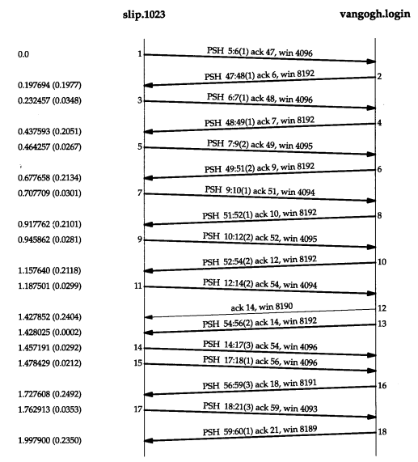

#### 19.4.1 关闭 Nagle 算法
有时候我们也需要关闭 Nagle 算法。一个典型的例子是 X 窗口系统服务器：小消息（鼠标移动）必须无延时地发送，以便为进行某种操作的交互用户提供实时的反馈。

一个更容易说明的例子--在一个交互注册过程中键入终端的一个特殊功能键。这个功能键通常可以产生多个字符序列，经常从 ASCII 码的转义 (escape)字符开始。如果 TCP 每次得到一个字符，它很可能会发送序列中的第一个字符（ASCII 码的 ESC），然后缓存其他字符并等待对该字符的确认。但当服务器接收到该字符后，它并不发送确认，而是继续等待接收序列中的其他字符。这就会经常触发服务器的经受时延的确认算法，表示剩下的字符没有在 200ms 内发送。对交互用户而言，这将产生明显的时延。

> socket API用户可以使用 TCP_NODELAY 选项来关闭Nagle算法

#### 19.4.2 一个例子
可以在 Nagle 算法和产生多个字符的按摩之间看到这种交互的情况。在主机 slip 和主机 vangogh.cs.berkeley.edu 之间建立一个 Rlogin 连接，然后按下 F1 功能键，这将产生 3 个字节：一个 escape、一个左括号和一个 M。然后再按下 F2 功能键，这将产生另外三个字节。图 19-5 表示的是 tcpdump 的输出结果（去掉了其中的服务类型和窗口通告）。

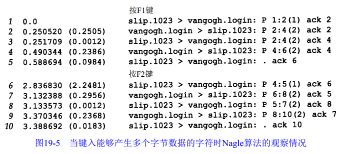

图 19-6 表示了这个交互过程的时间系列。在该图的下面部分给出了从客户发送到服务器的 6 个字节和它们的序号以及将要返回的 8 个字节的回显。

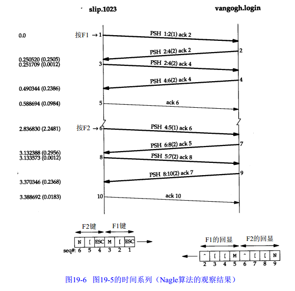

当 rlogin 客户读取到输入的第一个字节并向 TCP 写入时，该字节作为报文段 1被发送。这是 F1 键所产生的 3 个字节中的第一个。它的回显在报文段 2 中被返回，此时剩余的 2 个字节才被发送（报文段3）。这两个字节的回显在报文段 4 被接收，而报文段 5 则是对它们的确认。

第 1 个字节的回显为 2 个字节（报文段 2）的原因是因为在 ASCII 码中转义符的回显是 2 个字节：插入记号和一个左括号。剩下的两个输入字节：一个左括号和一个 M，分别以自身作为回显内容。

当按下下一个特殊功能键（报文段 6~10）时，也会发生同样的过程。正如我们希望的那样，在报文段 5 和 10（slip 发送回显的确认）之间的时间差时 200ms 的整数倍，因为这两个 ACK 被进行时延。

现在使用一个修改后关闭了 Nagle 算法的 rlogin 版本重复相同的实验。图 19-7 显示
了 tcpdump 的输出结果（同样去掉了其中的服务类型和窗口通告）。

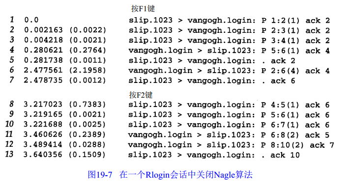

注意到第 1 个变化是当 3 个字节准备好时它们全部被发送（报文段 1、2 和 3）。没有时延发生--Nagle 算法被禁止。

在 tcpdump 输出中的下一个分组（报文段 4）中带有来自服务器的第 5 个字节及一个确认序号为 4 的 ACK。这是不正确的，因为客户并不希望接收到第 5 个字节，因此它立即发送一个确认序号为 2 而不是 6 的相应（没有被延迟）。看起来有一个报文段丢失了，在图 19-8 中用虚线表示。

如何知道这个丢失的报文段中包含第 2、3 和 4 个字节，且其确认序号为 3 呢？这是因为正如在报文段 5 中声明的那样，我们希望的下一个字节是第 2 个字节（每当 TCP  接收到一个超出期望序号的失序数据时，它总是发送一个确认序号为其期望序号的的确认）。也正是因为丢弃的分组中包含了第 2、3 和 4 个字节，这表明服务器必定已经接收到了报文段 2，因此丢弃的报文段中的确认序号一定为 3（服务器期望接收的下一个字节号）。最后，注意到重传的报文段 6 中包含有丢弃的报文段中的数据和报文段 4，这被称为重新分组化。

可以观察到键入下一个特殊功能键所产生的 3 个字节分别作为单独的报文段（报文段 8、9 和 10）被发送。这一次服务器首先回显了报文段 8 中的字节（报文段 11），然后回显了报文段 9 和 10 中的字节（报文段 12）。

在这个例子中，我们能观察到的是在跨广域网运行一个交互应用的环境下，当进行多字节的按键输入时，默认使用 Nagle 算法会引起额外的时延。

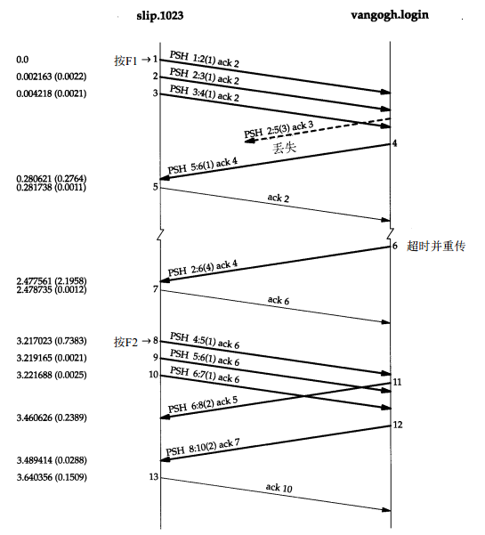
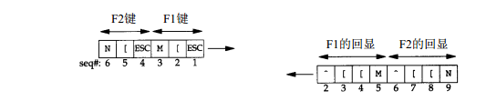

### 19.5 窗口大小通告
在图 19-4 中，可以观察到 slip 通告窗口大小为 4096 字节，而 vangogh 通告其窗口大小为 8192 个字节。该图中的绝大多数报文段都包含这两个值的一个。

然而，报文段 5 通告窗口大小为 4095 个字节，这意味着在 TCP 缓冲区中仍然有一个字节等待应用程序（Rlogin）读取。同样，来自客户的下一个报文段声明其窗口大小为 4094 个字节，着说明仍有两个字节等待读取。

服务器通常通告窗口大小为 8192 个字节，这是因为服务器在读取并回显接收到的数据之前，其 TCP 没有数据发送。当服务器已经读取了来自客户的输入后，来自服务器的数据将被发送。

然而，当 ACK 到来时，客户的 TCP 总是有数据需要发送。这是因为它在等待 ACK 的过程中缓存接收到的字符。当客户 TCP 发送缓存的数据时，Rlogin 客户没有机会来读取来自服务器的数据，因此，客户通告的窗口大小总是小于 4096.

## chatper 20 TCP 的成块数据流
### 20.2 正常数据流
我们以从主机 svr4 单向传输 8192 个字节到主机 bsdi 开始。在 bsdi 上运行 sock 程序作为服务器：
>bsdi % sock -i -s 7777

其中，标志 -i 和 -s 指示程序作为一个“吸收（sink）”服务器运行（从网络上读取并丢弃数据），服务器端口指明为 7777。相应的客户程序运行为：
>svr4 % sock -i -n8 bsdi 7777

该命令指示客户向网络发送 8 个 1024 字节的数据。图 20-1 显示了这个过程的时间系列。我
们在输出的前 3 个报文段中显示了每一端 MSS 的值。发送方首先传送 3 个数据报文段（4~6）。下一个报文段（7）仅确认了前两个数据报文段，这可以从其确认序号为 2048 而不是 3073 看出来。

报文段 7 的 ACK 的序号之所以是 2048 而不是 3037 是由以下原因造成的：当一个分组到达时，它首先被设备中断例程进行处理，然后放置到 IP 的输入队列中。三个报文段4、5 和 6 依次到达并按接收顺序放到 IP 输入队列。IP 将按同样顺序将它们交给 TCP。当 TCP 处理报文段 4 时，该连接被标记产生一个经受时延的确认。TCP 处理下一报文段（5），由于 TCP 现在有两个未完成的报文段需要确认，因此产生一个序号未 2048 的 ACK（报文段7），并清除该连接产生经受时延的确认标志。TCP 处理下一个报文段（6），而连接又被标志为产生一个经受时延的确认。在报文段 9 到来之前，由于时延定时器溢出，因此产生一个序号为 3073 的 ACK（报文段8)。报文段 8 中的窗口大小为 3072，这表明在 TCP 的接收缓存中还有 1024 个字节的数据等待被应用程序读取。

报文段 11~16 说明了通常使用的“隔一个报文段确认”的策略。报文段 11、12 和 13 到达并被放入 IP 的接收队列。当报文段 11 被处理时，连接被标记为产生一个经受时延的确认。当报文段 12 被处理时，它们的 ACK（报文段14）被产生且连接的经受时延的确认标志被清楚。报文段 13 使得连接再次被标记为产生经受时延。但在时延定时器溢出之前，报文段 15 处理完毕，因此该确认立即被发送。

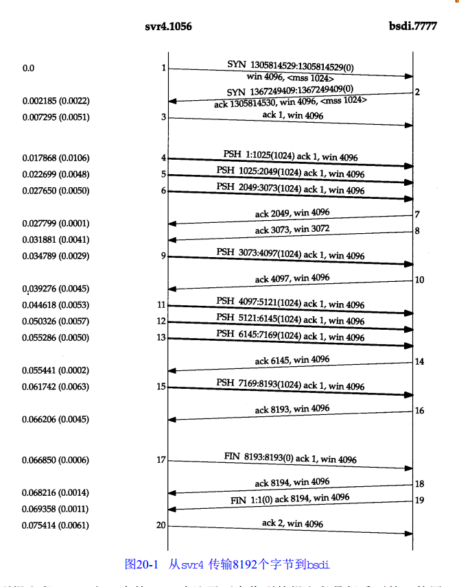

注意到报文段7、14 和 16 中 的 ACK 确认了两个收到的报文段是很重要的。使用 TCP 的滑动窗口协议时，接收方不必确认每一个收到的分组。在 TCP 中，ACK 是累积的--它们表示接收方已经正确收到了一直到确认序号减 1 的所有字节。在本例中，三个确认的数据为 2048 字节而两个确认的数据为 1024 字节（忽略了连接建立和终止中的确认）。

用 tcpdump 看到的是 TCP　的动态活动情况。我们在线路上看到的分组顺序依赖于许多无法控制的因素：发送方 TCP 的实现、接收方 TCP 的实现、接收进程读取数据（依赖于操作系统的调度）和网络的动态性（如以太网的冲突和退避等）。对于这两个 TCP 而言，没有一种单一的、正确的方法来交换给定数量的数据。

为了显示情况可能怎么样变化，图 20-2 显示了在同样两个主机之间交换同样数据时的另一个时间系列，它们是图 20-1 所示的几分钟之后截取的。

一些情况发生了变化。这一次接收方没有发送一个序号为 3037 的 ACK，而是等待并发送序号为 4097 的 ACK。接收方仅发送了 4 个ACK（报文段7、10、12 和 15）。三个确认了 2048 字节，另一个确认了 1024 字节。最后 1024 字节数据的 ACK 出现在报文段 17 中，它与 FIN 的 ACK 一并发送（比较该图中的报文段 17 与 图 20-1 中的报文段 16 和 18）。

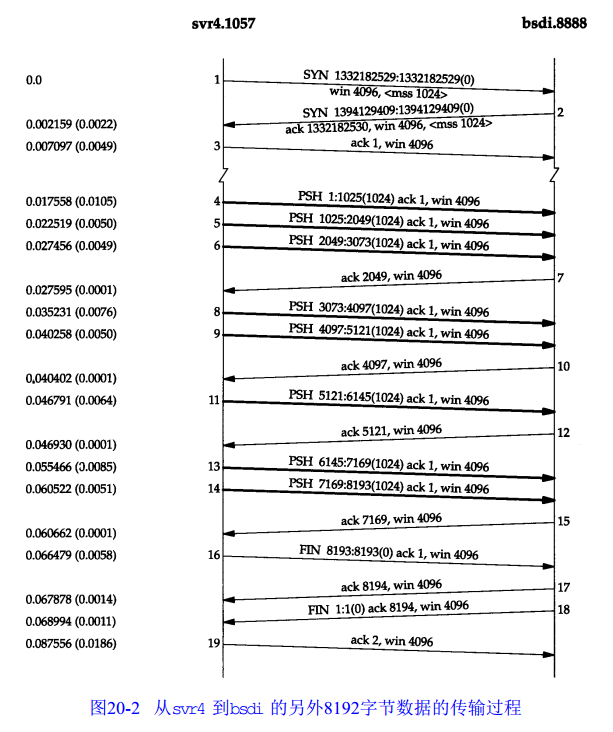

图 20-3 显示了另外一个时间系列。这次是从一个快的发送方（一个 Sparc 工作站）到一个慢的接收方（配有慢速以太网卡的 80386 机器）。它的动态活动情况又有所不同。

发送方发送 4 个背靠背（back-to-back）的数据报文段去填充接收方的窗口，然后停下来等待一个
 ACK。接收方发送 ACK （报文段 8),但通告其窗口大小为 0，这说明接收方已经收到所有数据，但这些数据都在接收方的 TCP 缓冲区，因为应用程序还没有机会读取这些数据。另一个 ACK(称为窗口更新）在 17.4ms 后发送，表明接收方现在可以接收另外 4096 个字节的数据。虽然这看起来像一个 ACK，但由于它并不确认任何数据，只是用来增加窗口的右边沿，因此被称为窗口更新。

发送方发送最后 4 个报文段（10~13），再次填充了接收方的窗口。注意到报文段 13 中包括两个比特标志：PUSH 和 FIN。随后从接收方传来另外两个 ACK，它们确认了最后的 4096 字节的数据（从 4097 到 8192 字节）和 FIN（标号为 8192）。

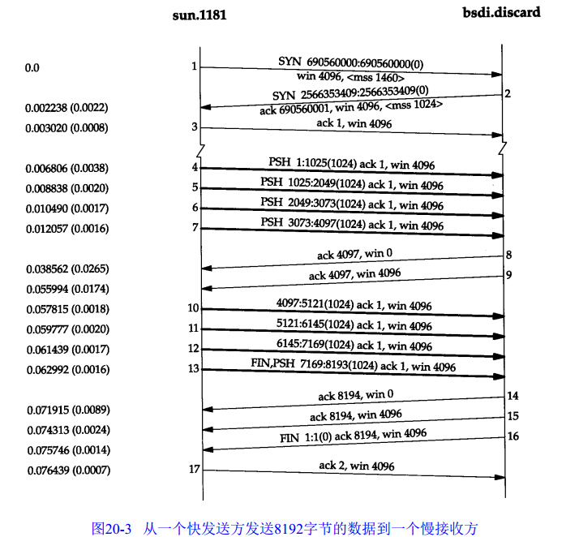

### 20.3 滑动窗口
图 20-4 用可视化的方法显示了我们在前一节观察到的滑动窗口协议。

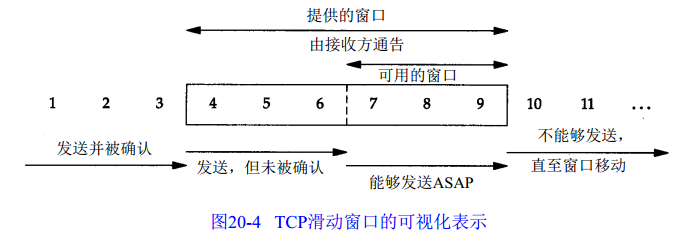

在这个图中，我们将字节从 1 至 11 进行标号。接收方通告的窗口称为提出的窗口（offered window），它覆盖了从第 4 字节到第 9 字节的区域，这表明接收方已经确认了包括第 3 字节在内的数据，且通告窗口大小为 6。发送方计算它的可用窗口，该窗口表明多少数据可以立即被发送。

当接收方确认数据后，这个滑动窗口不时地向右移动。窗口两个边沿的相对运动增加或减少了窗口的大小。使用三个术语来描述窗口左右边沿的运动：
1. 称窗口左边沿向右边沿靠近为窗口合拢。这种现象发生在数据被发送和确认时。
2. 当窗口右边沿向右移动时将允许发送更多的数据，称之为窗口打开。这种现象发生在另一端的接收进程读取已经确认的数据并释放了 TCP 的接收缓存时。
3. 当右边沿向左移动时，称之为窗口收缩。Host Requirements RFC强烈建议不要使
用这种方式。但 TCP 必须能够在某一端产生这种情况时进行处理。

图 20-5 表示了这三种情况。因为窗口的左边沿受另一端发送的确认序号的控制，因此不可能向左边移动。如果接收到一个指示窗口左边沿向左移动的 ACK，则它被认为是一个重复 ACK，并被丢弃。

如果左边沿到达右边沿，则称其为一个零窗口，此时发送方不能够发送任何数据。

图 20-6 显示了在图 20-1 所示的数据传输过程中滑动窗口协议的动态性。

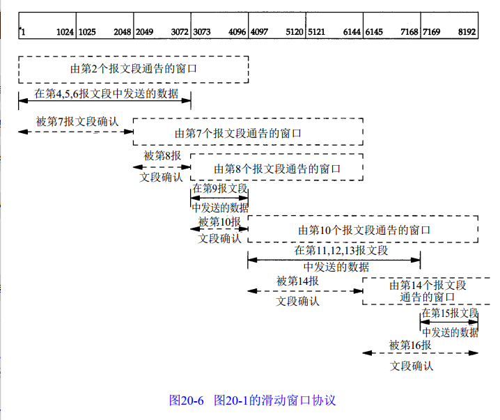

以该图为例可以总结如下几点：
1. 发送方不必发送一个全窗口大小的数据
2. 来自接收方的一个报文确认数据并把窗口向右边滑动。这是因为窗口的大小是相对于确认序号的。
3. 正如从报文段 7 到报文段 8 中变化那样，窗口的大小可以减小，但是窗口的右边沿却不能够向左移动。
4. 接收方在发送一个 ACK 前不必等待窗口被填满

### 20.4 窗口大小
由接收方提供的窗口大小通常可以由接收进程控制，这将影响 TCP 的性能。

>4.2BSD 默认设置发送和接受缓冲区的大小为 2048 个字节。在 4.3BSD 中双方被增加为 4096 个字节。

[Mogul 1993]显示了在改变发送和接收缓存大小（在单向数据流的应用中，如文件传输，只需改变发送方的发送缓存和接收方的接收缓存大小）的情况下，位于以太网上的两个工作站之间进行文件传输时的一些结果。它表明对以太网而言，默认的 4096 字节并不是最理想的大小，将两个缓存增加到 16384 个字节可以增加约 40% 左右的吞吐量。在 [Papadopoulos和 Parulkar 1993]中也有相似的结果。

一个例子。可以使用 sock 程序来控制这些缓存的大小。我们以如下方式调用服务器程序：
> bsdi % sock -i -s -R6144 5555

该命令设置接收缓存为 6144 个字节（-R 选项）。接着我们在主机 sun 上启动客户程序并使之发送8192 个字节的数据：
> sun % sock -i -n1 -w8192 bsdi 5555

图 20-7 显示了结果。

首先注意到的是在报文段 2 中提供的窗口大小为 6144 字节。由于这是一个较大的窗口，因此客户立即连续发送了 6 个报文段（4~9），然后停止。报文段 10 确认了所有的数据（从第 1 到 6144 字节），但提供的窗口大小却为 2048，这很可能是接收程序没有机会读取多于 2048 字节的数据。报文段 11 和 12 完成了客户的数据传输，且最后一个报文段带有 FIN 标志。报文段 13 包含与报文段 10 相同的确认序号，但通告了一个更大的窗口大小。报文段 14 确认了最后的 2048 字节的数据和 FIN，报文段 15 和 16 仅用于通告一个更大的窗口大小。报文段 17 和 18 完成通常的关闭过程。
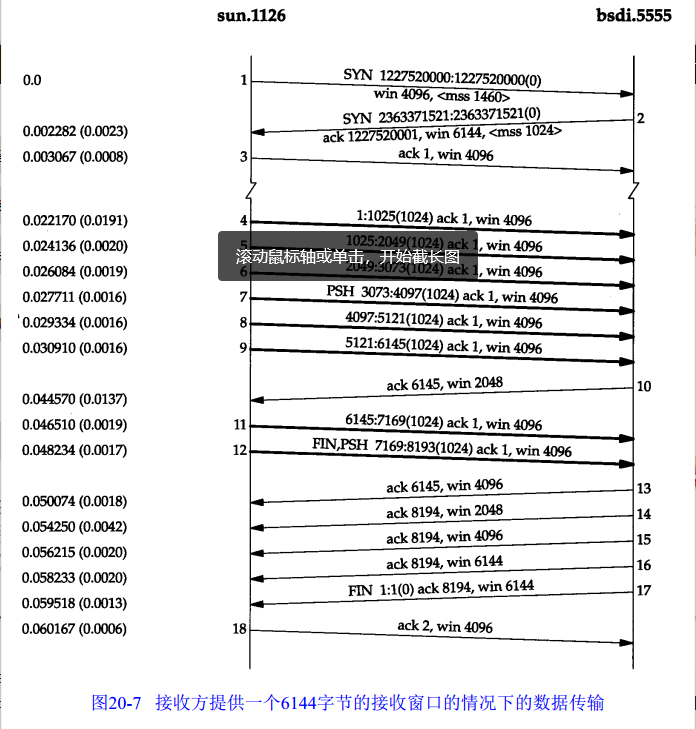

### 20.5 PUSH 标志
发送方使用 PUSH 标志通知接收方将所收到的数据全部提交给接收进程。这里的数据包括与 PUSH 一起传送的数据以及接收方 TCP 已经为接收进程收到的其他数据。

### 20.6 慢启动
迄今为止，在本章所有的例子中，发送方一开始便向网络发送多个报文段，直至达到接收方通告的窗口大小为止。当发送方和接收方处于同一个局域网时，这种方式是可以的。但是如果在发送方和接收方之间存在多个路由器和速率较慢的链路时，就有可能出现一些问题。一些中间路由器必须缓存分组，并有可能耗尽存储器的空间。

现在，TCP 需要支持一种被称为“慢启动（slow start）”的算法。该算法通过观察到新分组进入网络的速率应该与另一端返回确认的速率相同而进行工作。

慢启动为发送方的 TCP 增加了另一个窗口：拥塞窗口（congestion window），记为 cwnd。当与另一个网络的主机建立 TCP 连接时，拥塞窗口被初始化为 1 个报文段（即另一端通告的报文段大小）。每收到一个 ACK，拥塞窗口就增加一个报文段（cwnd 以字节为单位，但是慢启动以报文段大小为单位进行增加）。发送方取拥塞窗口与通告窗口的最小值作为发送上限。拥塞窗口是发送方使用的流量控制，而通告窗口则是接收方使用的流量控制。

发送方开始时发送一个报文段，然后等待 ACK。当收到该 ACK 时，拥塞窗口从 1 增加为 2，即可以发送两个报文段。当收到这两个报文段的 ACK 时，拥塞窗口就增加为 4.这是一个指数增加的关系。

在某些点上可能达到了互联网的容量，于是中间路由器开始丢弃分组。这就通知发送方它的拥塞窗口开得过大。当我们在下一章讨论 TCP 的超时和重传机制时，将会看到它们是怎样对拥塞窗口起作用的。现在，我们来观察一个实际中的慢启动。

图 20-8 表示的是将从主机 sun 发送到主机 vangogh.cs.berkeley.edu 的数据。这些数据将通过一个慢的 SLIP 链路，该链路是 TCP 连接上的瓶颈（我们已经在时间系列上去掉了连接建立的过程）。

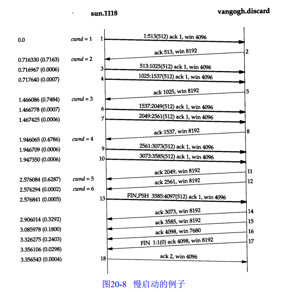

我们观察到发送方发送一个长度为 512 字节的报文段，然后等待 ACK。该 ACK 在 716ms 后收到。这个时间是一个往返时间的指示。于是拥塞窗口增加了 2 个报文段，且又发送了两个报文段。当收到报文段 5 的 ACK 后，拥塞窗口增加为 3。此时尽管可发送多达 3 个报文段，可是在下一个 ACK 收到之前，只发送了 2 个报文段。

### 20.7 成块数据的吞吐量
让我们看一看窗口大小、窗口流量控制以及慢启动对传输成块数据的 TCP 连接的吞吐量的相互作用。

图 20-9 显示了左边的发送方和右边的接收方之间的一个 TCP 连接上的时间系列，共显示了 16 个时间单元。为简单起见，本图只显示离散的时间单元。每个粗箭头线的上半部分显示的是从左到右的携带数据的报文段，标记为 1, 2, 3, 等等。在粗线箭头下面表示的是反向传输的  ACK。我们把 ACK 用细箭头线表示，并标注了被确认的报文段号。

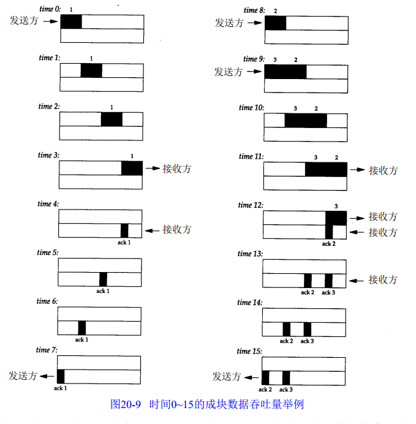

在时间0，发送方发送了一个报文段。由于发送方处于慢启动中（其拥塞窗口为 1个报文
段），因此在继续发送以前它必须等待该数据段的确认。

在时间1, 2 和 3，报文段从左向右移动一个时间单元。在时间 4 接收方读取这个报文段并产生确认。经过时间 5、6 和 7，ACK 移动到左边的发送方。我们有了一个 8 个时间单元的往返时间RT T（Round-Trip Time）。

们有意把 ACK 报文段画得比数据报文段小，这是因为它通常只有一个 IP 首部和一个 TCP 首部。这里显示仅仅是一个单向的数据流动，并且假定 ACK 的移动速率与数据报文段的移动速率相等。实际上并不总是这样。

>通常发送一个分组的时间取决于两个因素：传播时延（由光的有限速率、传输设备的等待时间等引起）和一个取决于媒体速率（即媒体每秒可传输的比特数）的发送时延。对于一个给定的两个接点之间的通路，传播时延一般是固定的，而发送时延则取决于分组的大小。在速率较慢的情况下发送时延起主要作用，而在千兆比特速率下传播时延则占主要地位（见图24-6）。

当发送方收到 ACK 后，在时间 8 和 9 发送两个报文段（我们标记为 2 和 3 ）。此时它的拥塞窗口为2个报文段。这两个报文段向右传送到接收方，在时间 12 和 13 接收方产生两个 ACK。这两个返回到发送方的 ACK 之间的间隔与报文段之间的间隔一致，被称为 TCP 的自计时( self-clocking)行为。由于接收方只有在数据到达时才产生 ACK，因此发送方接收到的 ACK之间的间隔与数据到达接收方的间隔是一致的（然而在实际中，返回路径上的排队会改变ACK的到达率）。

图 20-10 表示的是后面 16 个时间单位。 2 个 ACK 的到达使得拥塞窗口从 2 个报文段增加为 4
 个，而这 4 个报文段在时间 16~19 时被发送。第 1 个 ACK 在时间 23 到达。 4 个 ACK 的到达使得拥塞窗口从4个报文段增加为 8 个，并在时间 24~31 发送 8 个报文段。

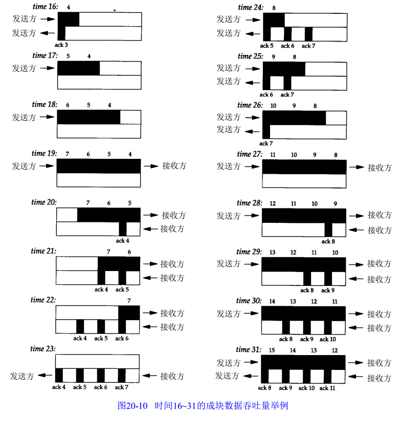

在时间 31 及其后续时间，发送方和接收方之间的管道 (pipe)被填满。此时不论拥塞窗口和通告窗口是多少，它都不能再容纳更多的数据。每当接收方在某一个时间单位从网络上移去一个报文段，发送方就再发送一个报文段到网络上。但是不管有多少报文段填充了这个管道，返回路径上总是具有相同数目的 ACK。这就是连接的理想稳定状态。

#### 20.7.1 带宽时延乘积

可以计算通道的容量为：
capacity (bit) = bandwidth (b/s) × round-trip time (s)
一般称之为带宽时延乘积。这个值依赖于网络速度和两端的 RTT，可以有很大的变动。例如，一条穿越美国（ RTT 约为 60ms）的 T1 的电话线路（1544000 b/s）的带宽时延乘积为11580字节。

#### 20.7.2 拥塞
当数据到达一个大的管道（如一个快速局域网）并向一个较小的管道（如一个较慢的广域网）发送时便会发生拥塞。当多个输入流到达一个路由器，而路由器的输出流小于这些输入流时的总和时也会发生拥塞。

图 20-13 显示了一个典型的大管道向小管道发送报文的情况。之所以说它典型，是因为大多数的主机都连接在局域网上，并通过一个路由器与速率相对较低的广域网相连（我们再次假定图中上半部分的报文段（9~20）都是相同的，而图中下半部分的 ACK 也都是相同的）。

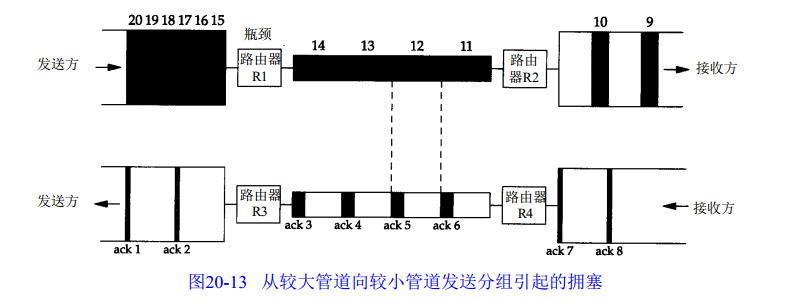

在该图中，我们已经标记路由器 R1 为“瓶颈”，因为它是拥塞发生的地方。它从左侧速率较高的局域网接收数据并向右侧速率较低的广域网发送（通常 R1 与 R3 是同样的路由器，如同 R2 与 R4 一样。但这并不是必需的，有时也会使用不对称的路径）。当路由器 R2 将所接收到的分组发送到右侧的局域网时，这些分组之间维持与其左侧广域网上同样的间隔，尽管局域网具有更高的带宽。类似地，返回的确认之间的间隔也与其在路径中最慢的链路上的间隔一致。

在图 20-13 中已经假定发送方不使用慢启动，它按照局域网的带宽尽可能快地发送编号为 1~20 的报文段（假定接收方的通告窗口至少为 20 个报文段）。正如我们看到的那样， ACK 之间的间隔与在最慢链路上的一致。假定瓶颈路由器具有足够的容纳这 20 个分组的缓存。如果这个不能保证，就会引起路由器丢弃分组。在 21.6 节讨论避免拥塞时会看到怎样避免这种情况

### 20.8 紧急方式
TCP 提供了“紧急方式（urgent mode）”，它使一端可以告诉另一端有些具有某种方式的“紧急数据”已经放置在普通的数据流中。另一端被通知这个紧急数据已经被放置在普通数据流中，有接收方决定如何处理。

可以通过设置 TCP 首部（图 17-2）中的两个字段来发出这种从一端到另一端的紧急数据已经被放置在数据流中的通知。 URG 比特被置 1，并且一个 16bit 的紧急指针被置为一个正的偏移量，该偏移量必须与 TCP 首部中的序号字段相加，以便得出紧急数据的最后一个字节的序号。

## chapter 21 TCP 的超时与重传
TCP 提供可靠的运输层。它使用的方法之一就是确认从另一端接收到的数据。但数据和确认都有可能会丢失。TCP 通过在发送时设置一个定时器来解决这种问题。如果当定时器溢出时还没有收到确认，它就重传该数据。对任何实现而言，关键之处就在于超时和重传的策略，即怎样决定超时间隔和如何确定重传频率。

对每个连接，TCP 管理 4 个不同的定时器。
1. 重传定时器使用于当希望收到另一端的确认。
2. 坚持（presist）定时器使窗口大小信息保持不断流动，即使另一端关闭了其接收窗口。
3. 保活（keepalive）定时器可以检测到一个空闲连接的另一端何时崩溃或重启。
4. 2MSL 定时器测量一个连接处于 TIME_WAIT 状态的时间。

### 21.2 超时与重传的简单例子
首先观察 TCP 所使用的重传机制，我们将建立一个连接，发送一些分组来证明一切正常，然后拔掉电缆，发送更多的数据，再观察 TCP 的行为。

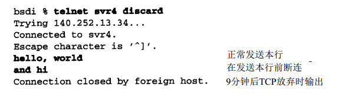

图 21-1 表示的是 tcpdump 的输出结果
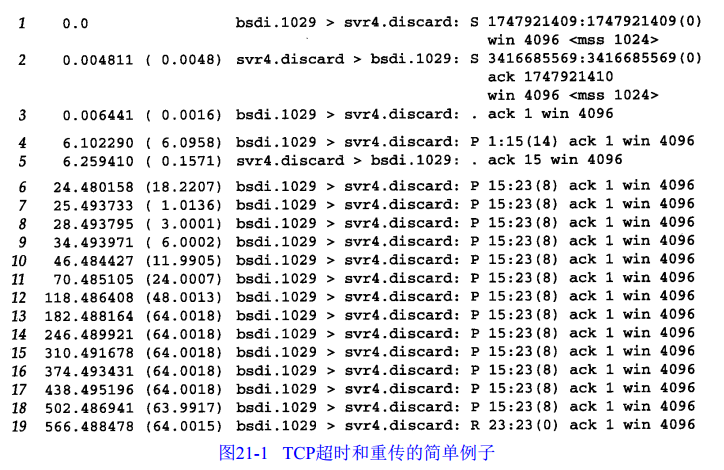