# TCP/IP协议 读书笔记

## chapter 1 概述
### 1.4 地址划分
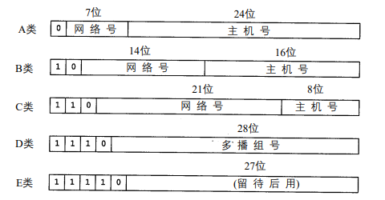
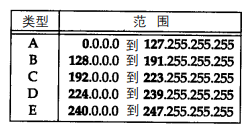

### 1.5 域名系统
在 T C P / I P领域中，域名系统（ D N S）是一个分布的数据库，由它来提供 I P地址和
主机名之间的映射信息。

任何应用程序都可以调用一个标准的库函数来查看给定名字的主机 的I P地址。类似地，系统还提供一个逆函数—给定主机的I P地址，查看它所对应的主机名。

### 1.6 封装
当应用程序用 T C P传送数据时，数据被送入协议栈中，然后逐个通过每一层直到被当作
一串比特流送入网络。其中每一层对收到的数据都要增加一些首部信息（有时还要增加尾部信息）。
T C P传给I P的数据单元称作 T C P报文段或简称为 T C P段（TCP segment）。I P传给网络接口层的数据单元称作 I P数据报(IP datagram)。通过以太网传输的比特流称作帧(Frame)。

以太网数据帧的物理特性是其长度必须在 4 6～1 5 0 0字节之间。
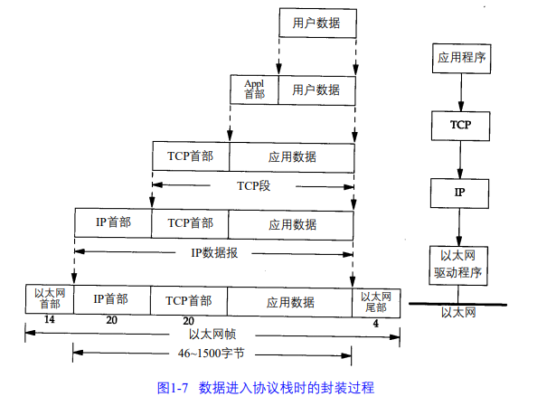

### 1.7 分用
当目的主机收到一个以太网数据帧时，数据就开始从协议栈中由底向上升，同时去掉各
层协议加上的报文首部。每层协议盒都要去检查报文首部中的协议标识，以确定接收数据的
上层协议。这个过程称作分用（Demultiplexing）
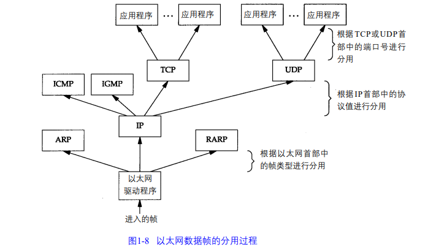

### 1.9 端口
T C P和U D P采用16 bit的端口号来识别应用程序。

服务器一般都是通过知名端口号来识别的。例如，对于每个 T C P / I P实现来说，F T P服务
器的T C P端口号都是2 1，每个Telnet服务器的T C P端口号都是23，每个TFTP (简单文件传送协议)服务器的U D P端口号都是69。任何T C P / I P实现所提供的服务都用知名的 1～1023之间的端口号。这些知名端口号由Internet号分配机构（Internet Assigned Numbers Authority, IANA）来管理。

客户端通常对它所使用的端口号并不关心，只需保证该端口号在本机上是唯一的就可以
了。客户端口号又称作临时端口号（即存在时间很短暂）。这是因为它通常只是在用户运行该客户程序时才存在，而服务器则只要主机开着的，其服务就运行。

大多数T C P / I P实现给临时端口分配 1024～5000之间的端口号。大于 5000的端口号是为其他服务器预留的（Internet上并不常用的服务)

### 1.16 网络测试 图 1-11
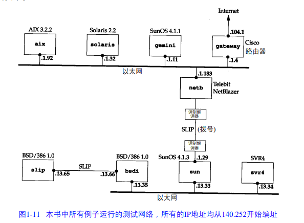

## chapter 2 链路层
在T C P / I P协议族中，链路层主要有三个目的：（1）为I P模块发送和接收I P数据报；（2）为ARP模块发送ARP请求和接收ARP应答；（3）为RARP发送RARP请求和接收RARP应答。

### 2.2 以太网和IEEE 802封装
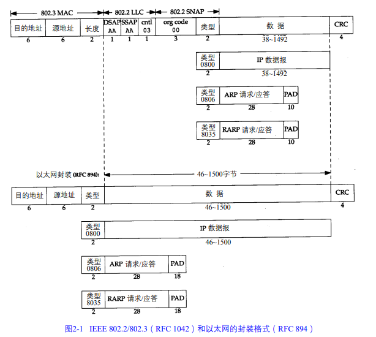
802.3标准定义的帧和以太网的帧都有最小长度要求。802.3规定数据部分必须至少为 38字
节，而对于以太网，则要求最少要有46字节。为了保证这一点，必须在不足的空间插入填充
（pad）字节。以太网帧使用2字节的类型字段来标识上层协议：如0x800为IP数据报，0x806为ARP请求或应答报文，0x835为RARP请求或应答报文。

### 2.7 环回接口
大多数的产品都支持环回接口（ Loopback Interface），以允许运行在同一台主机上的客户
程序和服务器程序通过 T C P / I P进行通信。A类网络号127就是为环回接口预留的。根据惯例，
大多数系统把I P地址127.0.0.1分配给这个接口，并命名为 localhost。一个传给环回接口的 I P数据报不能在任何网络上出现。

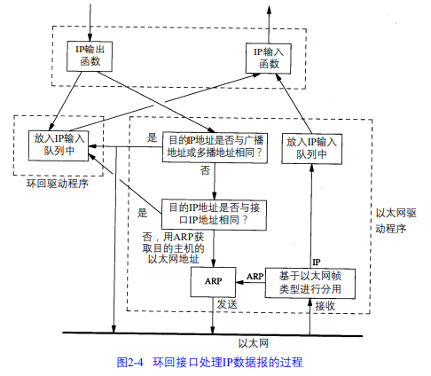
1) 传给环回地址（一般是127.0.0.1）的任何数据均作为I P输入。
2) 传给广播地址或多播地址的数据报复制一份传给环回接口，然后送到以太网上。这是因为广播传送和多播传送的定义包含主机本身。
3) 任何传给该主机I P地址的数据均送到环回接口。

### 2.8 最大传输单元MTU
正如在图2-1看到的那样，以太网和802.3对数据帧的长度都有一个限制，其最大值分别是1500和1492字节。链路层的这个特性称作MTU，最大传输单元。不同类型的网络大多数都有一个上限。

如果 I P层有一个数据报要传，而且数据的长度比链路层的 MTU还大，那么 I P层就需要进行分片（fragmentation），把数据报分成若干片，这样每一片都小于 MTU。

### 2.9 路径MTU
当在同一个网络上的两台主机互相进行通信时，该网络的 MTU是非常重要的。但是如果两台主机之间的通信要通过多个网络，那么每个网络的链路层就可能有不同的 MTU。重要的不是两台主机所在网络的 MTU的值，重要的是两台通信主机路径中的最小 MTU。它被称作路径MTU。

## chapter 3 IP: 网际协议
### 3.1 引言
IP提供不可靠、无连接的数据报传送服务。
不可靠(unreliale): 它不保证IP数据报能成功到达目的地。IP仅提供最好的服务。可靠性应该由上层提供(如TCP)。如果发生某种错误时，如某个路由器暂时用完了缓冲区， IP有一个简单的错误
处理算法：丢弃该数据报，然后发送ICMP消息报给信源端。任何要求的可靠性必须由上层来
提供（如TCP）。
无连接(connectionless): IP并不维护任何关于后续数据报的状态信息。每个数据报的处理都是相互独立的。这也说明IP数据报可以不按发送顺序接收。如果一信源向相同的信宿发送两个连续的数据报（先是 A，然后是B），每个数据报都是独立地进行路由选择，可能选择不同的路线，因此 B可能在A到达之前先到达。

### 3.2 IP首部
IP数据报的格式如下图所示。普通的IP首部长为20个字节，除非含有选项字段。
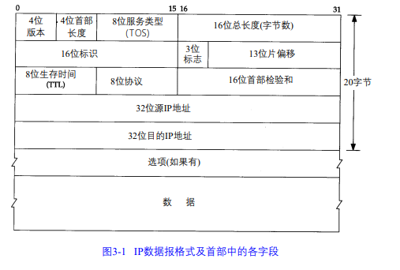
4位版本号指定IP协议的版本，对于IPv4来说，其值是4

4位头部长度标识该IP头部有多少个32bit字(4字节)。因为4位最大能表示15,所以IP头部最长是60字节

8位服务类型(Type of Service, TOS)包括一个3位的优先权字段（现已忽略），4位的TOS字段和1位保留字（必须置0）。4位的TOS字段分别表示：最小延时，最大吞吐量，最高可靠性和最小费用。其中最多有一个能置1

16位总长度(total length)是指整个IP报的长度，以字节位单位，因此IP数据报的最大长度为65 535(2^16  - 1)字节。尽管以太网的最小帧长为 4 6字节（见图 2 - 1），但是I P数据可能会更短。如果没有总长度字段，那么I P层就不知道4 6字节中有多少是I P数据报的内容

16位标识(identification)唯一地标识主机发送的每一个数据报。其初值由系统随机生成，每发送一个数据报，其值加1.该值在数据报分片时被复制到每个分片中，因此同一个数据报的所有分片都具有相同的标识值

3位标志的第一位保留。第二位(Don't Fragment, DF)表示“禁止分片”。如果设置了这个位，IP模块将不对数据报进行分片。这种情况下，如果IP数据报长度超过MTU的话，IP模块将丢弃该数据报并返回一个ICMP差错报文。
第三位(More Fragment, MF)表示“更多分片”。除了数据报的最后一个分片外，其他分片都要把它置1

13位分片偏移(fragmentation offset)是分片相对原始IP数据报开始处(仅指数据部分)的偏移。实际的偏移值是该值左移3位(乘8)后得到的。由于这个原因，除了最后一个IP分片外，每个IP分片的数据部分的长度必须是8的整数倍

8位生存时间(Time To Live, TTL)是数据报到达目的地之前允许经过的路由器跳数。TTL值被发送端设置(常见的值是64)。数据报在转发过程中每经过一个路由，该值就被路由器减1.当TTL值减为0时，路由器将丢弃数据报，并向源端发送一个ICMP差错报文。TTL值可以防止数据报陷入路由循环

8位协议用来区分上层协议，/etc/protocols 文件定义了所有上层协议对应的protocol字段的数值。其中，ICMP是1, TCP是6，UDP是17

16位头部校验和(header checksum)由发送端填充，接收端对其使用CRC算法以检验IP数据报头部(注意，仅检验头部)在传输过程中是否损坏

32位源端IP地址和目的端IP地址用来标识数据报的发送端和接收端

IPv4最后一个选项字段(option)是可变长的可选信息。这部分最多包含40字节，因为IP头部最长是60字节（其中包含了20字节的固定部分）。可用的IP选项包括：
- 记录路由(record route)，告诉数据报途径的所有路由器都将自己的IP地址填入IP头部的选项部分，这样我们就可以跟踪数据报的传递路径
- 时间戳(timestamp)，告诉每个路由器都将数据报被转发的时间（或时间与IP地址对）填入IP头部选项部分，这样就可以测量途经路由之间数据报传输的时间
- 松散路由选择(loose source routing)，指定一个路由器IP地址列表，数据报发送过程中必须经过其中的所有路由器
- 严格路由选择(strict source routing)，和松散路由选择类似，不过数据报只能经过被指定的路由器

### 3.3 IP路由选择
如果目的主机与源主机直接相连（如点对点链路）或都在一个共享网络上（以太网或令牌环网），那么I P数据报就直接送到目的主机上。否则，主机把数据报发往一默认的路由器上，由路由器来转发该数据报。

在一般的体制中，IP可以从TCP、UDP、ICMP和IGMP接收数据报（即在本地生成的数据报）并进行发送，或者从一个网络接口接收数据报（待转发的数据报）并进行发送。 I P层在内存中有一个路由表。当收到一份数据报并进行发送时，它都要对该表搜索一次。当数据报来自某个网络接口时，I P首先检查目的I P地址是否为本机的I P地址之一或者I P广播地址。如果确实是这样，数据报就被送到由 I P首部协议字段所指定的协议模块进行处理。如果数据报的目的不是这些地址，那么（ 1）如果I P层被设置为路由器的功能，那么就对数据报进行转发（也就是说，像下面对待发出的数据报一样处理）；否则（ 2）数据报被丢弃。

路由表中的每一项都包含下面这些信息：
- 目的I P地址。它既可以是一个完整的主机地址，也可以是一个网络地址，由该表目中的标志字段来指定（如下所述）。主机地址有一个非0的主机号（见图1 - 5），以指定某一特定的主机，而网络地址中的主机号为0，以指定网络中的所有主机（如以太网，令牌环网）。
- 下一站（或下一跳）路由器（ next-hop router）的I P地址，或者有直接连接的网络 I P地址。下一站路由器是指一个在直接相连网络上的路由器，通过它可以转发数据报。下一站路由器不是最终的目的，但是它可以把传送给它的数据报转发到最终目的。
- 标志。其中一个标志指明目的 I P地址是网络地址还是主机地址，另一个标志指明下一站路由器是否为真正的下一站路由器，还是一个直接相连的接口
- 为数据报的传输指定一个网络接口

I P路由选择主要完成以下这些功能：
1) 搜索路由表，寻找能与目的 I P地址完全匹配的表目（网络号和主机号都要匹配）。如果
找到，则把报文发送给该表目指定的下一站路由器或直接连接的网络接口（取决于标
志字段的值）。
2) 搜索路由表，寻找能与目的网络号相匹配的表目。如果找到，则把报文发送给该表目
指定的下一站路由器或直接连接的网络接口（取决于标志字段的值）。目的网络上的所
有主机都可以通过这个表目来处置。例如，一个以太网上的所有主机都是通过这种表
目进行寻径的。
3) 搜索路由表，寻找标为“默认（default）”的表目。如果找到，则把报文发送给该表目
指定的下一站路由器。

如果上面这些步骤都没有成功，那么该数据报就不能被传送。如果不能传送的数据报来自本机，那么一般会向生成数据报的应用程序返回一个“主机不可达”或“网络不可达”的错误。

完整主机地址匹配在网络号匹配之前执行。只有当它们都失败后才选择默认路由。默认路由，以及下一站路由器发送的 I C M P间接报文（如果我们为数据报选择了错误的默认路由）

## chapter 4 ARP：地址解析协议
当一台主机把以太网数据帧发送到位于同一局域网上的另一台主机时，是根据 48 bit的以
太网地址来确定目的接口的。设备驱动程序从不检查 I P数据报中的目的I P地址。

地址解析为这两种不同的地址形式提供映射： 32 bit的I P地址和数据链路层使用的任何类型的地址。

### 4.2 例子
任何时候我们敲入下面这个形式的命令：
>  ftp bsdi

都会进行以下这些步骤。这些步骤的序号如图 4-2所示
1) 应用程序FTP客户端调用函数gethostbyname(3)把主机名（bsdi）转换成32 bit的IP地址。这个函数在D N S（域名系统）中称作解析器。这个转换过程或者使用DNS，或者在较小网络中使用一个静态的主机文件（/etc/hosts）。
2) F T P客户端请求T C P用得到的I P地址建立连接。
3) T C P发送一个连接请求分段到远端的主机，即用上述 I P地址发送一份 I P数据报
4) 如果目的主机在本地网络上（如以太网、令牌环网或点对点链接的另一端），那么I P数据报可以直接送到目的主机上。如果目的主机在一个远程网络上，那么就通过 I P选路函数来确定位于本地网络上的下一站路由器地址，并让它转发 I P数据报。在这两种情况下，I P数据报都是被送到位于本地网络上的一台主机或路由器。
5) 假定是一个以太网，那么发送端主机必须把 32 bit的I P地址变换成48 bit的以太网地址。从逻辑Internet地址到对应的物理硬件地址需要进行翻译。这就是 A R P的功能。A R P本来是用于广播网络的，有许多主机或路由器连在同一个网络上。
6) A R P发送一份称作 A R P请求的以太网数据帧给以太网上的每个主机。这个过程称作广播，如图 4 - 2中的虚线所示。 A R P请求数据帧中包含目的主机的 I P地址（主机名为bsdi），其意思是“如果你是这个 I P地址的拥有者，请回答你的硬件地址。”
7) 目的主机的A R P层收到这份广播报文后，识别出这是发送端在寻问它的 I P地址，于是发送一个A R P应答。这个A R P应答包含I P地址及对应的硬件地址。
8) 收到A R P应答后，使A R P进行请求—应答交换的I P数据报现在就可以传送了。
9) 发送I P数据报到目的主机。
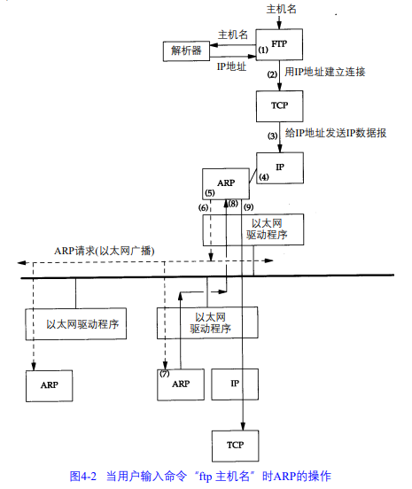

在A R P背后有一个基本概念，那就是网络接口有一个硬件地址（一个 48 bit的值，标识不同的以太网或令牌环网络接口）。在硬件层次上进行的数据帧交换必须有正确的接口地址。但是，TCP / IP有自己的地址：32 bit的I P地址。知道主机的I P地址并不能让内核发送一帧数据给主机。内核（如以太网驱动程序）必须知道目的端的硬件地址才能发送数据。 A R P的功能是在32 bit的I P地址和采用不同网络技术的硬件地址之间提供动态映射。

### 4.3 ARP高速缓存
A R P高效运行的关键是由于每个主机上都有一个 A R P高速缓存。这个高速缓存存放了最近Internet地址到硬件地址之间的映射记录。高速缓存中每一项的生存时间一般为 2 0分钟，起始时间从被创建时开始算起。
可以用arp(8)命令来检查ARP高速缓存。参数-a的意思是显示高速缓存中所有的内容
> arp -a

### 4.4 ARP的分组格式
在以太网上解析 I P地址时，A R P请求和应答分组的格式如图 4-3所示（A R P可以用于其他类型的网络，可以解析 I P地址以外的地址。紧跟着帧类型字段的前四个字段指定了最后四个字段的类型和长度）。
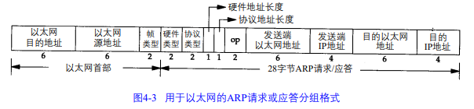
两个字节长的以太网帧类型表示后面数据的类型。对于 A R P请求或应答来说，该字段的
值为0x0806

形容词hardware(硬件)和protocol(协议)用来描述A R P分组中的各个字段。例如，一个 A R P请求分组询问协议地址（这里是 I P地址）对应的硬件地址（这里是以太网地址）。硬件类型字段表示硬件地址的类型。它的值为 1即表示以太网地址。协议类型字段表示要映射的协议地址类型。它的值为 0x0800即表示I P地址。它的值与包含 I P数据报的以太网数据帧中的类型字段的值相同，这是有意设计的（参见图 2-1）。

接下来的两个1字节的字段，硬件地址长度和协议地址长度分别指出硬件地址和协议地址的长度，以字节为单位。对于以太网上 I P地址的A R P请求或应答来说，它们的值分别为 6和4。

操作字段指出四种操作类型，它们是 A R P请求（值为1）、A R P应答（值为2）、R A R P请求（值为3）和R A R P应答（值为4）。这个字段必需的，因为 A R P请求和A R P应答的帧类型字段值是相同的。

接下来的四个字段是发送端的硬件地址（在本例中是以太网地址）、发送端的协议地址（I P地址）、目的端的硬件地址和目的端的协议地址。注意，这里有一些重复信息：在以太网的数据帧报头中和ARP请求数据帧中都有发送端的硬件地址。

对于一个A R P请求来说，除目的端硬件地址外的所有其他的字段都有填充值。当系统收到一份目的端为本机的 A R P请求报文后，它就把硬件地址填进去，然后用两个目的端地址分别替换两个发送端地址，并把操作字段置为 2，最后把它发送回去。

### 4.6 ARP代理
如果A R P请求是从一个网络的主机发往另一个网络上的主机，那么连接这两个网络的路由器就可以回答该请求，这个过程称作委托 A R P或A R P代理(Proxy ARP)。

## Chapter 10 动态选路协议
**RIP(Routing Information Protocol)**: 选路信息协议。
**OSPF**:
**BGP**:

## chapter 17 TCP 传输控制协议
### 17.2 TCP 的服务
TCP提供一种面向连接、可靠的字节流服务。

面向连接意味着两个使用 TCP 的应用在彼此交换数据之前必须先建立一个 TCP 连接。

TCP 通过一下方式提供可靠性：
1. 应用数据被分割成 TCP 认为合适发送的数据块。这和UDP 应用程序产生的数据报长度将保持不变完全不同。由 TCP 传递给 IP 的信息单位成为报文段（segment）。
2. 当 TCP 发送一个报文段后，它启动一个定时器，等待目的端确认收到这个报文段。如果不能及时收到一个确认，将重发这个报文段。
3. 当 TCP 收到发自 TCP 连接另一端的数据，它将会发送一个确认。这个确认不是立即发送，通常将推迟几分之一秒。
4. TCP 将保持它首部和数据的检验和。这是一个端到端的检验和，目的是检测数据在传输中的变化。如果收到段的检验和有差错，TCP 将丢弃这个报文段和不确认收到此报文段（希望发送端超时并重发）。
5. TCP 报文段作为 IP 数据报来传输，而 IP 数据报的到达可能会失序，因此 TCP 报文段的到达也可能会失序。如果必要，TCP 将对收到的数据进行重新排序，将收到的数据以正确的顺序交给应用层。
6. IP 数据报会发生重复，TCP 的接收端必须丢弃重复的数据报。
7. TCP 还提供流量控制。TCP 连接的每一方都有固定大小的缓冲空间。 TCP 的接收端只允许另一端发送接收端缓冲区所能容纳的数据。这将防止比较快主机导致比较慢主机的缓冲区溢出。

两个应用程序通过 TCP 交换 8 bit字节构成的字节流。TCP 不在字节流中插入标识符。这称为字节流服务（byte stream service）。

TCP 对字节流的内容不作任何解释。TCP 不知道传输的数据字节流是二进制数据，还是 ASCII 字符或者其他类型数据。对字节流的解释由 TCP 连接双方的应用层解释。

### 17.3 TCP 首部
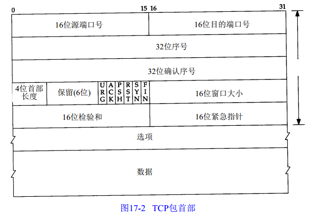

每个 TCP 段都包含源端和目的端的端口号，用于寻找发送端和接收端的应用进程。

序号表示在这个报文段中的第一个数据字节，用来标识从 TCP 发送端向 TCP 接收端发送的数据字节流。

当建立一个新的连接时，SYN 标志变 1。序号字段包含由这个主机选择的该连接的初始序号 **ISN（Initital Sequence Number）**。该主机要发送数据的第一个字节序号为这个 **ISN** 加 1，因为 SYN 标志消耗了一个序号。

既然每个传输的字节都被计数，确认序号包含发送确认的一端所期望收到的下一序号。因此确认序号应当是上次已经成功收到的数据字节序号加 1。只要 ACK 标志为 1时确认序号字段才有效。

发送 ACK 无需任何代价，因为 32 bit的确认序号和 ACK 标志一样，总是 TCP 首部的一部分。因此，一旦一个连接建立起来，这个字段总是被设置，ACK 标志也总是被置为 1。

TCP 为应用层提供全双工服务。这意味数据能在两个方向u上独立地进行传输。因此，连接的每一端必须保持每个方向上的传输数据序号。

TCP 可以表述为一个没有选择确认或者否认的滑动窗口协议。TCP缺少选择确认是因为 TCP 首部中的确认序号表示发送方已成功接收到字节，但还不包含确认序号所指的字节。当前还无法对数据流中选定的部分进行确认。例如 1~1024 字节已成功收到，下一报文段中包含序号从 2049~3072 的字节，接收端并不能确认这个新的报文段。它所能做的是发回一个确认序号为 1025 的 ACK。它也无法对一个报文段进行否认。例如，如果收到包含 1025~2048 字节的报文段，但它的检验和错，TCP 接收端所能做的就是发送回一个确认序号为 1025 的 ACK。

首部长度给出首部中 32 bit 字的数目。需要这个值是因为任选字段的长度是可变的。这个字段占 4 bit，因此 TCP 最多有 60 字节的首部。然而，没有任选字段，正常的长度为 20 字节。

在 TCP 首部中有 6 个标志比特。它们中的多个可同时被设置为 1。他们用法分别为：
- URG：紧急指针（urgent pointer）有效。
- ACK：确认序号有效
- PSH：接收方应该尽快将这个报文段交给应用层
- RST：重建连接
- SYN：同步序号用来发起一个连接
- FIN：发送端完成发送任务

