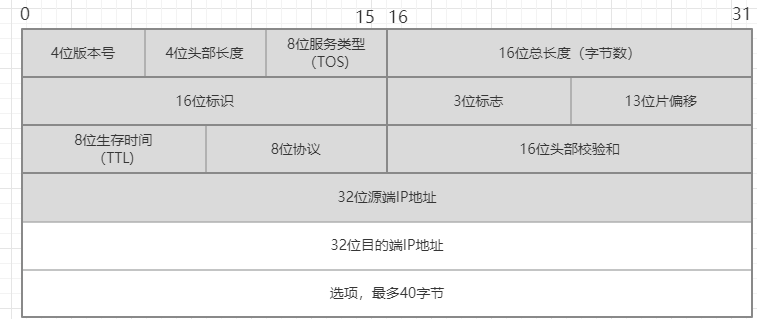

# TCP/IP协议 读书笔记

## chapter 1 概述
### 1.4 地址划分

### 1.5 域名系统
在 T C P / I P领域中，域名系统（ D N S）是一个分布的数据库，由它来提供 I P地址和
主机名之间的映射信息。

任何应用程序都可以调用一个标准的库函数来查看给定名字的主机 的I P地址。类似地，系统还提供一个逆函数—给定主机的I P地址，查看它所对应的主机名。

### 1.6 封装
当应用程序用 T C P传送数据时，数据被送入协议栈中，然后逐个通过每一层直到被当作
一串比特流送入网络。其中每一层对收到的数据都要增加一些首部信息（有时还要增加尾部信息）。
T C P传给I P的数据单元称作 T C P报文段或简称为 T C P段（TCP segment）。I P传给网络接口层的数据单元称作 I P数据报(IP datagram)。通过以太网传输的比特流称作帧(Frame)。

以太网数据帧的物理特性是其长度必须在 4 6～1 5 0 0字节之间。

### 1.7 分用
当目的主机收到一个以太网数据帧时，数据就开始从协议栈中由底向上升，同时去掉各
层协议加上的报文首部。每层协议盒都要去检查报文首部中的协议标识，以确定接收数据的
上层协议。这个过程称作分用（Demultiplexing）

### 1.9 端口
T C P和U D P采用16 bit的端口号来识别应用程序。

服务器一般都是通过知名端口号来识别的。例如，对于每个 T C P / I P实现来说，F T P服务
器的T C P端口号都是2 1，每个Telnet服务器的T C P端口号都是23，每个TFTP (简单文件传送协议)服务器的U D P端口号都是69。任何T C P / I P实现所提供的服务都用知名的 1～1023之间的端口号。这些知名端口号由Internet号分配机构（Internet Assigned Numbers Authority, IANA）来管理。

客户端通常对它所使用的端口号并不关心，只需保证该端口号在本机上是唯一的就可以
了。客户端口号又称作临时端口号（即存在时间很短暂）。这是因为它通常只是在用户运行该客户程序时才存在，而服务器则只要主机开着的，其服务就运行。

大多数T C P / I P实现给临时端口分配 1024～5000之间的端口号。大于 5000的端口号是为其他服务器预留的（Internet上并不常用的服务)

### 1.16 网络测试 图 1-11

## chapter 2 链路层
在T C P / I P协议族中，链路层主要有三个目的：（1）为I P模块发送和接收I P数据报；（2）为ARP模块发送ARP请求和接收ARP应答；（3）为RARP发送RARP请求和接收RARP应答。

### 2.2 以太网和IEEE 802封装

## chapter 3 IP: 网际协议
### 3.1 引言
IP提供不可靠、无连接的数据报传送服务。
不可靠(unreliale): 它不保证IP数据报能成功到达目的地。IP仅提供最好的服务。可靠性应该由上层提供(如TCP)。
无连接(connectionless): IP并不维护任何关于后续数据报的状态信息。每个数据报的处理都是相互独立的。这也说明IP数据报可以不按发送顺序接收。

### 3.2 IP首部
IP数据报的格式如下图所示。普通的IP首部长为20个字节，除非含有选项字段。

## Chapter 10 动态选路协议
**RIP(Routing Information Protocol)**: 选路信息协议。
**OSPF**:
**BGP**:

