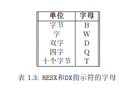

# pcasm-book
## Introduction
### 1.2.2 The CPU
时钟脉冲：脉冲信号是一个按一定电压幅度，一定时间间隔连续发出。脉冲信号之间的时间间隔称为周期；而将在单位时间（如1秒）内所产生的脉冲个数称为频率。

频率为1.5GHz的CPU每秒产生1500000000次脉冲，也称每次脉冲为一个周期。

一个指令需要多少周期依赖于CPU的模式。

#### 寄存器
16位寄存器 | 说明
:----|:----
AX | AX可拆分为AH,AL
BX | BX可拆分为BH,BL
CX | CX可拆分为CH,CL
DX | DX可拆分为DH,DL
SI | 不可拆分
DI | 不可拆分
BP | 
SP |
CS | Code Segment
DS | Data Segment
SS | Stack Segment
ES | Extra Segment
IP | Instruction Pointer

32位寄存器(E:extend) | 说明
:----|:----
EAX | EAX可拆分为EAH,EAL
EBX | EBX可拆分为EBH,EBL
ECX | ECX可拆分为ECH,ECL
EDX | EDX可拆分为EDH,EDL

#### 指令操作数
机器代码指令拥有个数和类型不同的操作数； 然而， 通常每个指令有几
个固定的操作数(0到3个)。 操作数可以有下面的类型：
- 寄存器：这些操作数直接指向CPU寄存器里的内容
- 内存：这些操作数指向内存里的数据。 数据的地址可能是硬编码到指令里
的常量或可能直接使用寄存器的值计算得到。 距离段的起始地址的偏
移值即为此地址
- 立即数：这些操作数是指令本身列出的固定的值。 它们储存在指令本身(在
代码段)， 而不在数据段
- 暗指的操作数：这些操作数没有明确显示。 例如： 往寄存器或内存增加1的加法指令。 1是暗指的

#### 基本指令
最基本的指令是 MOV 指令。它将数据从一个地方移到另一个地方(像高级语
言里面的赋值操作一样)。 它携带两个操作数：
```
mov dest (目的操作数), src(源操作数)
```
src指定的数据拷贝到了dest。一个指令的两个操作数不能同时是内存操作
数。 这就指出了一个汇编古怪的地方。 通常， 对于各种各样指令的使用都
有某些强制性的规定。 操作数必须是同样的大小。 AX 里的值就不能储存
到 BL 里去。

这儿有一个例子(分号表示注释的开始)：
```
mov eax, 3 ; 将3存入 EAX 寄存器(3是一个立即数)。
mov bx, ax ; 将AX的值存入到BX寄存器。
add eax, 4 ; eax = eax + 4
add al, ah ; al = al + ah
sub bx, 10 ; bx = bx - 10
sub ebx, edi ; ebx = ebx - edi

;INC 和DEC 指令将值加1或减1。 因为1是一个暗指的操作数， INC 和DEC的
机器代码比等价的ADD和SUB指令要少。
inc ecx ; ecx++
dec dl ; dl--
```

#### 指示符
指示符是由汇编程序产生的而不是由CPU产生。 它们通常用来要么指示
汇编程序做什么要么提示汇编程序什么。 它们并不翻译成机器代码。 指示
符普遍的应用有：
- 定义常量
- 定义用来储存数据的内存
- 将内存组合成段
- 有条件地包含源代码
- 包含其他文件

NASM 代码像 C 一样要通过一个预处理程序。 它拥有许多和 C 一样的预
处理程序。 但是， NASM 的预处理的指示符以 % 开头而不是像 C 一样以 #开
头。

##### equ 指示符
equ指示符可以用来定义一个符号。 符号被命名为可以在汇编程序里使
用的常量。 格式是：
```
symbol equ value
```
符号的值以后不可以再定义。

##### %define 指示符
这个指示符和C中的#define非常相似。 它通常用来定义一个宏常量，
像在C里面一样。
```
%define SIZE 100
mov eax, SIZE
```
上面的代码定义了一个称为SIZE的宏通过使用一个MOV指令。宏在两个方面
比符号要灵活。 宏可以被再次定义而且可以定义比简单的常量数值更大的
值。

##### 数据指示符
数据指示符使用在数据段中用来定义内存空间。 保留内存有两种方法。
第一种方法仅仅为数据定义空间； 第二种方法在定义数据空间的同时给与一个初始值。 第一种方法使用 RESX 指示符中的一个。 X可由字母替代， 字母由需要储存的对象的大小来决定。 表 1.3给出了可能的值。


第二种方法(同时定义一个初始值)使用DX指示符中的一个。 X可以由字母替代， 字母的值与RESX里的值一样。

使用变量 来标记内存位置是非常普遍的。 变量使得在代码中指向内存位
置变得容易。 下面是几个例子：
```
L1 db 0 ;字节变量L1， 初始值为0
L2 dw 1000 ;字变量L2， 初始值为1000
L3 db 110101b ;字节变量初始化成110101(十进制为53)
L4 db 12h ;字节变量初始化成十六进制12(在十进制中为18)
L5 db 17o ;字节变量初始化成八进制17(在十进制中为15)
L6 dd 1A92h ;双字变量初始化成十六进制1A92
L7 resb 1 ;1个未初始化的字节
L8 db "A" ;字节变量初始化成ASCII值A(65)
```
双引号和单引号被同等对待。 连续定义的数据储存在连续的内存中。 也
就是说， 字L2就储存在L1的后面。 内存的顺序可以同样被定义。
```
L9 db 0, 1, 2, 3 ; 定义4个字节
L10 db "w", "o", "r", ’d’, 0 ; 定义一个等于"word"的C字符串
L11 db ’word’, 0 ; 等同于L10
```
指示符DD可以用来定义整形和单精度的浮点数常量6。 但是， DQ指示符
仅仅可以用来定义双精度的数常量。

对于大的序列， NASM 的TIMES 指示符常常非常有用。 这个指示符每次
都重复它的操作对象一个指定的次数。 例如：
```
L12 times 100 db 0 ; 等价于100个值为0的字节
L13 resw 100 ; 储存空间为100个字
```

记住变量可以用来表示代码中的数据。 变量的使用方法有两种。 如果
一个平常的变量被使用了， 它被解释为数据的地址(或偏移)。 如果变量被
放置在方括号([])中， 它就被解释为在这个地址中的数据。 换句话说，
你必须把变量当作一个指向数据的指针而方括号引用这个指针就像*号
在C中一样。 (MASM/TASM使用的是另外一个惯例。 )在32位模式下， 地
址是32位。 这儿有几个例子：

```
1 mov al, [L1] ; 复制L1里的字节数据到AL
2 mov eax, L1 ; EAX = 字节变量L1代表的地址
3 mov [L1], ah ; 把AH拷贝到字节变量L1
4 mov eax, [L6] ; 复制L6里的双字数据到 EAX
5 add eax, [L6] ; EAX = EAX + L6里的双字数据
6 add [L6], eax ; L6 = L6里的双字数据 + EAX
7 mov al, [L6] ; 拷贝L6里的数据的第一个字节到AL
```

例子的第7行展示了NASM 一个重要性能。 汇编程序并不 保持跟踪变量的
数据类型。 它由程序员来决定来保证他(或她)正确使用了一个变量。 随后它
一般将数据的地址储存到寄存器中， 然后像在C中一样把寄存器当一个指针
变量来使用。 同样， 没有检查使得指针能正确使用。 以这种方式， 汇编程
序跟C相比有更易出错的倾向。

考虑下面的指令：
```
mov [L6], 1 ; 储存1到L6中
```
这条语句产生一个operation size not specified(操作大小没有指定)的
错误。 为什么？ 因为汇编程序不知道是把1当作一个字节， 还是字， 或是双
字来储存。 为了修正这个， 加一个大小指定：
```
mov dword [L6], 1 ; 储存1到L6中
```
这个告诉汇编程序把1储存在从L6开始的双字中。 另一些大小指定为： BYTE(字
节)， WORD(字)， QWORD(四字)和TWORD(十字节)。
