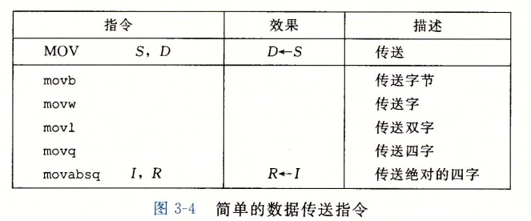
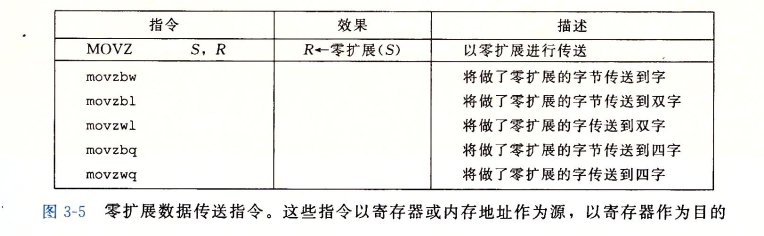
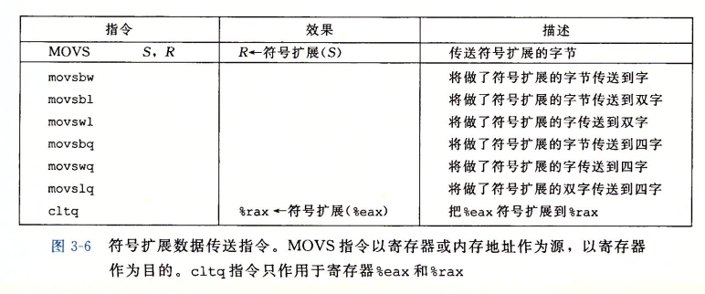
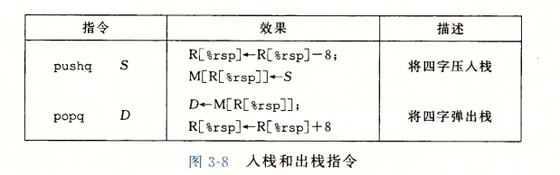
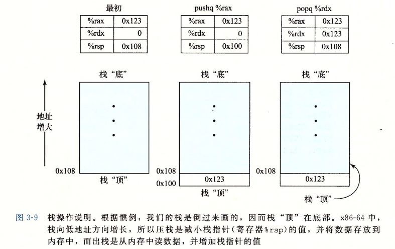
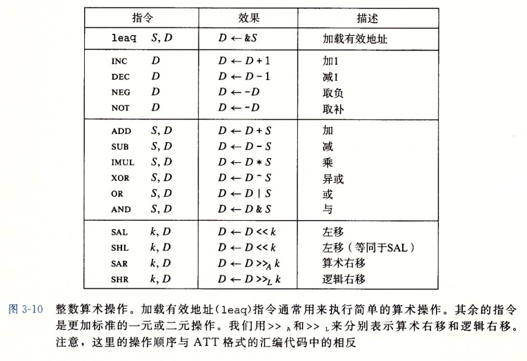
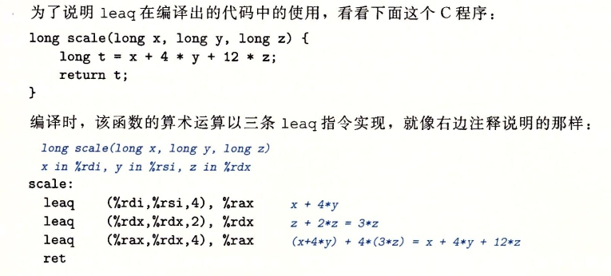

# 深入理解计算机系统笔记


## chapter 1 计算机系统漫游
### 1.4.1 系统的硬件组成
1. 总线：贯穿整个系统的是一组电子管道，称作总线，它携带信息字节并负责在各个部件间传递。通常总线被设计成传送定长的字节块，就是字（word）。字中的字节数（即字长）是一个基本系统参数，各个系统中不尽相同。
2. I/O 设备是系统与外部世界的联系通道。
3. 主存
4. 处理器（CPU）是解释（或执行）存储在主存中指令的引擎。处理器的核心是一个大小为一个字的存储设备（或寄存器），称为程序计数器（PC）。在任何时刻，PC 都指向主存中的某条机器语言指令（即含有该条指令的地址）。

## 1.7 操作系统管理硬件
操作系统有两个基本功能：
1. 防止硬件被失控的应用程序滥用
2. 向应用程序提供简单一致的机制来控制复杂而又通常大不相同的低级硬件设备。

操作系统通过几个基本的抽象概念（进程、虚拟内存和文件）来实现这两个功能。文件是对 I/O 设备的抽象表示，虚拟内存是对主存和磁盘 I/O 设备的抽象表示，进程则是对处理器、主存和 I/O 设备的抽象表示。

## chapter 3 程序的机器级表示
### 3.2.1 机器级代码
对于机器级编程来说，其中两种抽象尤为重要。第一种是由指令集体系机构或指令集架构（Instruction Set Architecture, ISA）来定义机器级程序的格式和行为，它定义了处理器状态、指令的格式，以及每条指令对状态的影响。第二种抽象是，机器级程序使用的内存地址是虚拟地址，提供内存模型看上去是一个非常大的字节数组。

x86-64 的机器代码和原始的 C 代码差别非常大。一些通常对 C 语言程序员隐藏的处理起状态都是可见的：
- 程序计数器（PC，在 x86-64 中用 %rip 表示）给出将要执行的下一条指令在内存中的地址。
- 整数寄存文件包含16个命名的位置，分别存储 64 位的值。这些寄存器可以存储地址（对应于 C 语言的指针）或整数数据。有的寄存器被用来记录某些重要的程序状态，而其他的寄存器用来保存临时数据，例如过程的参数或局部变量，以及函数的返回值。
- 条件码寄存器保存着最近执行的算术或逻辑命令的状态信息。它们用来实现控制或者数据流中的条件变化，比如说用来实现 if 和 while 语句。
- 一组向量寄存器可以存放一个或多个整数或者浮点数值。


### 3.3 数据格式


### 3.4 访问信息


#### 3.4.1 操作数指示符
大多数指令有一个或多个操作数（operand），指示出执行一个操作中要使用的数据值，以及放置结果的目的位置。源数据值可以以常数形式给出，或是从寄存器或内存中读出。结果可以存放在寄存器或内存中。因此不同操作数可能被分成三种类型。第一种类型是**立即数（Immediate）**，用来表示常数值。在 ATT 格式的汇编代码中，立即数的书写方式是 '\$' 后面跟一个用标准 C 表示法表示的整数，比如，\$-577 或 \$0x1F。第二种类型是寄存器（register），它表示某个寄存器的内容。第三类操作数是内存引用。


#### 3.4.2 数据传送指令
图 3-4 列出的是最简单形式的数据传送指令--MOV 类。这些指令把数据从源位置复制到目的位置，不做任何变化。MOV 类由四条指令组成：movb、movw、movl、movq。这些指令都执行相同操作；主要区别在于它们操作的数据大小不同：分别是1、2、4和8字节。



源操作数指定的值是一个立即数，存储在寄存器中或内存中。目的操作数指定一个位置，要么是一个寄存器或者，要么是一个内存地址。x86-64 加了一条限制，传送指令的两个操作数不能都指向内存位置。将一个值从一个内存位置复制到另一个内存位置需要两条指令--第一条指令将源值加载到寄存器中，第二条指令将寄存器值写入目的位置。大多数情况中，MOV 指令只会更新目的操作数指定的那些寄存器字节或内存位置。唯一例外是 movl 指令以寄存器为目的时，它会把该寄存器的高位 4 字节设置为 0。造成这个例外的原因是 x86-64 采用的惯例，即任何为寄存器生成 32 位值的指令都会把该寄存器的高位置为 0。

下面的 MOV 指令示例给出了源和目的类型的五种可能的组合。记住，第一个是源操作数，第二个是目的操作数。
```c
movl $0x4050, %eax 	Immediate--Register, 4 bytes
movw %bp, %sp		Register--Register, 2 bytes
movb (%rdi, %rcx), %al	Memory--Registre, 1 bytes
movb $-17, (%rsp)	Immediate--Memory, 1 bytes
movq %rax, -12(%rbp)	Register--Memory, 8 bytes
```
成规的 movq 指令只能表示为 32 位补码数字的立即数作为源操作数，然后把这个值符号扩展得到 64 位的值，放到目的位置。movabsq 指令能够以任意 64 位立即数作为源操作数，并且只能以寄存器为目的。

图 3-5 和图 3-6 记录的是两类数据移动指令，在将较小的源值复制到较大的目的时使用。所有这些指令都把数据从源（寄存器或内存中）复制到目的寄存器。MOVZ 类中的指令把目的中剩余的字节填充为 0，而MOVS 类中的指令通过符号扩展来填充，把源操作的最高位进行复制。可以观察到，每条指令名字的最后两个字符都是大小指示符：第一个字符指定源的大小，而第二个指明目的大小。




###3 3.4.4 压入和弹出栈数据
如图 3-8 所示栈通过 push 操作把数据压入栈中，通过 pop 操作删除数据。如 3-9 所示，栈向下增长，这样一来，栈顶元素的地址是所有栈中元素地址中最低的。（根据惯例，栈是倒过来画的，栈顶在图的底部）栈指针 %rsp 保存着栈顶元素的地址。



将一个 4 字值压入栈中，首先要把栈指针减 8，然后将值写入新的栈顶地址。因此指令 pushq %rbp 的行为等价于下面两条指令：
```c
sub $8, %rsp		Decrement stack pointer
movq %rbp, (%rsp)	Store %rbp on stack
```
它们之间的区别是在机器码中 pushq 指令编码为 1 字节，而上面两条指令一共需要 8 个字节。


### 3.5 算术和逻辑运算
图 3-10 罗列了 x86-64 的一些整数和逻辑操作。


#### 3.5.1 加载有效地址
加载有效地址(load effective address)指令 leaq 实际上是 movq 指令的变形。它的指令形式是从内存读取数据到寄存器，但实际上它根本就没有引用内存。它的第一个操作数看上去是一个内存引用，但该指令并不是从指定的位置读入数据，而是将有效地址写入到目的操作数。在图 3-10 中我们用 C 语言的地址操作符 &S 说明这种计算。这条指令可以为后面的内存引用产生指针。另外，它还可以简洁地描述普通的算术操作。例如，如果寄存器 %rdx 的值为 x，那么指令 leaq 7(%rdx, %rdx, 4)，%rax 将设置寄存器 %rax 的值为 5x+7	。编译器经常发现一些 leaq 的灵活用法，根本与有效地址计算无关。目的操作数必须是一个寄存器。



leaq 指令能执行加法和有限形式的乘法，在编译如上简单的算术表达式时，是很有用的。

#### 3.5.3 移位操作
移位操作先给出移位量，然后第二项给出的是要移位的数。可以进行算术和逻辑右移。移位量可以是立即数，或者放在单字节寄存器 %cl 中。（这些指令很特别，因为只允许这个特定的寄存器作为操作数）原则上来说，一个字节的移位量使得移位量的编码范围可达到 255。x86-64 中，移位操作对 w  位长的数据值进行移位操作，移位量是由 %cl 寄存器的低 m 位决定的，这个 2^m = w。高位会被忽略。所以，例如当寄存器 %cl 的十六进制值为 0XFF 时，指令 salb 会移 7 位，salw 会移 15 位，sall 会移 31 位，而 salq 会移 63 位。

如图 3-10 所示，左移指令由两个名字：SAL 和 SHL。两者的效果都是一样的，都是将右边填上 0。