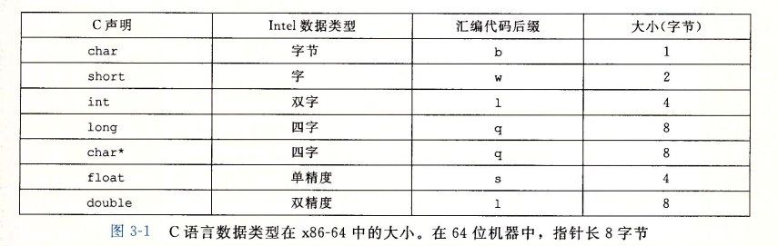
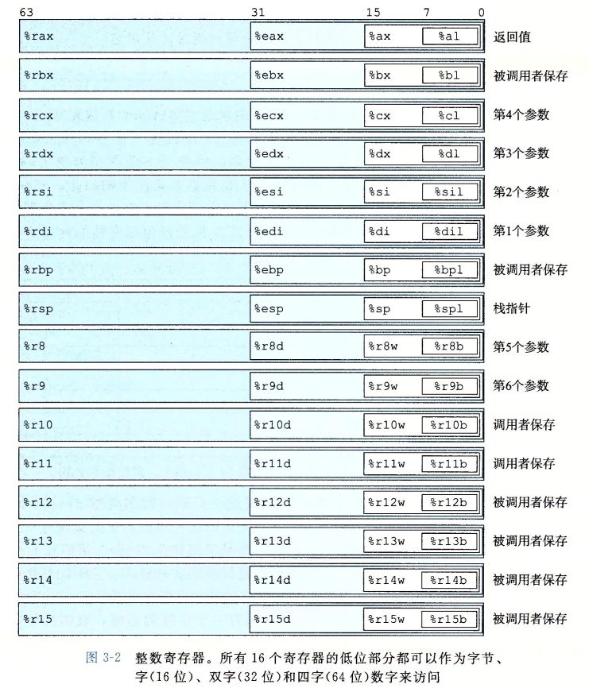
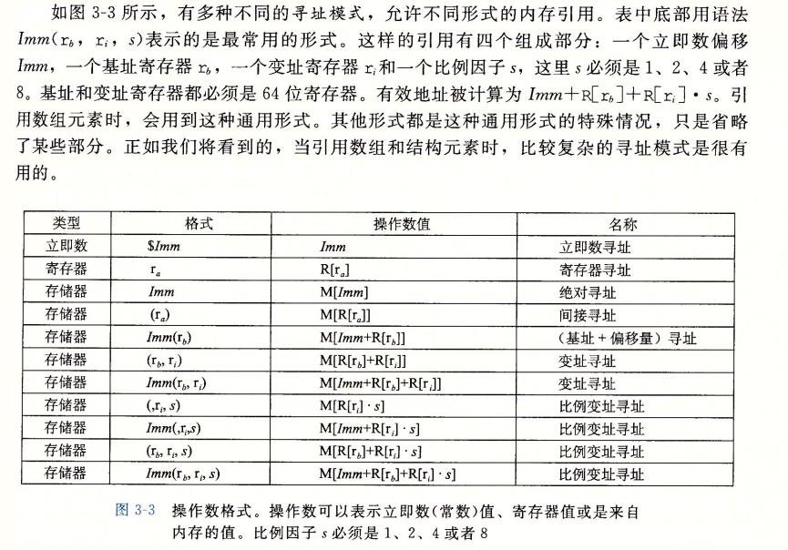

# 深入理解计算机系统笔记

## chapter 1 计算机系统漫游
### 1.4.1 系统的硬件组成
1. 总线：贯穿整个系统的是一组电子管道，称作总线，它携带信息字节并负责在各个部件间传递。通常总线被设计成传送定长的字节块，就是字（word）。字中的字节数（即字长）是一个基本系统参数，各个系统中不尽相同。
2. I/O 设备是系统与外部世界的联系通道。
3. 主存
4. 处理器（CPU）是解释（或执行）存储在主存中指令的引擎。处理器的核心是一个大小为一个字的存储设备（或寄存器），称为程序计数器（PC）。在任何时刻，PC 都指向主存中的某条机器语言指令（即含有该条指令的地址）。

## 1.7 操作系统管理硬件
操作系统有两个基本功能：
1. 防止硬件被失控的应用程序滥用
2. 向应用程序提供简单一致的机制来控制复杂而又通常大不相同的低级硬件设备。

操作系统通过几个基本的抽象概念（进程、虚拟内存和文件）来实现这两个功能。文件是对 I/O 设备的抽象表示，虚拟内存是对主存和磁盘 I/O 设备的抽象表示，进程则是对处理器、主存和 I/O 设备的抽象表示。

## chapter 3 程序的机器级表示
### 3.2.1 机器级代码
对于机器级编程来说，其中两种抽象尤为重要。第一种是由指令集体系机构或指令集架构（Instruction Set Architecture, ISA）来定义机器级程序的格式和行为，它定义了处理器状态、指令的格式，以及每条指令对状态的影响。第二种抽象是，机器级程序使用的内存地址是虚拟地址，提供内存模型看上去是一个非常大的字节数组。

x86-64 的机器代码和原始的 C 代码差别非常大。一些通常对 C 语言程序员隐藏的处理起状态都是可见的：
- 程序计数器（PC，在 x86-64 中用 %rip 表示）给出将要执行的下一条指令在内存中的地址。
- 整数寄存文件包含16个命名的位置，分别存储 64 位的值。这些寄存器可以存储地址（对应于 C 语言的指针）或整数数据。有的寄存器被用来记录某些重要的程序状态，而其他的寄存器用来保存临时数据，例如过程的参数或局部变量，以及函数的返回值。
- 条件码寄存器保存着最近执行的算术或逻辑命令的状态信息。它们用来实现控制或者数据流中的条件变化，比如说用来实现 if 和 while 语句。
- 一组向量寄存器可以存放一个或多个整数或者浮点数值。

### 3.3 数据格式

### 3.4 访问信息

#### 3.4.1 操作数指示符
大多数指令有一个或多个操作数（operand），指示出执行一个操作中要使用的数据值，以及放置结果的目的位置。源数据值可以以常数形式给出，或是从寄存器或内存中读出。结果可以存放在寄存器或内存中。因此不同操作数可能被分成三种类型。第一种类型是**立即数（Immediate）**，用来表示常数值。在 ATT 格式的汇编代码中，立即数的书写方式是 '\$' 后面跟一个用标准 C 表示法表示的整数，比如，\$-577 或 \$0x1F。第二种类型是寄存器（register），它表示某个寄存器的内容。第三类操作数是内存引用。

#### 3.4.2 数据传送指令
图 3-4 列出的是最简单形式的数据传送指令-