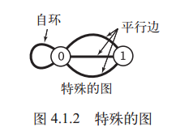

## Tree
树的结点Node
```cpp
template<typename T>
struct Node
{
    T key_;
    Node* parent_;
    Node* left_;
    Node* right_;
}
```

二叉搜索树性质：
>设x是二叉搜索树中的一个结点。如果y是x左子树中的一个结点，那么y.key_ <= x.key_。如果y是x右子树中的一个结点，那么y.key_ >= x.key_。

**中序遍历**
>输出的子树根的关键字值位于其左子树的关键字值和右子树的关键字值之间
```cpp
// 递归算法
void inorderTreeWalk(Node* x)
{
    if(x != NULL)
    {
	inorderTreeWalk(x->left_);
	std::cout << x->key_;
	inorderTreeWalk(x->right_);
    }
}

// 非递归算法，使用stack
void inorderTreeWalk(Node* x)
{
    std::stack<Node*> nodes;
    while(x != NULL || !nodes.empty())
    {
        if(x != NULL)
	{
	    nodes.push(x);
	    x = x->left_;
	}
	else
	{
	    x = nodes.top();
	    std::cout << x->key_;
	    x = x->right_;
	    nodes.pop()
	}
    }
}   
```
**前序遍历**
>输出的子树根的关键字值位于其左子树的关键字值和右子树的关键字值之前
```cpp
void inorderTreeWalk(Node* x)
{
    if(x != NULL)
    {
	std::cout << x->key_;
	inorderTreeWalk(x->left_);
	inorderTreeWalk(x->right_);
    }
}
```
**后序遍历**
>输出的子树根的关键字值位于其左子树的关键字值和右子树的关键字值之后
```cpp
void inorderTreeWalk(Node* x)
{
    if(x != NULL)
    {
	inorderTreeWalk(x->left_);
	inorderTreeWalk(x->right_);
	std::cout << x->key_;
    }
}
```
***查找***
```cpp
Node* search(Node* x, T key)
{
    while(x != NULL && x->key_ != key)
    {
        if(x->key_ < key)
            x = x->left-;
        else
            x = x->right_;
    }
    return x;
}
```

## Graph
图论的应用示例：
1. **地图**。正在计划旅行的人也许想知道“从普罗维登斯到普林斯顿的最短路线” 。 对最短路径上经历过交通堵塞的旅行者可能会问：“从普罗维登斯到普林斯顿的哪条路线最快？ ”要回答这些问题，我们都要处理有关结点（十字路口） 之间多条连接（公路） 的信息。
2. **网页信息**。当我们在浏览网页时， 页面上都会包含其他网页的引用（链接） 。 通过单击链接，我们可以从一个页面跳到另一个页面。 整个互联网就是一张图， 结点是网页， 连接就是超链接。 图算法是帮助我们在网络上定位信息的搜索引擎的关键组件。
3. **任务调度**。品的生产过程包含了许多工序以及一些限制条件， 这些条件会决定某些任务的先后次序。 如何安排才能在满足限制条件的情况下用最少的时间完成这些生产工序呢？
4. **商业交易**。零售商和金融机构都会跟踪市场中的买卖信息。 在这种情形下， 一条连接可以表示现金和商品在买方和卖方之间的转移。 在此情况下， 理解图的连接结构原理可能有助于增强人们对市场的理解。
5. **计算机网络**。计算机网络是由能够发送、 转发和接收各种消息的站点互相连接组成的。 我们感兴趣的是这种互联结构的性质， 因为我们希望网络中的线路和交换设备能够高效率地处理网络流量。
6. **软件**。编译器会使用图来表示大型软件系统中各个模块之间的关系。图中的结点即构成整个系统的各种类和模块， 连接则为类的方法之间的可能调用关系（静态分析），或是系统运行时的实际调用关系（动态分析） 。 我们需要分析这幅图来决定如何以最优的方式为程序分配资源。
7. **社交网络**。 当你在使用社交网站时， 会和你的朋友之间建立起明确的关系。 这里， 结点对应人而连接则联系着你和你的朋友或是关注者。分析这些社交网络的性质是当前图算法的一个重要应用。

### 无向图
**定义**：图是由一组顶点和一组能够将两个顶点相连的边组成的。

**特殊的图**：
1. 自环，即一条连接一个顶点和其自身的边
2. 连接同一对顶点的两条边称为平行边。



#### 术语表
当两个顶点通过一条边相连时，我们称这两个顶点是相邻的，并称连接依附于这两个顶点