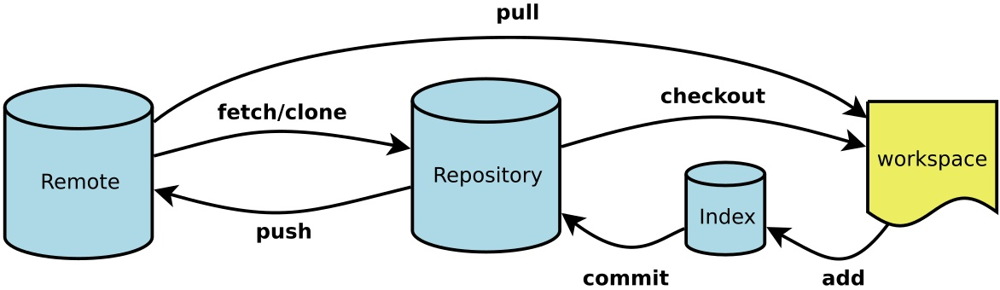

## git 工作原理

WorkSpace: 工作区
Index/Stage: 暂存区
Repository: 仓库区(或本地仓库)
Remote: 远程仓库

## git commands
##### config [--global] user.name
git config user.name "cv": 将"cv"设置为该仓库的用户名。使用 --global 参数表示使用"cv"作为该机器下所有仓库的用户名。

##### config [--global] user.email
git config user.email "xxx@qq.com": 将"xxx@qq.com"设置为该仓库的用户email。使用 --global 参数表示使用"xxx@qq.com"作为该机器下所有仓库的用户email。

##### init
git init:将当前目录初始化为一个仓库。

##### add
git add file: 将file添加到暂存区。

##### commit
git commit [-m]: 将暂存区的文件提交到仓库。-m 参数用于注释。

##### status
git status: 检查仓库状态。

##### diff
git diff: 查看修改比对。

##### log
git log: 查看历史纪录

##### reflog
git reflog: 查看所有历史纪录。

##### reset --hard HEAD
git reset --hard HEAD~n: 回滚到第n个版本。
git reset --hard 版本号: 回滚到版本号。

##### checkout -\- file
git checkout -\- file: 撤销对file的改动。

##### ssh-keygen -t rsa -C 
ssh-keygen -t rsa -C “youremail@example.com”: 创建 SSH Key。因为本地Git仓库和github仓库之间的传输是通过SSH加密的，所有要创建 SSH Key。id_rsa是私钥，不能泄露出去，id_rsa.pub是公钥，可以放心地告诉任何人。登录github,打开” settings”中的SSH Keys页面，然后点击“Add SSH Key”,填上任意title，在Key文本框里黏贴id_rsa.pub文件的内容

##### remote add origin 
git remote add origin xxx.git: 将远程仓库xxx.git与本地仓库关联。

##### push [-u] origin master
git push -u origin master: 将本地master分支的最新修改推送到远程仓库。当远程仓库为空，第一次推送master分支时，加上了 –u参数，Git不但会把本地的master分支内容推送的远程新的master分支，还会把本地的master分支和远程的master分支关联起来，在以后的推送或者拉取时就可以简化命令。

git push origin master: 将本地master分支的最新修改推送到远程仓库。

##### checkout -b
git checkout -b 分支名: 创建并切换到分支。

##### branch
git branch: 显示当前所有分支，*号表示当前所在分支。
##### Create a Branch
**Branching** is the way to work on different versions of a repository at one time.