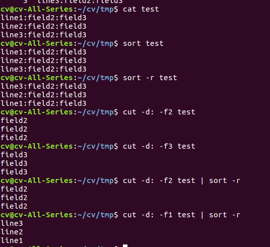
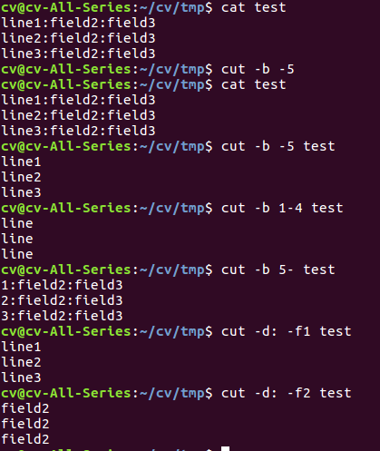

# Chapter 1
#### Basic wildcards
**Wildcard** | **Matches**
|:--------|:------------|
| ? | Any single character|
| * | Any string of characters|
| [set] | Any character in set |
| [!set] | Any character not in set |

#### Using the set construct wildcards
**Expression** | **Matches** |
|:------|:------------|
| [abc] | a, b, or c |
| [.,;] | Perioad, comma, or semicolon |
| [-_] | Dash or underscore |
| [a-c] | a, b, or c |
| [a-z] | All lowercase letters |
| [!0-9] | All non-digits |
| [0-9!] | All digits and exclamation point |
| [a-zA-Z] | All lower-and uppercase letters |
| [a-zA-Z0-9_-] | All letters, all digits, underscore, and dash |

#### Popular UNIX data filtering utilities
**Utility** | **Purpose** |
|:----------|:-----------|
cat | Copy input to output 
grep | Search for strings in the input
sort | Sort lines in the input 
cut | Extract columns from input 
sed | Perform editing operations on input 
tr | Translate characters in the input to other characters

#### cat cut sort 指令的使用


#### cut 指令的使用:cut作用于每一行，-d: 表示用:作为分隔域(field), -f配合-d使用，-f1是第一域。-b指定第几字节


#### background/foreground jobs
1. background job, put an ampersand(&) after the command
2. foreground job, a job run the normal way 

command **jobs**: For each background job, **jobs** prints a line to show an indication of the job's status.

### TODO: 将See Chapter改成超链接
#### Special characters
**Character** | **Meaning** | **See** **Chapter**
:-----------|:-------------|:-----------------
~ | Home directory | Chapter 1
` | Command substitution | Chatper 4
# | Comment | Chapter 4
$ | Variable expression | Chapter 3
& | Background job | Chapter 1
* | String wildcard | Chatper 1
( | Start subshell | Chapter 8
) | End subshell | Chapter 8
\ | Quote next character | chatper 1
\| | Pipe | Chapter 1
[ | Start character-set wildcard | Chapter 1
] | End character-set wildcard | Chapter 1
{ | Start command block | Chapter 7
} | End command block | Chapter 7
; | Shell command separator | Chapter 3
' | Strong quote | Chapter 1
<"> | Weak quote | Chapter 1
< | Input redirect | Chapter 1 
> | Output redirect | Chapter 1
/ | Pathname directory separator | Chapter 1
? | Single-character wildcard | Chapter 1
! | Pipeline logical NOT | Chapter 5

# Chapter 3
#### source 
**source** executes the commands in the specified file.

### 3.2 Aliases
alias name=command
This syntax specifies that name is an alias for command.

alias cdcv='cd ./cv'
Notice the quotes around the full cd command; these are
necessary if the string being aliased consists of more than
one word.

### 3.4.2.4 Command search path
PATH是一个变量，shell通过它保存的地址来找到输入的命令 
**echo \$PATH**，可以回显PATH的值
可以添加路径在PATH中，在~/.bashrc写入如下指令
PATH=$PATH":/home/cv/whatever"
### 3.4.25 Command hashing
每次通过PATH搜索命令会花费许多时间，所以bash有一个hash table用于
存储最近使用过的命令。
在终端输入**hash**，就可以查看最近使用过的命令

### 4.2 Shell Variables
1. **$#**, 表示命令行参数个数(不包括命令本身)
2. **$\***, 表示一个被环境变量IFS(internal field separator)里的第一个字符的值分隔所有命令行参数(除了第0个参数)组成的字符串。
3. **$@**，表示一个由空格分隔所有命令行参数组成的字符串
4. **$N**，表示第N个参数的值，$0为命令，N > $#则为null。

./alice.sh 1 2 3 
```c
1 echo "$# arguments"
2 echo "$0: $1 $2 $3 $4"
3 echo "$*"
4 echo "$@"

output:
3 arguments
./alice.sh: 1 2 3 
1 2 3
1 2 3
```
$*和$@的区别:
./test.sh arg1 arg2 arg3
```c
1 IFS=,
2 echo "\$*: $*"
3 echo "\$@: $@"

output:
$*: arg1,arg2,arg3
$@: arg1 arg2 arg3                
```

### String Operators
define in: ./string-operators.sh
1. ${varname:-word}
2. ${varname:=word}
3. ${varname:+word}
4. ${varname:offset:length}
5. ${varname:?message}
```c
function test
{
    v1="hello"
    v2="frogfootman"
    empty=""
    echo "v1=$v1 v2=$v2 empty=$empty"
    
    echo -e "\n"
    echo "test: \${varname:-word}"
    echo "if varname exists and isn't null, return its value."
    echo "\${v1:-\"don't exit.\"}: "${v1:-"don't exit."}
    echo "otherwise return word. "
    echo "\${empty:-\"don't exit.\"}: "${empty:-"don't exit."}

    echo -e "\n"
    echo "test: \${varname:=word}"
    echo "if varname exists and isn't null, return its value."
    echo "\${v1:=\"don't exit.\"}: "${v1:="don't exit."}
    echo "otherwise set it to word and then return its value."
    echo "before, empty="$empty
    echo "\${empty:=\"return this.\"}: "${empty:="return this."}
    echo "after, empty="$empty
    
    echo -e "\n"
    echo "test: \${varname:+word}"
    echo "if varname exists and isn't null, return word."
    echo "\${v1:+\"exit.\"}: "${v1:+"exit."}
    echo "otherwise return null. "
    echo "\${v100:+\"don't exit.\"}: "${v100:+"don't exit."}

    echo -e "\n"
    echo "test: \${varname:offset:length}"
    echo "It returns the substring of \$varname starting at offset and up to length characters."
    echo "The first character in \$varname is position 0."
    echo "If length is omitted, the substring starts at offset and continues to the end of \$varname."
    echo "test: \${varname:length}, v2="$v2
    echo "\${v2:4}: "${v2:4}
    echo "\${v2:4:4}: "${v2:4:4}
    echo "\${v2:-1:4}: "${v2:-1:4}

    echo -e "\n"
    echo "test: \${varname:?message}"
    echo "if varname exists and isn't null, return its value."
    echo "\${v1:?\"undefined!\"}: "${v1:?"undefined!"}
    echo "otherwise print varname: followed by message, and abort the current command."
    echo "\${v100:?\"undefined!\"}: "${v100:?"undefined!"}

}
test

output:
v1=hello v2=frogfootman empty=


test: ${varname:-word}
if varname exists and isn't null, return its value.
${v1:-"don't exit."}: hello
otherwise return word. 
${empty:-"don't exit."}: don't exit.


test: ${varname:=word}
if varname exists and isn't null, return its value.
${v1:="don't exit."}: hello
otherwise set it to word and then return its value.
before, empty=
${empty:="return this."}: return this.
after, empty=return this.


test: ${varname:+word}
if varname exists and isn't null, return word.
${v1:+"exit."}: exit.
otherwise return null. 
${v100:+"don't exit."}: 


test: ${varname:offset:length}
It returns the substring of $varname starting at offset and up to length characters.
The first character in $varname is position 0.
If length is omitted, the substring starts at offset and continues to the end of $varname.
test: ${varname:length}, v2=frogfootman
${v2:4}: footman
${v2:4:4}: foot
${v2:-1:4}: frogfootman


test: ${varname:?message}
if varname exists and isn't null, return its value.
${v1:?"undefined!"}: hello
otherwise print varname: followed by message, and abort the current command.
./test.sh: 行 46: v100: undefined!

```
-------------------------------------------------------------
# Chatper 4 
### 4.3.2 Patternsand Pattern Matching
##### Pattern-matching operators
**Operator** | **Meaning**
:---------|:-----------
${variable#pattern} | If the pattern matches the beginning of the variable's value,delete the shortest part that matches and return the rest. |
${variable##pattern} | If the pattern matches the beginning of the variable's value, delete the longest part that matches and return the rest. 
${variable%pattern} | If the pattern matches the end of the variable's value, delete the shortest part that matches and return the rest.
${variable%%pattern} | If the pattern matches the end of the variable's value, delete the longest part that matches and return the rest. 
${variable/pattern/string} ${variable//pattern/string} | The longest match to pattern in variable is replaced by string. In the first form, only the first match is replaced. In the second form, all matches are replaced. If the pattern begins with a #, it must match at the start of the variable. If it begins with a %, it must match with the end of the variable. If string is null, the matches are deleted. If variable is @ or *, the operation is applied to each positional parameter in turn and the expansion is the resultant list.

Assume that the variable path has the value /home/cam/book/long.file.name; then:
**Expression** | **Result**
:-----------|------------------:
${path##/*/} | long.file.name
${path#/*/} | cam/book/long.file.name
$path | <p style=line-height:0 align="left">/home/cam/book/long.file.name</p>
${path%.*} | <p style=line-height:0 align="left">/home/cam/book/long.file</p>
${path%%.*} | <p style=line-height:0 align="left">/home/cam/book/long</p>

/*/: mathches anyting between two slashes
.\*: matches dot followed by anything.

#### 4.3.3 Length Operators

${#varname}: Return the length of the value of the variable
as a character string.

v1="hello"
${#v1}则等于5

-------------------------------------

### 4.3.4 Extended Patter Matching
##### Table 4-3. Pattern-matching operators
**Operator** | **Meaning**
:---------|:-----------
*(patternlist) | Matches zero or more occurrences of the given patterns.
+(patternlist) | Matches one or more occurrences of the given patterns.
?(patternlist) | Matches zero or one occurrences of the given patterns.
@(patternlist) | Matches exactly one of the given patterns.
!(patternlist) | Matches anything except one of the given patterns

Some examples of these include:
- *(alice|hatter|hare) would match zero or more
occurrences of alice, hatter, and hare. So it
would match the null string, alice, alicehatter,
etc.
- +(alice|hatter|hare) would do the same except
not match the null string.
- ?(alice|hatter|hare) would only match the null
string, alice, hatter, or hare.
- @(alice|hatter|hare) would only match alice,
hatter, or hare.
- !(alice|hatter|hare) matches everything except
alice, hatter, and hare.

### 4.4 Command Substitution
command substitution, which allows you to use the
standard output of a command as if it were the value of a
variable.
The syntax of command substitution is:
$(UNIX command)
The command inside the parentheses is run, and anything
the command writes to standard output is returned as the
value of the expression.

# Chatper 5
