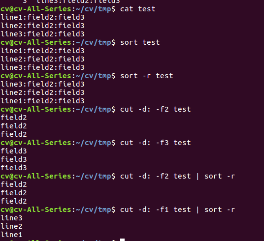

#### Basic wildcards
**Wildcard** | **Matches**
|:--------|:------------|
| ? | Any single character|
| * | Any string of characters|
| [set] | Any character in set |
| [!set] | Any character not in set |

#### Using the set construct wildcards
**Expression** | **Matches** |
|:------|:------------|
| [abc] | a, b, or c |
| [.,;] | Perioad, comma, or semicolon |
| [-_] | Dash or underscore |
| [a-c] | a, b, or c |
| [a-z] | All lowercase letters |
| [!0-9] | All non-digits |
| [0-9!] | All digits and exclamation point |
| [a-zA-Z] | All lower-and uppercase letters |
| [a-zA-Z0-9_-] | All letters, all digits, underscore, and dash |

#### Popular UNIX data filtering utilities
**Utility** | **Purpose** |
|:----------|:-----------|
cat | Copy input to output 
grep | Search for strings in the input
sort | Sort lines in the input 
cut | Extract columns from input 
sed | Perform editing operations on input 
tr | Translate characters in the input to other characters

#### cat cut sort 指令的使用

#### cut 指令的使用:cut作用于每一行，-d: 表示用:作为分隔域(field), -f配合-d使用，-f1是第一域。-b指定第几字节

#### background/foreground jobs
1. background job, put an ampersand(&) after the command
2. foreground job, a job run the normal way 

command **jobs**: For each background job, **jobs** prints a line to show an indication of the job's status.

#### Special characters
**Character** | **Meaning** | **See** **Chapter**
:-----------|:-------------|:-----------------
~ | Home directory | Chapter 1
` | Command substitution | Chatper 4
# | Comment | Chapter 4
$ | Variable expression | Chapter 3
& | Background job | Chapter 1
* | String wildcard | Chatper 1
( | Start subshell | Chapter 8
) | End subshell | Chapter 8
\ | Quote next character | chatper 1
\| | Pipe Chapter 1