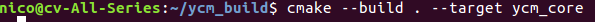
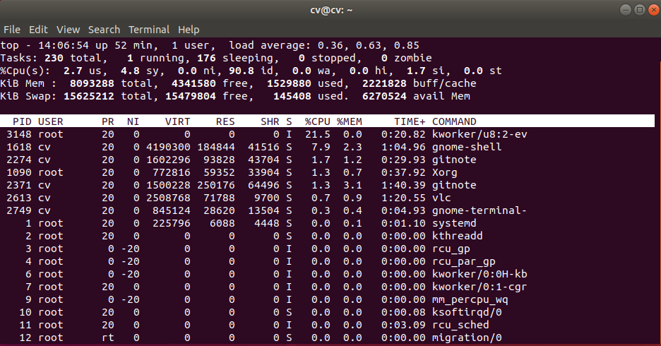

## Ubuntu 配置
### 
### 中文显示异常

原因：
当系统使用的是英文环境时，Ubuntu默认采用的字体Noto Sans CJK优先显示日文汉字，这一问题可以通过修改配置文件/etc/fonts/conf.avail/64-language-selector-prefer.conf来修复
64-language-selector-prefer.conf原文件内容:
```
<?xml version="1.0"?>
<!DOCTYPE fontconfig SYSTEM "fonts.dtd">
<fontconfig>
	<alias>
		<family>sans-serif</family>
		<prefer>
			<family>Noto Sans CJK JP</family>
			<family>Noto Sans CJK KR</family>
			<family>Noto Sans CJK SC</family>
			<family>Noto Sans CJK TC</family>
		</prefer>
	</alias>
	<alias>
		<family>serif</family>
		<prefer>
			<family>Noto Serif CJK JP</family>
			<family>Noto Serif CJK KR</family>
			<family>Noto Serif CJK SC</family>
			<family>Noto Serif CJK TC</family>
		</prefer>
	</alias>
	<alias>
		<family>monospace</family>
		<prefer>
			<family>Noto Sans Mono CJK JP</family>
			<family>Noto Sans Mono CJK KR</family>
			<family>Noto Sans Mono CJK SC</family>
			<family>Noto Sans Mono CJK TC</family>
		</prefer>
	</alias>
</fontconfig>
```
JP <--->日文
KR <---> 韩文
SC <---> 简体中文
TC <---> 繁体中文

修改上面的文件，将顺序改成SC TC JP KR

### ssr

#### 检测服务器是否被墙
网站: ping.pe

#### 代理设置
##### 终端走代理
export http_proxy=http://proxyAddress:port
export http_proxy=http://127.0.0.1:12333
export https_proxy=http://127.0.0.1:12333


## vim
### 下载vim 
>> git clone https://github.com/vim/vim.git

### 安装vim
1. cd vim
2.  ./configure --with-features=huge --enable-python3interp --enable-pythoninterp --with-python-config-dir=/usr/lib/python2.7/config-x86_64-linux-gnu/ --enable-rubyinterp --enable-luainterp --enable-perlinterp  --enable-multibyte --enable-cscope      --prefix=/usr/local/vim/
3. sudo make install

### 配置vim
配置插件
#### YouCompleteMe

##### Install YouCompleteMe
通过安装llvm二进制包来完成C\/C++语义补全。
然后从 ["网站"](http://releases.llvm.org/download.html) 下载适配的版本。
可以新建一个目录存放解压后的二进制文件：

可以新建一个目录用于构建make文件:
如果事先安装编译器，那么先安装编译器: sudo apt-get install g\++
cmake -G "Unix Makefiles" -DPATH_TO_LLVM_ROOT=~/ycm_temp/clang+llvm-8.0.1-powerpc64le-linux-ubuntu-16.04/ . ~/.vim/plugged/YouCompleteMe/third_party/ycmd/cpp/

然后构建目标文件：
cmake --build . --target ycm_core


最后在YCM的目录下运行安装脚本：
python3 install.py --clang-completer


### 查询 include path
> echo | cpp -xc++ -Wp,-v
The cpp -Wp,-v command waits for some input. The echo | saves the user needing Ctrl + D or Ctrl + C to return to shell
### vim 命令
verbose map \<key>: 查询 key 的映射


## syscall
```c
#define _GNU_SOURCE         /* See feature_test_macros(7) */
#include <unistd.h>
#include <sys/syscall.h>   /* For SYS_xxx definitions */

long syscall(long number, ...);
	Reuturns:  The return value is defined by the system call being invoked.  In 
general, a 0 return value indicates success. A -1 return value indicates an error, and an
 error code is stored in errno.

Description:
  syscall 是库函数，可以用于调用一些汇编接口的系统调用，这些系统调用没有C语言包装函数。
```


## gettid
```c
#include <sys/types.h>
pid_t gettid(void);
	Returns: On success, returns the thread ID of the calling process. This call is 
always successful.

Description:  gettid()  returns  the  caller's thread ID (TID).  In a single-threaded 
process, the thread ID is equal to the process ID (PID, as returned by getpid(2)).  In a 
multithreaded process, all threads have the  same  PID,  but each one has a unique TID.

Note: There is no glibc wrapper for this system call
```


## grub模式
通过开机启动按shitf键进入grub模式，然后按c键进入文字界面。

## 命令行
#### env
输出所有环境变量

## CPU 占用率高排查
使用 top 命令查看程序运行情况


第一行，任务队列信息，同 uptime 命令的执行结果
- 系统时间：14：06：54
- 运行时间：up 52 min
- 当前登陆用户：1 user
- 负载均衡（uptime）load average：0.36,0.63,0.85
	- average 后面的三个数分别是1分钟、5分钟、15分钟的负载情况。load average 数据是每隔5秒钟检查一次活跃的进程数，然后按特定算法计算出的数值。如果这个数除以逻辑 CPU 的数量，结果高于5的时候就表明系统在超负荷运转了

第二行，Tasks--任务（进程）
- 总进程：230 total，运行：1 running，休眠：176 sleeping，停止：0 stopped，僵尸进程：0 zombie

第三行，cpu 状态信息
- 2.7 us（user space）：用户空间占用 CPU 的百分比
- 4.8 sy（sysctl）：内核空间占用 CPU 的百分比
- 0.0 ni：改变过优先级的进程占用 CPU 的百分比
- 90.8 id（idolt）：空闲 CPU 的百分比
- 0.0 wa（wait）：IO 等待占用 CPU 的百分比
- 0.0 hi（Hardware IRQ）：硬中断占用 CPU 的百分比
- 1,7 si（Software Interrupts）：软中断占用 CPU 的百分比

