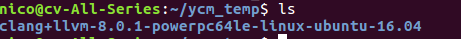
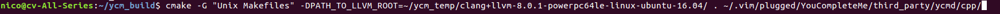
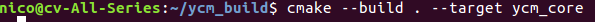
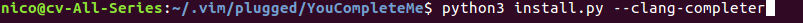

# vim note
## vim configuration
### Install YouCompleteMe
通过安装llvm二进制包来完成C\/C++语义补全。

然后从 http://releases.llvm.org/download.html 下载适配的版本。
可以新建一个目录存放解压后的二进制文件：

可以新建一个目录用于构建make文件:
cmake -G "Unix Makefiles" -DPATH_TO_LLVM_ROOT=~/ycm_temp/clang+llvm-8.0.1-powerpc64le-linux-ubuntu-16.04/ . ~/.vim/plugged/YouCompleteMe/third_party/ycmd/cpp/

然后构建目标文件：
cmake --build . --target ycm_core

最后在YCM的目录下运行安装脚本：

