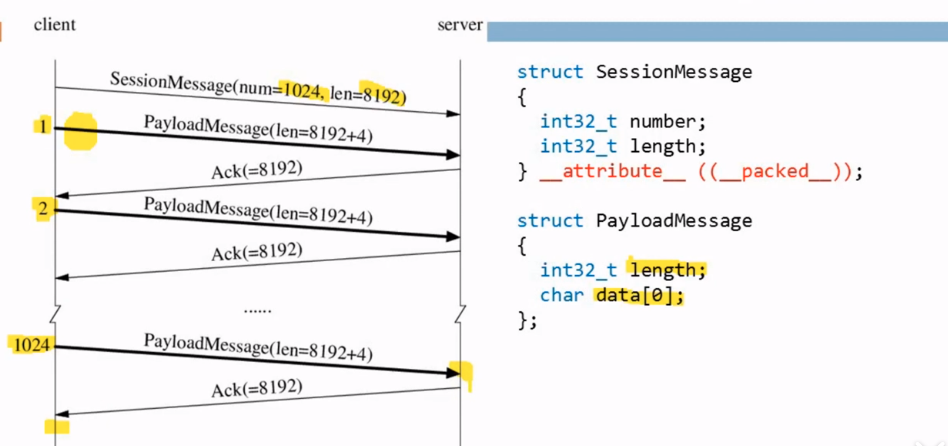

# 高性能服务器网络编程(陈硕)

## 常用命令
### nc
命令参数:
- -l: 监听端口

### dd
命令参数：
- if: input file
- bs: bytes
- count: count
## TCP 性能检测
> 客户端: dd if=/dev/zero bs=1MB count=10000 | nc localhost 5001

> 服务端: nc -l 5001

## Nonconcurrent examples
### TTCP
传统的 TCP 性能测试工具

#### What performance do we care?
- Bandwidth, MB/s
- Throughput, messages/s, queries/s(QPS), transactions/s(TPS)
- Latency, milliseconds, percentiles
- Utilization, percent, payload vs. carrier, goodput vs. theory BW
- overhead, eg. CPU usage, for compression and/or encryption

#### Why do we re-implement TTCP?
- It uses all basic Sockets APIs: socket, listen, bind, accept, connect,
read/recv, write/send, shutdown, close, etc.
- The protocol is binary, not just byte stream, so it's better than the classic
echo example
- Typical behaviors, meaningful results, instead of packets/s
- Service as benchmark for programming language as well, by comparing CPU usage
- Not concurrent, at least in the very basic form

#### 协议

#### 代码
1. Straight forward with blocking IO
- muduo/examples/ace/ttcp/ttcp\_blocking.cc(C with sockets API)
- recipes/tpc/ttcp.cc(C++ with a thin warpper)
2. Non-blocking IO with muduo library
- muduo/examples/ace/ttcp/ttcp.cc

### Round-trip
measure clock error between two hosts

### Netcat
a Swiss knife

### Slow sink/source

## Concurrent examples
### SOCKS proxy server
### Sudoku solver
### Simple memcached
### Broadcasting to multiple TCP peers

## Data processing with multiple machines
### Parallel N-queues
### Median of numbers across machines
### Frequent queries
### Distributed sorting

## Advanced topics
### RPC
### Load balancing
### Capacity of a serving system
#### How many machines do I need to support X QPS?
#### What will be the number of replicas of each component?
### Fight for latency
