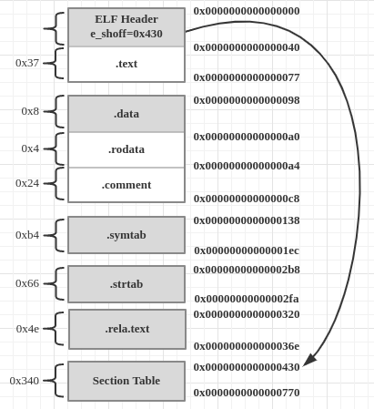

# 常用工具介绍
## objdump
objdump: display information from object files.
Options:
- -h: Display summary information from the section headers of the object file.
- -x: Display all available header information, including the symbol table and relocation entries.  Using -x is equivalent to specifying all of -a -f -h -p -r -t.
- -s: Display the full contents of any sections requested.  By default all non-empty sections are displayed.
- -d: Display the assembler mnemonics for the machine instructions from objfile.  This option only disassembles those sections which are expected to contain instructions.

## size
size: list section sizes and total size.
Options:

## readelf
readelf: Displays information about ELF files.
Options:
- -h: Displays the information contained in the ELF header at the start of the file.
- -s:  Displays the entries in symbol table section of the file, if it has one.
- -S: Displays the information contained in the file's section headers, if it has any.

## nm list symbols from object files
Options:

## c++filt
c++filt: Demangle C\++ and Java symbols.
# Chapter 1 温故而知新
### 1.5 使用虚拟内存的原因
不使用虚拟内存的缺点：
- **地址空间不隔离**，所有程序都可以直接访问物理内存地址，程序所使用的内存空间不是相互隔离的。恶意程序或者有bug的程序会访问到其他程序的内存地址，导致意外发生。
- **内存使用效率低**，由于没有有效的内存管理机制，程序所需要的空间是连续的。导致运行程序而内存不足时，会导致其他程序整个被切换出来以获取内存。这导致大量的数据在换入换出，效率低下。
- **程序运行的地址不确定**，因为每次程序运行时，都需要给它分配足够大的空闲区域，这个空闲区域的位置是不确定的。这个程序的编写造成了一定的麻烦，因为程序在编写时，它访问数据和指令跳转时的目标地址很多都是固定的，这涉及到重定位问题。

### 1.5.3 分页(Paging)
linux查看分页大小：getconf PAGE_SIZE。Ubuntu 16.0为 4096字节(4KB)。

分页：把地址空间人为地等分成固定大小的页。

### 1.6 多线程
使用多线程的好处：
- 某个操作可能要陷入长时间等待，等待的线程会进入睡眠状态，无法执行。多线程执行可以有效利用等待的时间。典型的例子是等待网络响应。
- 某个操作(常常是计算)会消耗大量的时间，如果只有一个线程，程序和用户之间的交互会中断。多线程可以让一个线程负责交互，另一个线程负责计算。
- 程序逻辑本身就要求并发操作，例如一个多端下载器(例如 Bittorrent)。
- 多CPU或多核计算机，本身具备同时执行多个线程的能力，因此单线程程序无法全面地发挥计算机的全部计算能力。
- 相对于多进程应用，多线程在数据共享方面效率要高很多。

不断在处理器上切换不同的线程的行为称之**线程调度**。在线程调度中，线程通常拥有至少三种状态，分别是：
- 运行(Running): 此时线程正在执行。
- 就绪(Ready): 此时线程可以立刻运行，但CPU已被占用。
- 等待(Waiting): 此时线程正在等待某一个事件(通常是I/O或同步）发生，无法执行。

处于运行中线程拥有一段可以执行的时间，这段时间称为**时间片(Time Slice)**，当时间片用尽的时候，该进程将进入就绪状态。如果在时间片用尽之前进程就开始等待某事件，那么它
将进入等待状态。每当一个线程离开运行状态时，调度系统就会选择一个其他的就绪线程继续执行。在一个处于等待状态的线程所等待的事件发生后，该线程将进入就绪状态。
状态的转移如图：


##### 双重检查锁定模式
["双重检查锁定模式"](https://zh.wikipedia.org/wiki/%E5%8F%8C%E9%87%8D%E6%A3%80%E6%9F%A5%E9%94%81%E5%AE%9A%E6%A8%A1%E5%BC%8F)

-----------------------------------------------

# Chatper 2 编译和链接
## 2.1 编译过程
编译过程可分为四个步骤：
1. 预处理（Prepressing）
2. 编译（Compilation）
3. 汇编（Assembly）
4. 链接（Linking）

GCC编译过程分解如下图所示：


### 2.1.1 预处理
首先将源代码文件和相关的头文件，如stdio.h等被预编译器cpp预编译成一个.i文件或者.ii文件。
可以使用如下命令进行预编译：
- $gcc -E hello.c -o hello.i
- $cpp hello.c > hello.i

预编译过程主要处理那些源代码文件中的以"#"开始的预编译指令。比如"#include"、"#define"等，主要处理规则如下：
- 将所有的"#define"删除，并且展开所有的宏定义。
- 处理所有条件预编译指令，比如"#if"、"#ifdef"、"#elif"、"#else"、"#endif"。
- 处理"#include"预编译指令，将被包含的文件插入到该预编译指令的位置。注意，这个过程是递归进行的，也就是说被包含的文件可能还包含其他的文件。
- 删除所有的注释"//"和"/**/"。
- 添加行号和文件名标识，比如#2"hello.c"2，以便于编译时编译器产生调式用的行号信息及用于编译时所产生编译错误或警告时能够显示行号。
- 保留所有的#pragma编译器指令，因为编译器必须要使用它们。

经过预编译后的.i文件不包含任何宏定义，因为所有宏都展开了，并且包含的文件也已经被插入到.i文件中。所以当无法判定宏定义是否正确或者头文件包含是否正确时，
可以查看预编译后的文件来确定问题。

### 2.1.2 编译
编译过程就是把预处理完的文件进行一系列词法分析、语法分析、语义分析以及优化后生成相应的汇编代码文件。上面的编译过程相当于如下命令：
- $gcc -S hello.i -o hello.s
- $gcc -S hello.c -o hello.s

### 2.1.3 汇编
汇编器将汇编代码转变成机器可以执行的指令。汇编过程可以调用汇编器as来完成：
- $as hello.s -o hello.o
- $gcc -c hello.s -o hello.o
- $gcc -c hello.c -o hello.o

### 2.1.4 链接
链接将所有.o文件链接起来得到可执行文件。

## 2.2 编译器做了什么
编译过程一般可以分为6步：扫描、语法分析、语义分析、源代码优化、代码生成和目标代码优化。如下图所示：


### 2.2.1 词法分析
首先源代码程序被输入到扫描器(Scanner)，扫描器只是简单的进行词法分析，运用一种类似于有限状态机(Finite State Machine)的算法将源代码的字符序列分割成一系列的记号(Token)。
比如源代码如下：
```c
array[index] = (index + 4) * (2 + 6)
```
上面代码总共包含了28个非空字符，经过扫描后，产生了16个记号，如下表所示：
**记号** | **类型**
:------|:-----
array | 标识符
[ | 左方括号
index | 标识符
] | 右方括号
= | 赋值
( | 左原括号
index | 标识符
+ | 加号
4 | 数字
) | 右圆括号
* | 乘号
( | 左圆括号
2 | 数字
+ | 加号
6 | 数字
) | 右圆括号

词法分析产生的记号一般可以分为如下几类：关键字、标识符、字面量（包含数字、字符串等）和特殊符号（如加号、等号）。在标识记号的同时，扫描器也完成了其他工作。比如将标识符存放在符号表，将数字、字符串常量存放在文字表，以备后面的步骤使用。

### 2.2.2 语法分析
语法分析器（Grammar Parser）将对由扫描器产生的记号进行语法分析，从而产生语法树（Syntax Tree）。整个分析过程采用了**上下文无关语法(Context-free Grammar)** 的分析手段。简单地讲，由语法分析器生成的语法树就是以表达式(Expression)为节点的树。上面例子中的语句就是一个有赋值表达式、加法表达式、乘法表达式、数组表达式、括号表达式组成的复杂语句。它在经过语法分析器以后形成如下图所示的语法树。

如果出现了表达式不合法，比如各种括号不匹配、表达式中缺少操作符等，编译器就会报告语法分析阶段的错误。

### 2.2.3 语义分析
语法分析仅仅是完成了对表达式的语法层面的分析，但是它并不了解这个语句是否真正有意义。比如C语言里面两个指针做乘法运算是没有意义的，但是这个语句在语法上是合法的;比如同样一个指针和一个浮点数做乘法运算是否合法等。编译器所能分析的语义是静态语义(Static Semantic)，所谓静态语义是指在编译期可以确定的语义。与之对应的动态语义(Dynamic Semantic)就是只有在运行期才能确定的语义。

静态语义通常包括声明和类型的匹配，类型的转换。比如当一个浮点型的表达式赋值给一个整型的表达式时，其中隐含了一个浮点类型到整型的转换过程，语义分析过程中需要完成这个步骤。比如将一个浮点型赋值给一个指针的时候，语义分析就会发现这个类型不匹配，编译器将会报错。动态语义一般指在运行期出现的语义相关的问题，比如将0作为除数是一个运行期语义错误。

经过语义分析阶段后，整个语法树的表达式都被标识了类型，如果有些类型需要做隐式转换，语义分析程序会在语法树中插入相应的转换节点。上面描述的语法树在经过语义分析阶段以后成为了如下图所示的形式：


### 2.2.4 中间语言生成
源码级优化器（Source Code Opitimizer）会在源代码级别进行优化。例如(2+6)这个表达式可以被优化掉，因为它的值在编译期就可以被确定。经过优化的语法树如下图所示：


直接在语法树上作优化比较困难，所以源代码优化器往往将整个语法树转换成中间代码（Itermediate Code），它是语法树的顺序表示，其实它已经十分接近目标代码了。但是它一般跟目标机器和运行时环境是无关的。如它不包含数据的尺寸、变量地址和寄存器的名字等。中间代码有很多种类型，在不同编译器中有着不同的形式，比较常见的有：三地址码（Three-address Code）和P-代码（P-Code）。

三地址码：
x = y op z
这个三地址码表示将变量y和z进行op操作以后，复制给x。这里的op操作可以是算术运算，比如加减乘除，也可以其他任何可以应用到y和z的操作。三地址码也得名于此，因为一个三地址码语句里有三个变量地址。上面例子中的语法树被翻译成三地址码后是这样的：
```c
t1 = 2 + 6
t2 = index + 4
t3 = t2 * t1
array[index] = t3
```
可以看到，为了使所有操作都符合三地址码形式，这里利用了几个临时变量：t1、t2、t3。在三地址码的基础上进行优化时，优化程序会将2+6的结果结算出来，得到t1=8，然后将后面代码中的t1替换成数字8。还可以省去一个临时变量t3，因为t2可以重复利用。经过优化后的代码如下：
```c
t2 = index + 4
t2 = t2 * 8
array[index] = t2
```
中间代码使得编译器可以被分为前端和后端。编译器前端负责产生机器无关的中间代码，编译器后端将中间代码转换成目标机器代码。这样对于一些可以跨平台的编译器而言，它们可以针对不同的平台使用同一个前端和针对不同机器平台的数个后端。

### 2.2.5 目标代码生成和优化
编译器后端主要包括代码生成器（Code Generator）和目标代码优化器（Target Code Optimizer）。

代码生成器将中间代码转换成目标机器代码，这个过程十分依赖于目标机器，因为不同的机器有着不同的字长、寄存器、整数数据类型和浮点数数据类型等。对于上面例子中的中间代码，代码生成器可能会产生下面的代码序列（用x86的汇编语言来表示，并且假设index的类型为int型，array的类型为int型数组）：
```c
movl index, %ecx	; value of index to ecx
addl $4, %ecx		; ecx = ecx + 4
mull $8, %ecx		; ecx = ecx * 8
movl index, %eax	; value of index to eax
movl %ecx, array(,eax,4); array[index] = ecx
```
最后目标代码优化器对上述的目标代码进行优化，比如选择合适的寻址方式、使用位移来代替乘法运算、删除多余的指令等。上面的例子中，乘法由一条相对复杂的基址比例变址寻址（Base Index Scale Addressing）的lea指令完成，随后由一条mov指令完成最后的赋值操作，这条mov指令的寻址方式与lea是一样的：
```c
movl index, %edx
leal 32(,%edx,8), %eax
movl %eax, array(,%edx,4)
```
当源代码最终被编译成了目标代码时，还有一个问题是：index和array的地址还没有确定。如果index和array的定义在跟上面的源代码同一编译单元里面，那么编译器可以为index和array分配空间，确定它们的地址。但如果是定义在其他的程序模块的话，就要涉及链接的问题。事实上，定义其他模块的全局变量和函数在最终运行时的绝对地址都要在最终链接的时候才能确定。

## 2.4 静态链接
人们把每个源代码模块独立地编译，然后按照需要将它们“组装”起来，这个组装模块的过程就是**链接(Linking)**。链接的过程主要包括了**地址和空间分配(Address and Storage Allocation)**、**符号决议(Symbol Resolution)**、和**重定位(Relocation)**等步骤。

每个模块的源代码文件(如.c)文件经过编译器编译成目标文件(Object File，一般扩展名为.o或.obj)，目标文件和库(Library)一起链接形成最终可执行文件。而最常见的库就是**运行时库(Runtime Library)**，它是支撑程序运行的基本函数的集合。库其实是一组目标文件的包，就是一些最常用的代码编译成目标文件后打包存放。

地址修成的过程也被叫做**重定位(Relocation)**，每个要被修正的地方叫一个**重定位入口(Relocation Entry)**。重定位所做的就是给程序中每个这样的绝对地址引用的位置“打补丁”，使它们指向正确的位置。

----------------

# Chatper 3 目标文件里有什么
## 3.1 目标文件的格式
PC平台流行的可执行文件格式（Executable）主要是Windows下的PE（Portable Executable）和Linux的ELF（Executable Linkable Format），它们都是COFF（Common file format）的变种。

动态链接库（DLL，Dynamic Linking Library）（Windows的.dll和Linux的.so）及静态链接库（Static Linking Library）（Windows的.lib和Linux的.a）文件都按照可执行文件格式存储。静态链接库稍有不同，它是把很多目标文件捆绑在一起，再加上一些索引形成一个文件。ELF文件标准里面把系统中采用ELF格式的文件归为下表所列举的四类：
**ELF文件类型** | **说明** | **实例**
:-----------|:----------|:------------
可重定位文件（Relocatable File）| 这类文件包含了代码和数据，可以被用来链接成可执行文件或共享目标文件，静态链接库也可以归为这一类 | Linux的.o、Windows的.obj
可执行文件（Executable File） | 这类文件包含了可以直接执行的程序，它的代表就是ELF可执行文件，它们一般都没有扩展名 | 比如/bin/bash文件、Windows的.exe
共享目标文件（Shared Object File） | 这种文件包含了代码和数据，可以在以下两种情况使用。一种是链接器可以使用这种文件跟其他的可重定位文件和共享目标文件链接，产生新的目标文件。第二种是动态链接器可以将几个这种共享目标文件与可执行文件结合，作为进程映像的一部分来运行 | Linux的.so，如/lib/glibc-2.5.so、Windows的DLL
核心转储文件（Core Dump File） | 当进程意外终止时，系统可以将该进程的地址空间的内容以及终止时的一些其他信息转储到核心转储文件 | Linux下的core dump

## 3.2 目标文件是什么样的

- File Header：它描述了整个文件的文件属性，包括文件是否可执行、是静态链接还是动态链接及入口地址（如果是可执行文件）、目标硬件、目标操作系统等信息。File Header还包括了一个段表（Section Table），段表是一个描述文件中各个段的数组。段表描述了文件中各个段在文件中的偏移位置以及段的属性等，从段表中可以得到每个段的所有信息。
- 代码段（Code Section）：程序源代码编译后的机器指令经常被放在代码段里，代码段常见的名字有".code"或".text"。
- .data：已初始化的全局变量和局部静态变量都保存在.data段。
- .bss：未初始化的全局变量和局部静态变量一般放在.bss段里。.bss段只是为未初始化的全局变量和局部静态变量预留位置，它并没有内容，所以它在文件中不占据空间。但程序运行时它们确实是要占空间的，所以可执行文件必须记录所有未初始化的全局变量和局部静态变量的大小总和。

总体来说，程序源代码被编译后主要分成两种段：程序指令和程序数据。代码段属于程序指令，而数据段和.bss段属于程序数据。数据和指令分段有如下好处：
- 当程序被加载后，数据和指令分别被映射到两个虚存区域。由于数据区域对进程来说是可读写的，而指令区域对进程来说是只读的，所以这两个虚存区域的权限分别可设置为可读写和只读。这样可以防止程序的指令被有意或无意地改写。
- CPU的缓存一般都被设计成数据缓存和指令缓存分离，所以程序的指令和数据被分开存放对CPU的缓存命中率提高有好处。
- 最重要的原因是当系统中运行着多个该程序的副本时，因为指令是一样的，所以内存中只需保存一份该程序的指令部分。对于指令这种只读区域是这样，对于其他的只读数据也一样。比如很多程序里面带有的图标、图片、文本等资源都是属于可以共享的。

## 3.3 挖掘SimpleSection.o
```c
/*
 * SimpleSection.c
 */
int printf(const char* format, ...);

int global_init_var = 84;
int global_uninit_var;

void func1(int i)
{
    printf("%d\n", i);
}


int main(void)
{
    static int static_var = 85;
    static int static_var2;
    int a = 1;
    int b;

    func1(static_var + static_var2 + a + b);
    return a;
}
```

SimpleSection.o的段除了最基本的代码段、数据段、BSS段以外，还有只读数据段(.rodata)、注释数据段(.comment)和堆栈提示段(.note.GNU-stack)等。"CONTENTS"、"ALLOC"等表示段的各种属性，"CONTENTS"表示该段在文件中存在。可以看到BSS段没有"CONTENTS"，表示它实际上在ELF文件中不存在内容。相应的段在ELF中的结构如下图所示：


### 3.3.1 代码段
可以使用 objdump -s -d SimpleSection.o 查看代码段内容。

可以观察到.text段的大小正好为0x55。

### 3.3.2 数据段和只读数据段
.data段保存的是哪些已经初始化了的全局变量和局部静态变量。SimpleSection.c代码里一共有两个这样的变量，分别是global_init_var和static_var。这两个变量每个4个字节，一个刚好8个字节，所以.data段的大小为8个字节。

SimpleSection.c里面调用"printf"的时候，用到了一个字符串常量"%d\n"，它是一种只读数据，所以它被放在了.rodata段。可以从输出结果看到"%d\n"这个段的4个字节刚好是这个字符串常量的ASCII字节序，最后以\0结尾。

.rodata段存放的是只读数据，一般是程序里面的只读变量(如const修饰的变量)和字符串常量。单独设立.rodata段有很多好处，不光是语义上支持了C++的const关键字，而且操作系统在加载的时候可以将.rodata段的属性映射成只读，这样对于这个段的任何修改操作都会被作为非法操作处理，保证了程序的安全性。

### 3.3.3 BSS段
.bss段存放的是未初始化的全局变量和局部静态变量，如上述代码中global_uninit_var和static_var2就是被存放在.bss段。但有些编译器不会把全局未初始化变量存放在.bss段，而是预留一个未定义的全局变量符号，等到最终链接成可执行文件时再在.bss段分配空间。所以可以看到.bss段目前只有4个字节大小。编译单元内部可见的静态变量（比如给global_uninit_var加上static修饰）的确是存放在.bss段的。

```c
static int x1 = 0;
static int x2 = 1;
```
x1会被存放在.bss中，而x2会被存放在.data中。因为x1为0,可以被认为是未初始化的，因为未初始化的都是0,所以被优化掉了可以放在.bss段，这样可以节省磁盘空间。

### 3.3.4 其他段
除了.text、.data、.bss这三个最常用的段之外，ELF文件也有可能包含其他的段，用来保存和程序相关的其他信息。下表列举了ELF的一些常见的段：
**常用段名** | **说明**
:----|:---
.rodata1 | Read only Data，这种段里存放的是只读数据，比如字符串常量、全局const变量。跟.rodata一样
.comment | 存放的是编译器版本信息，比如字符串："GCC:(GNU)4.2.0"
.debug | 调试信息
.dynamic | 动态链接信息
.hash | 符号哈希表
.line | 调试时的行号表，即源代码行号和编译后指令的对应表
.note | 额外的编译器信息。比如程序的公司名、发布版本号等
.strtab | String Table. 字符串表，用于存储ELF文件中用到的各种字符串
.symtab | Symbol Table. 符号表
.plt .got | 动态链接的跳转表和全局入口表
.init .fini | 程序初始化与终结代码段

## 3.4 ELF文件结构描述
ELF文件基本结构如下图所示：

ELF目标文件格式的最前部是ELF文件头(ELF Header)，它包含了描述整个文件的基本属性，比如ELF文件版本、目标机器型号、程序入口地址等。紧接着是ELF文件各个段。其中ELF文件中与段有关的重要结构就是段表(Section Header Table)，该表描述了ELF文件包含的所有段的信息，比如每个段的段名、段的长度、在文件中的偏移、读写权限及段的其他属性。

### 3.4.1 文件头（ELF Header）
可以用**readelf**命令来详细查看ELF文件：


ELF文件头结构及相关常数被定义在"/usr/include/elf.h"里，因为ELF文件在各种平台下都通用，ELF文件有32位版本和64位版本。它的文件头结构也有这两种版本，分别叫做"Elf32_Ehdr"和"Elf64_Ehdr"。两个版本的文件头内容是一样的，只不过有些成员的大小不一样。成员大小如下表所示：
**自定义类型** | **描述** | **原始类型** | **长度(字节)**
:-------|:-------------|:--------------|:------------
Elf32_Addr | 32位版本程序地址 | uint32_t | 4
Elf32_Half | 32位版本程序的无符号短整型 | uint16_t | 2
Elf32_Off | 32位版本的偏移地址 | uint32_t | 4
Elf32_Sword | 32位版本有符号整型 | uint32_t | 4 
Elf32_Word | 32位版本无符号整型 | int32_t | 4
Elf64_Addr | 64位版本程序地址 | uint64_t | 8
Elf64_Half | 64位版本程序的无符号短整型 | uint16_t | 2
Elf64_Off | 64位版本的偏移地址 | uint64_t | 8
Elf64_Sword | 64位版本有符号整型 | uint32_t | 4 
Elf64_Word | 64位版本无符号整型 | int32_t | 4

64位版本的文件头结构"Elf64_Ehdr"的定义如下：
```c
typedef struct
{
   unsigned char e_ident[EI_NIDENT]; /* Magic number and other info */	   
   Elf64_Half    e_type;         /* Object file type */
   Elf64_Half    e_machine;      /* Architecture */
   Elf64_Word    e_version;      /* Object file version */
   Elf64_Addr    e_entry;        /* Entry point virtual address */
   Elf64_Off     e_phoff;        /* Program header table file offset */
   Elf64_Off     e_shoff;        /* Section header table file offset */
   Elf64_Word    e_flags;        /* Processor-specific flags */
   Elf64_Half    e_ehsize;       /* ELF header size in bytes */
   Elf64_Half    e_phentsize;    /* Program header table entry size */
   Elf64_Half    e_phnum;        /* Program header table entry count */
   Elf64_Half    e_shentsize;    /* Section header table entry size */
   Elf64_Half    e_shnum;        /* Section header table entry count */
   Elf64_Half    e_shstrndx;     /* Section header string table index */
} Elf64_Ehdr;
```
下表是ELF文件头中各个成员的含义与readelf输出结果的对照表：
**成员** | **readelf输出结果与含义**
:----|:--------
e_ident | Magic：   7f 45 4c 46 02 01 01 00 00 00 00 00 00 00 00 00<br>类别:                            ELF64<br> 数据: 2<br> 补码，小端序 (little endian)<br>版本: 1 (current)<br>OS/ABI:                          UNIX - System V<br>ABI 版本: 0
e_type | 类型: REL (可重定位文件)<br>Object file type
e_machine | 系统架构:  Advanced Micro Devices X86-64<br>Architecture 
e_version | 版本:  0x1<br>Object file version
e_entry | 入口点地址：0x0<br>Entry point virtual address<br>操作系统在加载完该程序后从这个地址开始执行进程的指令。可重定位文件一般没有入口地址，则这个值为0
e_phoff | 程序头起点：0 (bytes into file)<br>Program header table file offset
e_shoff | Start of section headers: 1072 (bytes into file)<br>Section header table file offset<br>段表在文件中的偏移，上面这个例子的值是1072，也就是段表从文件的第1073个字节开始
e_flags | 标志：0x0<br>Processor-specific flags<br>ELF文件标志位，用来标识一些ELF文件平台相关的属性。相关常量的格式一般为ELF_machine_flag，machine为平台，flag为标志
e_ehsize | 本头的大小：64 (字节)<br>ELF header size in bytes<br>即ELF文件头本身的大小，这个例子里面为64字节
e_phentsize | 程序头大小：0 (字节)<br>Program header table entry size
e_phnum | Number of program headers:  0<br>Program header table entry count
e_shentsize | 节头大小：64 (字节)<br>Section header table entry size<br>段表描述符的大小，这个一般等于sizeof(Elf64_Shdr)
e_shnum | 节头数量：13<br>Section header table entry count<br>段表描述符数量。这个值等于ELF文件中有用的段的数量，上面那个例子里面为13
e_shstrndx | 字符串表索引节头：10<br>Section header string table index<br>段表字符串表所在的段在段表中的下标

Magic： 7f 45 4c 46 02 01 01 00 00 00 00 00 00 00 00 00
字节序：
- 0，无效格式
- 1, 小端格式
- 2, 大端格式

ELF文件类：
- 0，无效文件
- 1, 32位ELF文件
- 2, 64位ELF文件

最开始的4个字节是所有ELF文件都必须相同的标识码，分别为0x7F、0x45、0x4c、0x46，第1个字节对应ASCII字符里的DEL控制符，后面3个字节刚好是ELF这3个字母的ASCII码。这4个字节又被称为ELF文件的魔数，几乎所有的可执行文件格式的最开始的几个字节都是魔数。比如a.out格式最开始的两个字节为0x01、0x07;PE/COFF文件最开始两个字节为0x4d、0x5a。这种魔数用于确认文件的类型，操作系统在加载可执行文件的时候会确认魔数是否正确，如果不正确会拒绝加载。

第5个字节用来标识ELF的文件类，0x01表示是32位，0x02表示是64位;第6个字节是字节序，规定该ELF文件是大端还是小端;第7个字节规定ELF文件的主版本号，一般是1,因为ELF标准1.2版以后就再也没有更新了。后面的9个字节ELF标准没有定义，一般填0，有些平台会使用这9个字节作为扩展标志。

文件类型：e_type成员表示ELF文件类型，每个文件类型对应一个常量。系统通过这个常量来判断ELF文件的真正文件类型，而不是通过文件的扩展名。相关常量以"ET_"开头，如下表所示：
**常量** | **值** | **含义**
:-----|:-----|:----
ET_REL | 1 | 可重定位文件，一般为.o文件
ET_EXEC | 2 | 可执行文件
ET_DYN | 3 | 共享目标文件，一般为.so文件
ET_CORE | 4 | 核心转储文件

机器类型：ELF文件格式被设计成可以在多个平台下使用。这并不表示同一个ELF文件可以在不同平台使用，而是表示不同平台下的ELF文件都遵循同一套ELF标准。e_machine成员就表示该ELF文件的平台属性。比如3表示该ELF文件只能在Intel x86机器下使用。相关的常量以"EM_"开头，如下表所示：
**常量** | **值** | **含义**
:-----|:-----|:----
EM_M32 | 1 | AT&T WE 32100
EM_SPARC | 2 | SPARC
EM_386 | 3 | Intel x86

### 3.4.2 段表
ELF文件中有很多各种各样的段，段表（Section Header Table）就是保存这些段的基本属性的结构。段表是ELF文件中除了文件头以外最重要的结构，它描述了ELF的各个段的信息，比如每个段的段名、段的长度、在文件中的偏移、读写权限及段的其他信息。ELF文件的段结构就是有段表决定的，编译器、链接器和装载器都是依靠段表来定位和访问各个段的属性。段表在ELF文件中的位置有ELF文件头的"e_shoff"成员决定，比如在SimpleSection.o中，段表位于偏移0x430。

使用 readelf -S SimpleSection.o 输出完整的段表结构，如下图所示：

段表结构是一个以"Elf64_Shdr"结构体为元素的数组。数组元素的个数等于段的个数，每个"Elf64_Shdr"结构体对应一个段。"Elf64_Shdr"又称为段描述符（Section Descriptor）。对于SimpleSection.o来说，段表就是有13个元素的数组。ELF段表的这个数组的第一个元素是无效的段描述符，它的类型为"NULL"，除此之外每个段描述符都对应一个段。

段描述符结构（Section Descriptor）：
```c
typedef struct
{
  Elf64_Word	sh_name;		/* Section name (string tbl index) */
  Elf64_Word	sh_type;		/* Section type */
  Elf64_Xword	sh_flags;		/* Section flags */
  Elf64_Addr	sh_addr;		/* Section virtual addr at execution */
  Elf64_Off	sh_offset;		/* Section file offset */
  Elf64_Xword	sh_size;		/* Section size in bytes */
  Elf64_Word	sh_link;		/* Link to another section */
  Elf64_Word	sh_info;		/* Additional section information */
  Elf64_Xword	sh_addralign;		/* Section alignment */
  Elf64_Xword	sh_entsize;		/* Entry size if section holds table */
} Elf64_Shdr;
```
Elf64_Shdr的各个成员的含义如下表所示：
**成员** | **含义**
:----|:-----
sh_name | Section name 段名[^1]<br>段名是个字符串，它位于一个叫做.shstrtab的字符串表。sh_name是段名字符串在.shstrtab中的偏移
sh_type | Section type 段的类型
sh_flags | Section flag 段的标志位
sh_addr | Section Address 段虚拟地址[^2]<br>如果该段可以被加载，则sh_addr为该段被加载后在进程地址空间中的虚拟地址，否则sh_addr为0
sh_offset | Section Offset 段偏移<br>如果该段存在于文件中，则表示该段在文件中的偏移;否则无意义。比如sh_offset对于BSS段来说就没有意义
sh_link<br>sh_info | Section Link and Section Information 段链接信息
sh_addralign | Section Address Alignment 段地址对齐<br>有些段对段地址对齐有要求，比如假设有个段刚开始的位置包含了一个double变量，因为Intel x86系统要求浮点数的存储地址必须是本身的整数倍，也就是说保存double变量的地址必须是8字节的整数倍。这样对一个段来说，它的sh_addr必须是8的整数倍。<br>由于地址对齐的数量都是2的指数倍，sh_addralign表示是地址对齐数量中的指数，即sh_addralign=3表示对齐为2的3次方倍，即8倍，以此类推。如果sh_addralign为0或1，则表示该段没有对齐要求
sh_entsize | Section Entry Size 项的长度<br>有些段包含了一些固定大小的项，比如符号表，它包含的每个字符所占的大小都是一样的。对于这种段，sh_entsize表示每个项的大小。如果为0，则表示该段不包含固定的大小项

[^1]: 事实上段的名字对于编译器、链接器来说是有意义的，但是对于操作系统来说并没有什么实质的意义，对于操作系统来说，一个段该如何处理取决于它的属性和权限，即由段的类型和段的标志位这两个成员决定。
[^2]: 涉及映像文件的加载的概念。


下图为SimpleSection各个段的位置和长度。SectionTable长度为0x340,也就是832(64*13)个字节，它包含了13个段描述符，每个描述符为64字节，这个长度刚好等于sizeof(Elf64_Shdr)。整个文件以SectionTable结束，长度为0x770，即1904字节，刚好是整个SimpleSection.o的文件长度。


段的类型（sh_type）：段的名字只是在链接和编译过程中有意义，但它不能表示真正地表示段的类型。我们也可以命名一个数据段名为.text，但对于编译器和链接器来说，主要决定段的属性的是段的类型(sh_type)和段的标志位(sh_falgs)。段的类型相关常量以SHT_开头，列举如下表所示：
**常量** | **值** | **含义**
:-----------|:----|:------
SHT_NULL | 0 | 无效段
SHT_PROGBITS | 1 | 程序段。代码段、数据段都是这种类型
SHT_SYMTAB | 2 | 表示该段的内容为符号表
SHT_STRTAB | 3 | 表示该段的内容为字符串表
SHT_RELA | 4 | 重定位表。该段包含了重定位信息
SHT_HASH | 5 | 符号表的哈希表
SHT_DYNAMIC | 6 | 动态链接信息
SHT_NOTE | 7 | 提示性信息
SHT_NOBITS | 8 | 表示该段在文件中没有内容，比如.bss段
SHT_REL | 9 |  该段包含了重定位信息
SHT_SHLIB | 10 | 保留
SHT_DNYSYM | 11 | 动态链接的符号表

段的标志位（sh_flag）：段的标志位表示该段在进程虚拟空间地址中的属性，比如是否可写，是否可执行等。相关常量以SHF_开头，如下表所示：
**常量** | **值** | **含义**
:-----------|:----|:------
SHF_WRITE | 1 | 表示该段在进程空间中可写
SHF_ALLOC | 2 | 表示该段在进程空间中需要分配空间。有些包含指示或控制信息的段不需要在进程空间中分配空间。它们一般不会有这个标志。像代码段、数据段和.bss都会有这个标志位。
SHF_EXECINSTR | 4 | 表示该段在进程空间中可以被执行，一般指代码段

对于系统保留段，下表列举了它们的属性：
**Name** | **sh_type** | **sh_flag**
:------|:---------|:-----------
.bss | SHT_NOBITS | SHF_ALLOC + SHF_WRITE
.comment | SHT_PROGBITS | none
.data | SHT_PROGBITS | SHF_ALLOC + SHF_WRITE
.data1 | SHT_PROGBITS | SHF_ALLOC + SHF_WRITE
.debug | SHT_PROGBITS | none
.dynamic | SHT_DYNAMIC | SHF_ALLOC + SHF_WRITE<br>在有些系统下.dynamic段可能是只读的，所以没有SHF_WRITE标志位
.hash | SHT_HASH | SHF_ALLOC
.line | SHT_PROGBITS | none
.note | SHT_NOTE | none
.rodata | SHT_PROGBITS | SHF_ALLOC
.rodata1 | SHT_PROGBITS | SHF_ALLOC
.shstrtab | SHT_STRTAB | none
.strtab | SHT_STRTAB | 如果该ELF文件中有可装载的段需要用到该字符串表，那么该字符串表也将被装载到进程空间，则有SHF_ALLOC标志位
.symtab | SHT_SYNTAB | 同字符串表
.text | SHT_PROGBITS | SHF_ALLOC + SHF_EXECINSTR

段的链接信息（sh_link、sh_info）：如果段的类型是与链接相关的，比如重定位表、符号表等，那么sh_link和sh_info这两个成员所包含的意义如下表所示。对于其他类型的段，这两个成员没有意义：
**sh_type** | **sh_link** | **sh_info**
:------|:---------|:-----------
SHT_DYNAMIC | 该段所使用的字符串表在段表中的下标 | 0
SHT_HASH | 该段所使用的符号表在段表中的下标 | 0
SHT_REL<br>SHT_RELA | 该段所使用的相应符号表在段表中的下标 | 该重定位表所作用的段在段表中的下标
SHT_SYMTAB<br>SHT_DYNSYM  | 操作系统相关的 | 操作系统相关的
other | SHN_UNDEF | 0

### 3.4.3 重定位表
SimpleSection中有一个叫做.rel.text的段，它的类型(sh_type)为"RELA"，说明它是一个重定位表（Relocation Table）。链接器在处理目标文件时，要处理那些代码段和数据段中对绝地地址的引用做重定位。这些重定位信息都记录在ELF文件的重定位表里。对于每个需要重定位的代码段或数据段，都会有一个相应的重定位表。比如SimpleSection.o中的“.rel.text”就是针对“.text”段的重定位表，因为“.text”段中至少有一个绝对地址的引用，那就是对“printf”函数的调用;而“.data”段则没有绝对地址的引用，它只包含了几个常量，所以SimpleSection.o中没有针对“.data”段的重定位表“.rel.data”。
一个重定位表同时也是ELF的一个段，那么这个段的类型（sh_type）就是“SHT_REL”类型，它的“sh_link”表示符号表的下标，它的“sh_info”表示它作用于哪个段。比如“.rel.text”作用于“.text”段，而“.text”段的下标为“1”，那么“.rel.text”的“sh_info”为“1”。

### 3.4.4 字符串表
ELF文件中用到了很多字符串，比如段名、变量等。因为字符串的长度往往是不确定的，所以用固定的结构来表示它比较困难。一种很常见的做法是把字符串集中起来存放在一个表，然后使用字符串在表中的偏移来引用字符串。比如下面的字符串表：
**偏移** | **+0** |**+1** |**+2** |**+3** |**+4** |**+5** |**+6** |**+7** |**+8** |**+9** |
:---|:---|:---|:---|:---|:---|:---|:---|:---|:---|:---|
+0 | \0| h | e | l | l | o|w|o|r|l
+10|d|\0|M|y|v|a|r|i|a|b
+20|l|e||||||||
那么偏移与它们对应的字符串如下表所示：
**偏移** | **字符串**
:---|:---
0 | 空字符串
1 | helloworld
6 | world
12 | Myvariable

通过这种方法，在ELF文件中引用字符串只需给出一个数字下标即可，不用考虑字符串长度的问题。一般字符串表在ELF文件中也以段的形式保存，常见的段名为“.strtab”或“.shstrtab”。这两个字符串表分别为字符串表（String Table）和段表字符串表（Section Header String Table）。顾名思义，字符串表用来保存最普通的字符串，比如符号的名字;段表字符串表用来保存段表中用到的字符串，最常见的就是段名(sh_name)。

## 3.5 链接的接口--符号
在目标文件B要用到目标文件A中的函数“foo”，则称目标文件A定义（Define）了函数“foo”，称目标文件B引用（Reference）了目标文件A中的函数“foo”。每个函数或变量都有自己独特的名字，才能避免链接过程中不同变量和函数之间的混淆。

符号（Symbol）：函数和变量统称为符号
符号名（Symbol Name）：函数名或变量名
符号表（Symbol Table）：每一个目标文件都会有一个相应的符号表，这个表里记录了目标文件中所用到的所有符号。
符号值（Symbol Value）：每个定义的符号都有一个对应的值，对于变量和函数来说，符号值就是它们的地址。

除了函数和变量之外，还有其他几种不常用到的符号，可以将符号类型分类为以下几种：
- 定义在本目标文件的全局符号，可以被其他目标文件引用。比如SimpleSection.o里面的“func1”、“main”和“global_init_var”。
- 在本目标文件中引用的全局符号，却没有定义在本目标文件，这种一般叫做外部符号（External Symbol），也就是符号引用。比如SimpleSection.o里的“printf”。
- 段名，这种符号往往由编译器产生，它的值就是该段的起始地址。比如SimpleSection.o里的“.text”、“.data”等。
- 局部符号，这类符号只在编译单元内部可见。比如SimpleSection.o里面的“static_var”、和“static_var2”。调试器可以使用这些符号来分析程序或者崩溃时的核心转储文件。这些局部符号对于链接过程没有作用，链接器往往会忽略它们。
- 行号信息，即目标文件指令与源代码中代码行的对应关系，它也是可选的。

可以通过使用“nm”来查看ELF文件的符号表，比如“SimpleSection.o”的符号表：


### 3.5.1 ELF符包表结构
ELF文件中的符号表往往是文件中的一个段，段名一般叫做“.symbol”。符号表是一个Elf64_Sym结构的数组，每个Elf64_Sym结构对应一个符号。这个数组的第一个元素，也就是下标0的元素为无效的“未定义”符号。Elf64_Sym的结构定义如下：
```c
typedef struct
{
  Elf64_Word	st_name;		/* Symbol name (string tbl index) */
  unsigned char	st_info;		/* Symbol type and binding */
  unsigned char st_other;		/* Symbol visibility */
  Elf64_Section	st_shndx;		/* Section index */
  Elf64_Addr	st_value;		/* Symbol value */
  Elf64_Xword	st_size;		/* Symbol size */
} Elf64_Sym;
```
成员的定义如下表：
**成员** | **含义**
:------------|:---------------
st_name | 符号名。这个成员包含了该符号名在字符串表中的下标
st_info | 符号类型和绑定信息
st_other | 该成员目前为0,没用
st_shndx | 符号所在的段
st_value | 符号对应的值。这个值跟符号有关，可能是一个绝对值，也可能是一个地址等，不同的符号，它所对应的值含义不同
st_size | 符号大小。对于包含数据的符号，这个值是该数据类型的大小。比如一个double型的符号它占用8个字节。如果该值为0,则表示该符号大小为0或未知

符号类型和绑定信息（st_info）：该成员低4位表示符号的类型(Symbol Type)，高28位表示符号绑定信息(Symbol Binding)，如下表所示：
**符号绑定信息**：
**宏定义名** | **值** | **说明**
:----|:---|:----
STB_LOCAL | 0 | 局部符号，对于目标文件的外部不可见
STB_GLOBAL | 1 | 全局符号，外部可见
STB_WEAK | 2 | 弱引用

**符号类型**：
**宏定义名** | **值** | **说明**
:----|:---|:----
STT_NOTYPE | 0 | 未知类型符号
STT_OBJECT | 1 | 该符号是个数据对象，比如变量、数组等
STT_FUNC  | 2 | 该符号是个函数或其他可执行代码
STT_SECTION | 3 | 该符号表示一个段，这种符号必须是STB_LOCAL的
STT_FILE | 4 | 该符号表示文件名，一般都是该目标文件所对应的源文件名，它一定是STB_LOCAL类型的，并且它的st_shndx一定是SHN_ABS
STT_COMMON | 5 | Symbol is a common data object
STT_TLS | 6 | Symbol is thread-local data object

符号所在段（st_shndx)：如果符号定义在本目标文件中，那么这个符号表示符号所在的段在段表中的下标;但是如果符号不是定义在本目标文件中，或者对于有些特殊符号，st_shndx的值有些特殊，如下表所示：
**宏定义名** | **值** | **说明**
:----|:---|:----
SHN_ABS | 0xfff1 | 表示该符号包含了一个绝对的值。比如表示文件名的符号就属于这种类型。
SHN_COMMON | 0xfff2 | 表示该符号是一个“COMMON”类型的符号，一般来说，未初始化的全局符号定义就是这种类型的。比如SimpleSection.o里面的global_uninit_var
SHN_UNDEF | 0 | 表示该符号未定义。这个符号表示该符号在本目标文件被引用了，但是定义在其他目标文件中

符号值（st_value）：每个符号都有一个对应的值：
- 在目标文件中，如果是符号的定义并且该符号不是“COMMON”类型的(即st_shndx不为SHN_COMMON)，则st_value表示该符号在段中的偏移。即符号对应的函数或者变量位于由st_shndx指定的段，偏移st_value的位置。这是目标文件中定义全局变量的符号的最常见情况，比如SimpleSection.o中的“func1”、“main”和“global_init_var”。
- 在目标文件中，如果符号是“COMMOM”类型的(即st_shndx为SHN_COMMON)，则st_value表示该符号的对齐属性。比如SimpleSection.o中的“global_uninit_var”。
- 在可执行文件中，st_value表示符号的虚拟地址。这个虚拟地址对于动态链接器来说十分有用。

可以通过使用readelf工具查看ELF文件的符号：

第一行Num表示符号表数组的下标，从0开始，共15个字符;第二列Value就是符号值，即st_value;第三列Size为符号大小，即st_size;第四列和第五列分别为符号类型和绑定信息，即对应st_info的底4位和高28位;第六列Vis目前在C/C++语言中未使用;第七列Ndx，即st_shndx，表示该符号所属的段;最后一列是符号名称。第一个符号，即下标为0的符号，永远是一个未定义的符号。
- func1和main函数都是定义在SimpleSection.c里面的，它们所在的位置都为代码段，所以Ndx为1,即SimpleSection.o里面，.text段的下标为1.它们是函数，所以类型为STT_FUNC;它们是全局可见的，所以是STB_GLOBAL;Size表示函数指令所占的字节数;Value表示相对于代码段起始位置的偏移量。
- printf这个符号在SimpleSection.c里面被引用，但是没有被定义。所以它的Ndx是SHN_UNDEF。
- global_init_var是已初始化的全局变量，它被定义在.data段，即下标为3.
- global_uninit_var是未初始化的全局变量，它是一个SHN_COMMON类型的符号，它本身并没有存在于BSS段。
- static_var.1840和static_var2.1841是两个静态变量，它们的绑定属性是STB_LOCAL，即只是编译单元内部可见。它们的变量名由static_var和static_var2变成了static_var.1840和static_var2.1841是因为符号修饰机制。
- 对于那些STT_SECTION类型的符号，它们表示下标为Ndx的段的段名。比如二号符号的Ndx为1,那么它就是表示.text段的段名，该符号的符号名应该就是“.text”。
- “SimpleSection.c”这个符号表示编译单元的源文件名。

# 3.5.2 特殊符号
特殊符号：使用**ld**作为链接器来链接产生可执行文件时，它会定义很多特殊符号，这些符号并没有在程序中定义，但是可以直接声明并且引用它，称之为特殊符号。
几个具有代表性的特殊符号如下所示：
- __executable_start，该符号为程序起始地址，注意，不是入口地址，是程序的最开始的地址。
- __etext或_etext或etext，该符号为代码段结束地址，即代码段最末尾的地址。
- _edata或edata，该符号为数据段结束地址，即数据段最末尾地址。
- _end或end，该符号为程序结束地址。
- 以上地址都是程序被装载时的虚拟地址

可以直接在程序中使用这些符号：
```c
/*
 * SpecialSymbol.c
 */
#include <stdio.h>

extern char __executable_start[];
extern char etext[], _etext[], __etext[];
extern char edata[], _edata[];
extern char end[], _end[];

int main()
{
    printf("Executable Start %X\n", __executable_start);
    printf("Text End %X %X %X \n", etext, _etext, __etext);
    printf("Data End %X %X\n", edata, _edata);
    printf("Executable End %X %X\n", end, _end);
    return 0;
}

Output:
Executable Start 400000
Text End 40061D 40061D 40061D 
Data End 601038 601038
Executable End 601040 601040
```

### 3.5.3 符号修饰与函数签名
为了防止符号命名冲突，C语言源代码文件中的所有全局的变量和函数经过编译以后，相对应的符号名前加上下划线“\_”。比如一个C语言函数“foo”，经过编译后的符号名为“\_foo”。C\++语言通过增加**名称空间(Namespace)**，来解决多模块的符号冲突问题。在现在的Linux下的GCC编译器中，默认情况已经去掉了在C语言符号前添加“\_”的这种方式;但是Windows平台下的编译器还保持这样的传统，比如Visual C\++编译器就会在C语言符号前加“\_”，GCC在Windows平台下的版本(cygwin、mingw)也会加“\_”。GCC编译器也可以通过参数选项“-fleading-underscore”或“-fno-leading-underscore”来打开和关闭是否在C语言符号前加上下划线。

#### C++符号修饰
因为C\++拥有类、继承、虚机制、重载、名称空间等特性，它们使得符号管理更为复杂。最简单的例子，两个相同名字的函数func(int)和func(double)，尽管函数名相同，但是参数列表不同。为了编译器和链接器在链接过程中区分这些符号，人们发明了符号修饰(Name Decoration)或符号改编(Name Mangling)的机制。
比如下面的代码：
```c
int func(int);
float func(float);

class C
{
  int func(int);
  class C2
  {
    int func(int);
  };
};

namespace N
{
  int func(int);
  class C
  {
    int func(int);
  }
}
```
代码中共有6个同名函数叫func，只不过它们的返回类型和参数以及所在的名称空间不同。函数签名（Function Signature）包含了一个函数的信息，包括函数名、它的类型参数、它所在的类和名称空间及其他信息。函数签名用于识别不同的函数。在编译器及链接器处理符号时，它们使用某种名称修饰的方法，使得每个函数签名对应一个修饰后名称（Decorated Name）。编译器在将C\++源代码编译成目标文件时，会将函数和变量名字进行修饰，形成符号名。上面6个函数签名在GCC编译器下，相对应的修饰后名称如下表所示：
**函数签名** | **修饰后名称(符号名)**
:-----------|:------
int func(int) | _Z4funci
float func(float) | _Z4funcf
int C::func(int) | _ZN1C4funcEi
int C::C2::func(int) | _ZN1C2C24funcEi
int N::func(int) | _ZN1N4funcEi
int N::C::func(int) | _ZN1N1C4funcEi

GCC的基本C\++名称修饰方法如下：所有的符号都以“_Z”开头，对于嵌套的名字（在名称空间或者类里面的），后面紧跟“N”，然后是各个名称空间和类的名字，每个名字前是名字字符串长度，再以“E”结尾。比如N::C::func经过名称修饰以后就是_ZN1N1C4funcE。对于一个函数来说，它的参数列表紧跟在“E”后面，对于int类型来说，就是字母“i”。所以整个N::C::func(int)函数签名经过修饰为_ZN1N1C4funcEi。

binutils里面提供了一个“c++filt”的工具可以用来解析被修饰过的名称，比如：
```c
$ c++filt _ZN1N1C4funcEi
N::C::func(int)
```
C\++中全局变量和静态变量也有同样的机制。对于全局变量来说，它跟函数一样都是一个全局可见的名称，它也遵循上面的名称修饰机制。比如一个名词空间foo中的全局变量bar，它修饰后的名字为：_ZN3foo3barE，但是变量的类型没有被加入到修饰后名称中，所以不论这个变量是整型还是浮点甚至是一个全局对象，它的名称都是一样的。

名称修饰机制也被用来防止静态变量的名字冲突。比如main()函数里面有一个静态变量叫foo，而func()函数里面也有一个静态变量叫foo。为了区分它们，GCC会将它们的符号名修饰成两个不同的名字_ZZ4mainE3foo和_ZZ4funcE3foo。

不同的编译器厂商的名称修饰方法可能不同，所以导致不同编译器产生的目标文件无法正常相互链接。

### 3.5.4 extern "C"
C\++为了与C兼容，在符号管理上，C\++有一个用来声明或定义一个C的符号的“extern "C"”关键字用法：
```c
extern "C"
{
  int func(int);
  int var;
}
```
C\++编译器会将extern "C"的大括号内部的代码当作C语言代码处理。所以以上代码中，C\++的名称修饰机制不会起作用。

很多时候会碰到有些头文件声明了一些C语言的函数和全局变量，但是这个头文件可能会被C语言代码或者C\++代码