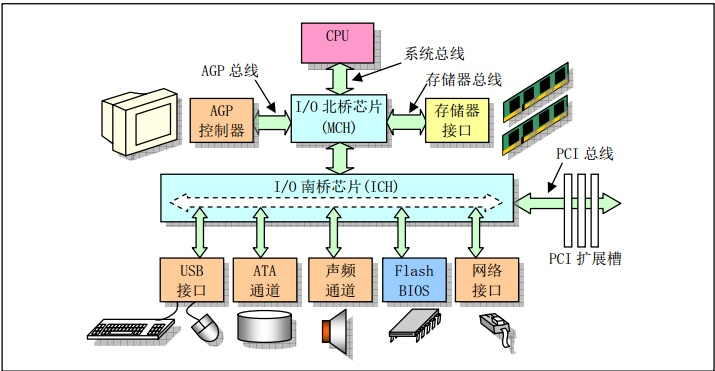
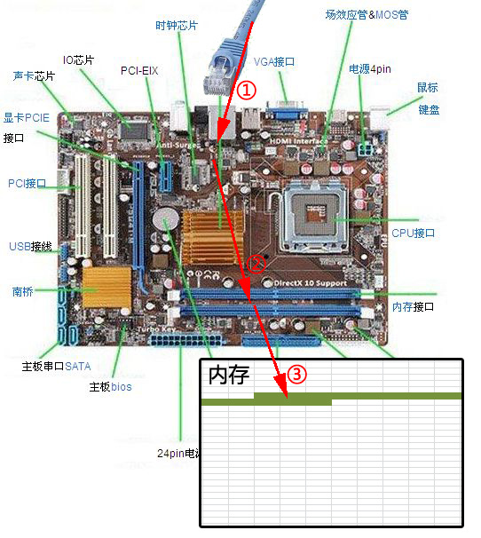

# 面试笔记
## epoll select
### 从网卡接收数据说起
下图是一个典型的计算机结构图，计算机由CPU、存储器（内存）、网络接口等部件组成。了解epoll本质的第一步，要从硬件的角度看计算机怎样接收网络数据。

下图展示了网卡接收数据的过程。在①阶段，网卡收到网线传来的数据；经过②阶段的硬件电路的传输；最终将数据写入到内存中的某个地址上（③阶段）。这个过程涉及到DMA传输、IO通路选择等硬件有关的知识，但我们只需知道：**网卡会把接收到的数据写入内存**。

