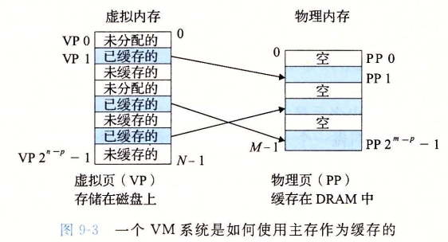
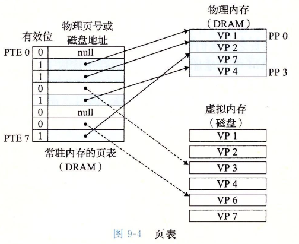
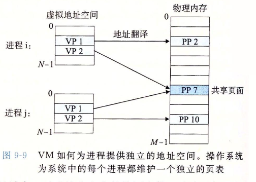

# 面试笔记
## epoll select
### 从网卡接收数据说起
下图是一个典型的计算机结构图，计算机由CPU、存储器（内存）、网络接口等部件组成。了解epoll本质的第一步，要从硬件的角度看计算机怎样接收网络数据。


下图展示了网卡接收数据的过程。在①阶段，网卡收到网线传来的数据；经过②阶段的硬件电路的传输；最终将数据写入到内存中的某个地址上（③阶段）。这个过程涉及到DMA传输、IO通路选择等硬件有关的知识，但我们只需知道：**网卡会把接收到的数据写入内存**。


通过硬件传输，网卡接收的数据存放到内存中。操作系统就可以去读取它们。

### 如何知道接受了数据
了解epoll本质的第二步，要从CPU的角度来看数据接收。要理解这个问题，要先了解一个概念——中断。

计算机执行程序时，会有优先级的需求。比如，当计算机收到断电信号时（电容可以保存少许电量，供CPU运行很短的一小段时间），它应立即去保存数据，保存数据的程序具有较高的优先级。

一般而言，由硬件产生的信号需要cpu立马做出回应（不然数据可能就丢失），所以它的优先级很高。cpu理应中断掉正在执行的程序，去做出响应；当cpu完成对硬件的响应后，再重新执行用户程序。中断的过程如下图，和函数调用差不多。只不过函数调用是事先定好位置，而中断的位置由“信号”决定。


以键盘为例，当用户按下键盘某个按键时，键盘会给cpu的中断引脚发出一个高电平。cpu能够捕获这个信号，然后执行键盘中断程序。下图展示了各种硬件通过中断与cpu交互。


现在可以回答本节提出的问题了：**当网卡把数据写入到内存后，网卡向cpu发出一个中断信号，操作系统便能得知有新数据到来**，再通过网卡中断程序去处理数据。

### 进程阻塞为什么不占用 cpu 资源

了解epoll本质的第三步，要从操作系统进程调度的角度来看数据接收。阻塞是进程调度的关键一环，指的是进程在等待某事件（如接收到网络数据）发生之前的等待状态，recv、select和epoll都是阻塞方法。了解“进程阻塞为什么不占用cpu资源？”，也就能够了解这一步。

为简单起见，我们从普通的recv接收开始分析，先看看下面代码：
```c
//创建socket
int s = socket(AF_INET, SOCK_STREAM, 0);   
//绑定
bind(s, ...)
//监听
listen(s, ...)
//接受客户端连接
int c = accept(s, ...)
//接收客户端数据
recv(c, ...);
//将数据打印出来
printf(...)
```
这是一段最基础的网络编程代码，先新建socket对象，依次调用bind、listen、accept，最后调用recv接收数据。recv是个阻塞方法，当程序运行到recv时，它会一直等待，直到接收到数据才往下执行。

那么阻塞的原理是什么？

#### 工作队列
操作系统为了支持多任务，实现了进程调度的功能，会把进程分为“运行”和“等待”等几种状态。运行状态是进程获得cpu使用权，正在执行代码的状态；等待状态是阻塞状态，比如上述程序运行到recv时，程序会从运行状态变为等待状态，接收到数据后又变回运行状态。操作系统会分时执行各个运行状态的进程，由于速度很快，看上去就像是同时执行多个任务。

下图中的计算机中运行着A、B、C三个进程，其中进程A执行着上述基础网络程序，一开始，这3个进程都被操作系统的工作队列所引用，处于运行状态，会分时执行。


##### 等待队列
当进程A执行到创建socket的语句时，操作系统会创建一个由文件系统管理的socket对象（如下图）。这个socket对象包含了发送缓冲区、接收缓冲区、等待队列等成员。等待队列是个非常重要的结构，它指向所有需要等待该socket事件的进程。


当程序执行到recv时，操作系统会将进程A从工作队列移动到该socket的等待队列中（如下图）。由于工作队列只剩下了进程B和C，依据进程调度，cpu会轮流执行这两个进程的程序，不会执行进程A的程序。**所以进程A被阻塞，不会往下执行代码，也不会占用cpu资源。**


ps：操作系统添加等待队列只是添加了对这个“等待中”进程的引用，以便在接收到数据时获取进程对象、将其唤醒，而非直接将进程管理纳入自己之下。上图为了方便说明，直接将进程挂到等待队列之下。

##### 唤醒进程

当socket接收到数据后，操作系统将该socket等待队列上的进程重新放回到工作队列，该进程变成运行状态，继续执行代码。也由于socket的接收缓冲区已经有了数据，recv可以返回接收到的数据。

### 内核接收网络数据全过程

**这一步，贯穿网卡、中断、进程调度的知识，叙述阻塞recv下，内核接收数据全过程。**

如下图所示，进程在recv阻塞期间，计算机收到了对端传送的数据（步骤①）。数据经由网卡传送到内存（步骤②），然后网卡通过中断信号通知cpu有数据到达，cpu执行中断程序（步骤③）。此处的中断程序主要有两项功能，先将网络数据写入到对应socket的接收缓冲区里面（步骤④），再唤醒进程A（步骤⑤），重新将进程A放入工作队列中。


唤醒进程的过程如下图所示。


**以上是内核接收数据全过程**

这里有两个问题。

其一，操作系统如何知道网络数据对应于哪个socket？

其二，如何同时监视多个socket的数据？

第一个问题：因为一个socket对应着一个端口号，而网络数据包中包含了ip和端口的信息，内核可以通过端口号找到对应的socket。当然，为了提高处理速度，操作系统会维护端口号到socket的索引结构，以快速读取。

第二个问题是**多路复用的重中之重**，是本文后半部分的重点！

### 同时监视多个 socket 的简单方法

服务端需要管理多个客户端连接，而recv只能监视单个socket，这种矛盾下，人们开始寻找监视多个socket的方法。epoll的要义是高效的监视多个socket。从历史发展角度看，必然先出现一种不太高效的方法，人们再加以改进。只有先理解了不太高效的方法，才能够理解epoll的本质。

假如能够预先传入一个socket列表，如果列表中的socket都没有数据，挂起进程，直到有一个socket收到数据，唤醒进程。这种方法很直接，也是select的设计思想。

为方便理解，我们先复习select的用法。在如下的代码中，先准备一个数组（下面代码中的fds），让fds存放着所有需要监视的socket。然后调用select，如果fds中的所有socket都没有数据，select会阻塞，直到有一个socket接收到数据，select返回，唤醒进程。用户可以遍历fds，通过FD_ISSET判断具体哪个socket收到数据，然后做出处理。

```c
int s = socket(AF_INET, SOCK_STREAM, 0);  
bind(s, ...)
listen(s, ...)

int fds[] =  存放需要监听的socket

while(1){
    int n = select(..., fds, ...)
    for(int i=0; i < fds.count; i++){
        if(FD_ISSET(fds[i], ...)){
            //fds[i]的数据处理
        }
    }
}
```

#### select 的流程
select的实现思路很直接。假如程序同时监视如下图的sock1、sock2和sock3三个socket，那么在调用select之后，操作系统把进程A分别加入这三个socket的等待队列中。


当任何一个socket收到数据后，中断程序将唤起进程。下图展示了sock2接收到了数据的处理流程。

> ps：recv和select的中断回调可以设置成不同的内容。


所谓唤起进程，就是将进程从所有的等待队列中移除，加入到工作队列里面。如下图所示。


经由这些步骤，当进程A被唤醒后，它知道至少有一个socket接收了数据。程序只需遍历一遍socket列表，就可以得到就绪的socket。

这种简单方式行之有效，在几乎所有操作系统都有对应的实现。

**但是简单的方法往往有缺点，主要是：**

其一，每次调用select都需要将进程加入到所有监视socket的等待队列，每次唤醒都需要从每个队列中移除。这里涉及了两次遍历，而且每次都要将整个fds列表传递给内核，有一定的开销。正是因为遍历操作开销大，出于效率的考量，才会规定select的最大监视数量，默认只能监视1024个socket。

其二，进程被唤醒后，程序并不知道哪些socket收到数据，还需要遍历一次。

那么，有没有减少遍历的方法？有没有保存就绪socket的方法？这两个问题便是epoll技术要解决的。

> 补充说明： 本节只解释了select的一种情形。当程序调用select时，内核会先遍历一遍socket，如果有一个以上的socket接收缓冲区有数据，那么select直接返回，不会阻塞。这也是为什么select的返回值有可能大于1的原因之一。如果没有socket有数据，进程才会阻塞。

### epoll 设计思路
epoll是在select出现N多年后才被发明的，是select和poll的增强版本。epoll通过以下一些措施来改进效率。

#### 功能分离
select低效的原因之一是将“维护等待队列”和“阻塞进程”两个步骤合二为一。如下图所示，每次调用select都需要这两步操作，然而大多数应用场景中，需要监视的socket相对固定，并不需要每次都修改。epoll将这两个操作分开，先用epoll_ctl维护等待队列，再调用epoll_wait阻塞进程。显而易见的，效率就能得到提升。


为方便理解后续的内容，我们先复习下epoll的用法。如下的代码中，先用epoll_create创建一个epoll对象epfd，再通过epoll_ctl将需要监视的socket添加到epfd中，最后调用epoll_wait等待数据。

```c
int s = socket(AF_INET, SOCK_STREAM, 0);   
bind(s, ...)
listen(s, ...)

int epfd = epoll_create(...);
epoll_ctl(epfd, ...); //将所有需要监听的socket添加到epfd中

while(1){
    int n = epoll_wait(...)
    for(接收到数据的socket){
        //处理
    }
}
```

功能分离，使得epoll有了优化的可能。

#### 就绪列表
select低效的另一个原因在于程序不知道哪些socket收到数据，只能一个个遍历。如果内核维护一个“就绪列表”，引用收到数据的socket，就能避免遍历。如下图所示，计算机共有三个socket，收到数据的sock2和sock3被rdlist（就绪列表）所引用。当进程被唤醒后，只要获取rdlist的内容，就能够知道哪些socket收到数据。


### epoll 的原理与流程
本节会以示例和图表来讲解epoll的原理和流程

#### 创建 epoll 对象
如下图所示，当某个进程调用epoll_create方法时，内核会创建一个eventpoll对象（也就是程序中epfd所代表的对象）。eventpoll对象也是文件系统中的一员，和socket一样，它也会有等待队列。


创建一个代表该epoll的eventpoll对象是必须的，因为内核要维护“就绪列表”等数据，“就绪列表”可以作为eventpoll的成员。

#### 维护监视列表
创建epoll对象后，可以用epoll_ctl添加或删除所要监听的socket。以添加socket为例，如下图，如果通过epoll_ctl添加sock1、sock2和sock3的监视，内核会将eventpoll添加到这三个socket的等待队列中。


当socket收到数据后，中断程序会操作eventpoll对象，而不是直接操作进程。

#### 接收数据
当socket收到数据后，中断程序会给eventpoll的“就绪列表”添加socket引用。如下图展示的是sock2和sock3收到数据后，中断程序让rdlist引用这两个socket。


eventpoll对象相当于是socket和进程之间的中介，socket的数据接收并不直接影响进程，而是通过改变eventpoll的就绪列表来改变进程状态。

当程序执行到epoll_wait时，如果rdlist已经引用了socket，那么epoll_wait直接返回，如果rdlist为空，阻塞进程。

#### 阻塞和唤醒进程
假设计算机中正在运行进程A和进程B，在某时刻进程A运行到了epoll_wait语句。如下图所示，内核会将进程A放入eventpoll的等待队列中，阻塞进程。


当socket接收到数据，中断程序一方面修改rdlist，另一方面唤醒eventpoll等待队列中的进程，进程A再次进入运行状态（如下图）。也因为rdlist的存在，进程A可以知道哪些socket发生了变化。


## 虚拟内存
为了更加有效地管理内存并且少出错，现代操作系统提供了一种对主存的抽象概念，叫做虚拟内存（VM)。虚拟内存是硬件异常、硬件地址翻译、主存、磁盘文件和内核软件的完美交互，它为进程提供了一个大的、一致的和私有的地址空间。通过一个很清晰的机制，虚拟内存提供了三个重要的能力：
1. 它将主存看成是一个存储在磁盘上的地址空间的高速缓存，在主存中只保留活动区域，并根据需要在磁盘和主存之间来回传送数据，通过这种方式，它高效地使用了主存。
2. 它为每个进程提供了一致的地址空间，从而简化了内存管理。
3. 它保护了每个进程的地址空间不被其他进程破坏。

### 物理和虚拟寻址
计算机系统的主存被组织成由一个 M 个连续的字节大小的单元组成的数组。每个字节都有一个唯一的物理地址（Physical Adress，PA）。第一个字节为0，接下来的字节地址为1，以此类推。给定这种简单的结构，CPU 访问内存最自然的方式就是使用物理地址。我们把这种方式称为物理寻址（Physical Adressing）。下图展示了一个物理寻址的示例。该示例的上下文是一条加载指令，它读取从物理地址 4 处开始的 4 字节。当 CPU 执行这条加载指令时，会生成一个有效的物理地址，通过内存总线，把他传递给主存。主存取出从物理地址 4 处开始的 4 字节，并将它返回给 CPU，CPU 会将它放在一个寄存器里。


早期的 PC 使用物理寻址，而且诸如数字信号处理器、嵌入式微控制器这样的系统仍然继续使用这种寻址方式。然而，现代处理器使用的是一种称为虚拟寻址（virtual addressing)的寻址方式，如下图。


使用虚拟地址，CPU 通过生成一个虚拟地址（Virtual Address，VA)来访问主存，这个虚拟地址在被送到内存前先转换适当的物理地址。将一个虚拟地址转换为物理地址的任务叫做地址翻译（address translation）。就异常处理一样，地址翻译需要 CPU 硬件和操作系统之间的紧密合作。CPU 芯片上叫做内存管理单元（Memory Manangement Uint，MMU）的专用硬件，利用存放在主存中的查询表来动态翻译虚拟地址，该表的内容由操作系统管理。

### 地址空间
地址空间（address space）是一个非负整数地址的有序集合：{0，1，2，...}

在一个带虚拟内存的系统中，CPU 从一个由 N=2^n 个地址的地址空间中生成虚拟地址，这个地址空间称为虚拟地址空间（virtual address space）：{0，1，2，...，N-1}
一个系统还有一个物理地址空间（physical address space），对应于系统中物理内存的 M 个字节：{0，1，2，...，M-1}

M 不要求是 2 的幂。

地址空间的概念很重要，因为它清楚地区分了数据对象（字节）和它们的属性（地址）。一旦认识到这种区别，那么就可以将其推广，允许每个数据对象有多个独立的地址，其中每个地址都选自一个不同的地址空间。这就是虚拟内存的基本思想。主存中的每个字节都有一个选自虚拟地址空间的虚拟地址和一个选自物理地址空间的物理地址。

### 虚拟内存作为缓存的工具
概念上而言，虚拟内存被组织为一个由存放在磁盘上的 N 个连续的字节大小的单元组成的数组。每个字节都有一个唯一的虚拟地址，作为到数组的索引。磁盘上数组的内容被缓存在主存中。和存储器层次结构中其他缓存一样，磁盘（较底层）上的数据被分割成块，这些块作为磁盘和主存（较高层）之间的传输单元。VM 系统通过将虚拟内存分割为称为虚拟页（Virtual Page，VP）的大小固定的块来处理这个问题。每个虚拟页的大小为 P=2^p 字节。类似地，物理内存被分割为物理页（Physical Page，PP），大小也为 P 字节（物理页也被称为页帧（page frame））。

在任意时刻，虚拟页面的集合都分为三个不相交的子集：
- 未分配的：VM 系统还未分配（或者创建）的页。未分配的块没有任何数据和它们相关联，因此也就不占用任何磁盘空间。
- 缓存的：当前已缓存在物理内存中的已分配页。
- 未缓存的：未缓存在物理内存中的已分配页。

下图展示了一个有 8 个虚拟页的小虚拟内存。虚拟页 0 和 3 还没有被分配，因此在磁盘上还不存在。虚拟页1、4 和 6 被缓存在物理内存中 。页2、5 和 7 已经被分配了，但是当前并未缓存在主存中。



### DRAM 缓存的组织结构
术语 SRAM 缓存表示位于 CPU 和 主存之间的 L1、L2 和 L3 高速缓存。用术语 DRAM 缓存来表示虚拟内存系统的缓存，它在主存中缓存虚拟页。

在存储层次结构中，DRAM 缓存的位置对它的组织结构有很大影响。DRAM 比 SRAM 要慢大约 10 倍，而磁盘要比 DRAM 慢大约 100000 多倍。因此，DRAM 缓存中的不命中比起 SRAM 缓存中的不命中要昂贵得多，这是因为 DRAM 缓存不命中要由磁盘来服务，而 SRAM 缓存不命中通常是由基于 DRAM 的主存来服务的。而且，从磁盘的一个扇区读取第一个字节的时间开销比起读这个扇区中连续的字节要慢大约 100000 倍。归根结底，DRAM 缓存的组织结构完全是由巨大的不命中开销驱动的。

### 页表
同任何缓存一样，虚拟内存系统必须有某种方法来判断一个虚拟页是否存在 DRAM 中的某个地方。如果是，系统还必须确定这个虚拟页放在哪个物理页中。如果不命中，系统必须判断这个虚拟页存放在磁盘中的哪个位置，在物理页内存中选择一个牺牲页，并将虚拟页从磁盘复制到 DRAM 中，替换这个牺牲页。

这些功能是由软硬件联合提供的，包括操作系统软件、MMU（内存管理单元）中的地址翻译硬件和一个存放在物理内存中叫做页表（page table）的数据结构，页表将虚拟页映射到物理页。每次地址翻译硬件将一个虚拟地址转换为物理地址时，都会读取页表。操作系统负责维护页表的内容，以及在磁盘与 DRAM 之间来回传送页。

下图展示了一个页表的基本组织结构。页表就是一个页表条目（Page Table Entry，PTE）的数组。虚拟地址空间中的每个页在页表中一个固定偏移量处都有一个 PTE。为了我们的目的，我们将假设每个 PTE 是由一个有效位（valid bit）和一个 n 位地址字段组成的。有效位表明了该虚拟页当前是否被缓存在 DRAM 中。如果设置了有效位，那么地址字段就表示 DRAM 中相应的物理页的起始位置，这个物理页中缓存了该虚拟页。如果没有设置有效位，那么一个空地址表示这个虚拟页还未被分配。否则，这个地址就指向该虚拟页在磁盘上的起始位置。

示例展示了一个有 8 个虚拟页和 4 个物理页的系统的页表。4 个虚拟页（VP 1、VP 2、VP 4 和 VP 7）当前被缓存在 DRAM 中。2 个页（VP 0 和 VP 5）还未被分配，而剩下的页（VP 3 和 VP 6）已经被分配了，但是当前还未被缓存。



### 页命中
考虑一下当 CPU 想要读包含在 VP 2 中的虚拟内存的一个字时会发生什么（下图），VP 2 被缓存在 DRAM 中。通过地址翻译硬件将虚拟地址作为一个索引来定位 PTE 2，并从内存中读取它。因为设置了有效位，那么地址翻译硬件就知道 VP 2 是缓存在内存中的了。所以它使用 PTE 中的物理内存地址（该地址指向 PP 1 中缓存页的起始位置），构造出这个字的物理地址。


### 缺页
在虚拟内存的习惯说法中，DRAM 缓存不命中称为缺页（page fault）。图 9-6 展示了在缺页之前我们的示例页表的状态。CPU 引用了 VP 3 中的一个字，VP 3 并未缓存在 DRAM 中。地址翻译硬件从内存中读取 PTE 3，从有效位推断出 VP 3 未被缓存，并且触发一个缺页异常。缺页异常调用内核中的缺页异常处理程序，该程序会选择一个牺牲页，在此例中就是存放在 PP 3 中的 VP 4.如果 VP 4 已经被修改了，那么内核就会将它复制回磁盘。无论哪种情况，内核都会修改 VP 4 的页表条目，反映出 VP 4 不再缓存在主存中这一事实。


接下来，内核从磁盘复制 VP 3 到内存中的 PP 3，更新 PTE 3，随后返回。当异常处理程序返回时，它会重新启动导致缺页的指令，该指令会把导致缺页的虚拟地址重新发送到地址翻译硬件。但是现在，VP 3 已经被缓存在主存中了，那么页命中也能由地址翻译硬件正常处理了。图 9-7 展示了在缺页之后的示例页表状态。


### 分配页面
图 9-8 展示了当操作系统分配一个新的虚拟内存页时对我们示例页表的影响，例如，调用 malloc 的结果。在这个示例中，VP 5 的分配过程是在磁盘上创建空间并更新 PTE 5，使它指向磁盘上这个新创建的页面。


### 局部性
因为不命中处罚很大，页面调度会破坏程序性能，所以第一印象通常是虚拟内存效率会非常低。实际上，虚拟内存工作得相当好，这归功于局部性（locality）。

尽管在整个运行过程中程序引用的不同页面的总数可能超出物理内存总的大小，但是局部性原则保证了在任意时刻，程序将趋向于在一个较小的活动页面（active page）集合上工作，这个工作集合叫做工作集（working set）或者常驻集合（resident set）。在初始开销，也就是将工作页面调度到内存中之后，接下来对这个工作集的引用将导致命中，而不会产生额外的磁盘流量。

只有程序有好的时间局部性，虚拟内存系统工作就能工作的相当好。但是，当然不是所有的程序都能展现良好的时间局部性。如果工作集的大小超出了物理内存的大小，那么程序将产生一种不幸的状态，叫做抖动（thrashing），这时页面将不断地换进换出。虽然通常虚拟内存是有效的，但一个程序性能慢得像爬一样，那么有可能是发生了抖动。

### 虚拟内存作为内存管理的工具
到目前为止，我们都假设有一个单独的页表，将一个虚拟空间映射到物理地址空间。实际上，操作系统为每个进程提供了一个独立的页表，因而也就是一个独立的虚拟地址空间。图 9-9 展示了基本思想。在这个示例中，进程 i 的页表将 VP 1 映射到 PP 2，VP 2 映射到 PP 7。相似地，进程 j 的页表将 VP 1 映射到 PP 7，VP 2 映射到 PP 10。注意，多个虚拟页面可以映射到同一个共享物理页面上。



按需页面调度和独立的虚拟地址空间的结合，对系统中内存的使用和管理造成了深远的影响。特别地，VM 简化了链接和加载、代码和数据共享，以及应用程序的内存分配。
- **简化链接**。独立的地址空间允许每个进程的内存映像使用相同的基本格式，而不管代码和数据实际存放在物理内存的何处。
- **简化加载**。虚拟内存还使得容易向内存中加载可执行文件和共享对象文件。要把目标文件中 .text 和 .data 节加载到一个新创建的进程中，Linux 加载器为代码和数据段分配虚拟页，把它们标记为无效的（即未被缓存的），将页表条目指向目标文件中适当的位置。加载器从不从磁盘到内存实际复制任何数据。在每个页表初次被引用时，要么是 CPU 取指令时引用的，要么是一条正在执行的指令引用一个内存位置时引用的，虚拟内存系统会按照需要自动地调入数据页。
- **简化共享**。独立地址空间为操作系统提供了一个管理用户进程和操作系统自身之间共享地一致机制。一般而言，每个进程都有自己私有的代码、数据、堆以及栈区域，而不和其他进程共享的。在这种情况中，操作系统创建页表，将相应的虚拟页映射到不连续的物理页面。
- **简化内存分配**。虚拟内存为向用户进程提供一个简单的分配额外内存的机制。当一个运行在用户进程中的程序要求额外的堆空间时（如调用 malloc 的结果），操作系统分配一个适当的数字（例如 k）个连续的虚拟内存页面，并且将它们映射到物理内存中任意位置的 k 个任意的物理页面。由于页表工作的方式，操作系统没有必要分配 k 个连续的物理内存页面。页面可以随机地分散在物理内存中。

将一组连续的虚拟页映射到任意一个文件中的任意位置的表示法称作内存映射（memory mapping）。Linux 提供一个称为 mmap 的系统调用，允许应用程序自己做内存映射。

### 虚拟内存作为内存保护的工具
提供独立的地址空间u使得区分不同进程的私有内存变得容易。但是，地址翻译机制可以以一种自然的方式扩展到提供更好的访问控制。因为每次 CPU 生成一个地址时，地址翻译硬件都会读取一个 PTE，所以通过在 PTE

### Linux 
### 内存映射


## 继承和组合
一般只在需要利用多态的性质时使用继承，减少代码复用不要使用继承，因为后期难以维护，继承关系耦合度很高，一处改动会导致处处需要修改。这个时候就需要组合。组合优于继承的原因在于组合首先能保持两个模块之间的解耦，保证被组合的组件仍然有足够高的抽象性。其次，组合可以封闭被组合组件的对外接口到内部。而继承通常会大量暴露被继承组件的内部细节，同时也暴露被继承组件之前的对外接口，因此如果组合和继承都可以使用，一般应该优先组合，因为这说明你用被组合组件的公开接口就足以实现逻辑。

## 排查死循环
测试代码如下。
```c
#include <thread>
using namespace std;
void deadLoop()
{
  int i = 0;
  while (true)
  {
    i++;
  }
}
int main()
{
  thread t(deadLoop);
  thread t2(deadLoop);
  thread t3(deadLoop);
  t.join();
  t2.join();
  t3.join();
  return 0;
}
```

使用命令 top 和 ps 命令查看发生死循环的进程（线程），生死循环的进程 cpu 占用率高。

使用命令 top -H 查看线程信息，-H 操作使得 top 显示单个线程信息，否则只显示进程信息。


可以发现线程 4741~4743 cpu 占用率高达 99%，说明这些线程发生了死循环。

使用命令 ps -eT 获取到线程的主进程 id 4740。


使用 gdb attach 进程。


使用 info threads 显示线程信息。


使用 thread 命令进入线程。


使用 bt 命令打印堆栈，可以发现线程处于 dealLoop 函数内，说明该函数的调用堆栈发生了死循环。


